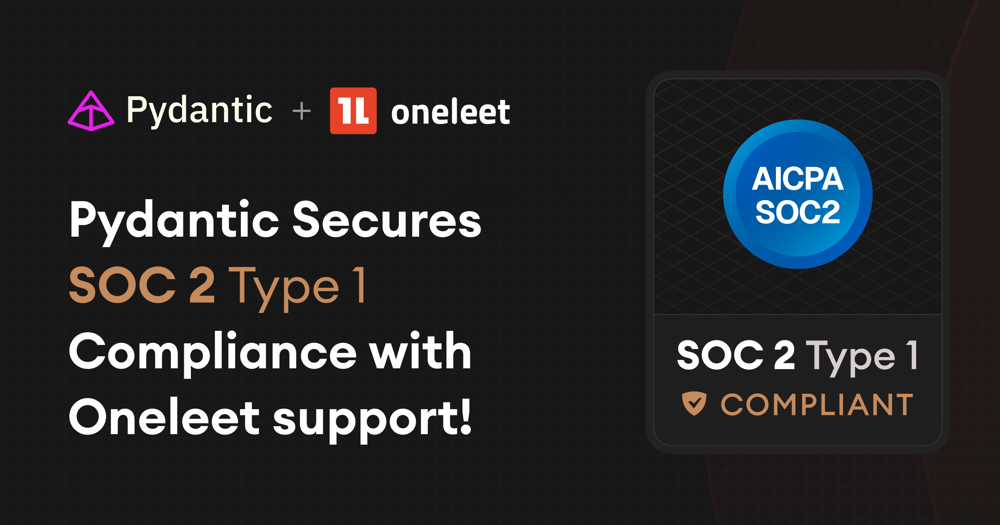

If you have any questions about compliance, feel free to [get in touch](help.md)

## SOC2 💡

Logfire is SOC2 Type I certified. Type II auditing is underway and expected by April 2025. You can
request a copy of our SOC2 report by emailing: [legal@pydantic.dev](mailto:legal@pydantic.dev)

## HIPAA

Logfire is [HIPAA](https://www.hhs.gov/hipaa/for-professionals/privacy/laws-regulations/index.html) compliant. We are able to offer Business Associate Agreements (BAAs) to customers
on our enterprise plan. For details, please email: [sales@pydantic.dev](mailto:sales@pydantic.dev)
