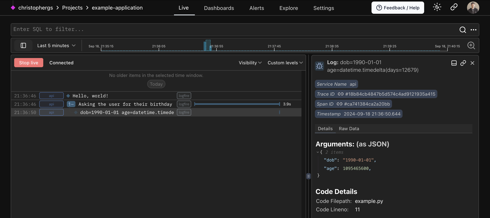

## Overview

Understand the core building blocks of observability helps you monitor, debug, and optimize your applications. The four key concepts work together to give you complete insight into your application's behavior: spans and traces show you what's happening and how long it takes, metrics reveal trends and performance over time, and logs capture specific events and details. 

New to observability? Another great resource is the [OpenTelemetry primer](https://opentelemetry.io/docs/concepts/observability-primer/). 

## Concepts

| Concept   | Description  |
|-----------|--------------|
| Span | Atomic unit of telemetry data |
| Trace | Contains spans, tree structure shows parent/child relationships |
| Metric | Values calculated using telemetry data |
| Log | No duration, timestamped, emitted by services/loggers |


## What is a Span?

A **span** is the building block of a trace. You might also think of spans as logs with extra functionality — a single row in our live view.

!!! info
    Spans let you **add context** to your logs and **measure code execution time**. Multiple spans combine to form a trace, providing a complete picture of an operation's journey through your system.

## What is a Trace?

A trace is a tree structure of spans which shows the path of any client request, LLM run, API call through your application. 

Spans are ordered and nested, meaning you can think of this like a stack trace - it shows you the whole history of all services touched and all responses returned. 

### Example - File size counter

In this example:

1. The outer span measures the time to count the total size of files in the current directory (`cwd`).
2. Inner spans measure the time to read each individual file.
3. Finally, the total size is logged.

```py
from pathlib import Path
import logfire

logfire.configure()

cwd = Path.cwd()
total_size = 0

with logfire.span('counting size of {cwd=}', cwd=cwd):
    for path in cwd.iterdir():
        if path.is_file():
            with logfire.span('reading {path}', path=path.relative_to(cwd)):
                total_size += len(path.read_bytes())

    logfire.info('total size of {cwd} is {size} bytes', cwd=cwd, size=total_size)
```


---

### Example - Happy Birthday

In this example:

1. The outer span sets the topic — the user's birthday
2. The user input is captured in the terminal
3. `dob` (date of birth) is displayed in the span
3. Logfire calculates the age from the `dob` and displays age in the debug message

```py
from datetime import date

import logfire

logfire.configure()

with logfire.span('Asking the user for their {question}', question='birthday'):  # (1)!
    user_input = input('When were you born [YYYY-mm-dd]? ')
    dob = date.fromisoformat(user_input)  # (2)!
    logfire.debug('{dob=} {age=!r}', dob=dob, age=date.today() - dob)  # (3)!
```

1. Spans allow you to nest other Logfire calls, and also to measure how long code takes to run. They are the fundamental building block of traces!
2. Attempt to extract a date from the user input. If any exception is raised, the outer span will include the details of the exception.
3. This will log for example `dob=2000-01-01 age=datetime.timedelta(days=8838)` with `debug` level.



---

By instrumenting your code with traces and spans, you can see how long operations take, identify bottlenecks,
and get a high-level view of request flows in your system — all invaluable for maintaining the performance and
reliability of your applications.


## What is a Metric?

A metric a calculated value measuring your application through time.

- Metrics are collected at regular intervals—such as request latency, CPU load, or queue length
- Metrics are aggregated over time
- Metrics make it easy to chart long‑term trends, establish Service‑Level Objectives (SLOs), and trigger alerts when your system drifts outside acceptable thresholds 

Alongside logs and traces, metrics complete the "three pillars" of observability, giving you a continuous,
low‑overhead signal about the overall health and performance of your services.


*Metric example in Logfire* (note that many of these are setup for you automatically via our [integrations](integrations/index.md))
```python
import time
import logfire

logfire.configure()

# Create the histogram metric once at import time
request_duration = logfire.metric_histogram(
    'request_duration',
    unit='ms',  # milliseconds
    description='Duration of HTTP requests',
)


def handle_request():
    start = time.perf_counter()
    # … handle the request …
    duration_ms = (time.perf_counter() - start) * 1000
    # Record the observed latency
    request_duration.record(duration_ms)
```

Each call to `request_duration.record()` adds a sample to the histogram. On the backend you can visualise
p50/p95 latency, set SLOs, and trigger alerts whenever performance degrades. For more metrics examples
see the [adding metrics guide](guides/onboarding-checklist/add-metrics.md).

## What is a Log?

Logs record something which happened in your application. Importantly, they do not have a duration, compared to spans and traces. 

A log is a timestamped text record, either structured (recommended) or unstructured, with optional metadata. Of all telemetry signals, logs are the best known and have the largest footprint on our collective understanding. Most programming languages have built-in logging capabilities or well-known, widely used logging libraries. Most Python users are familiar with the [`logging`][] module for example.

