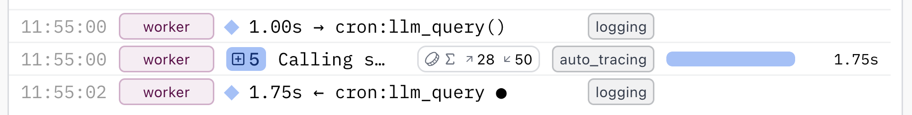
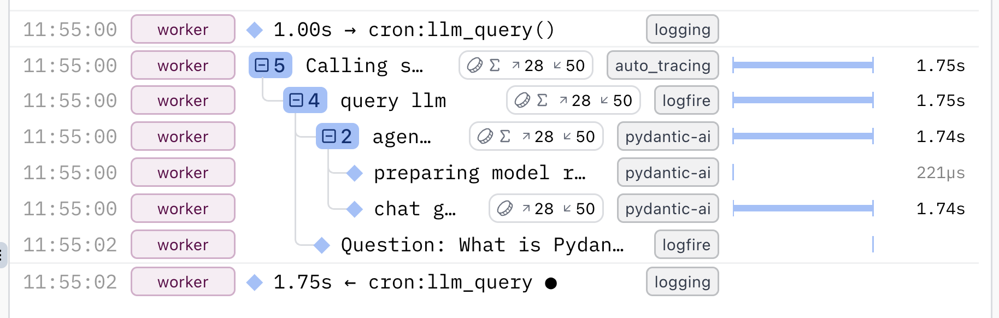
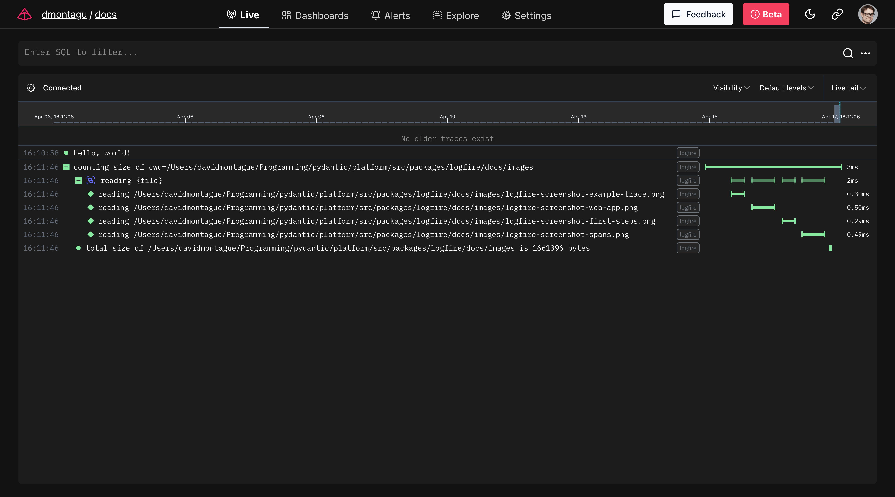
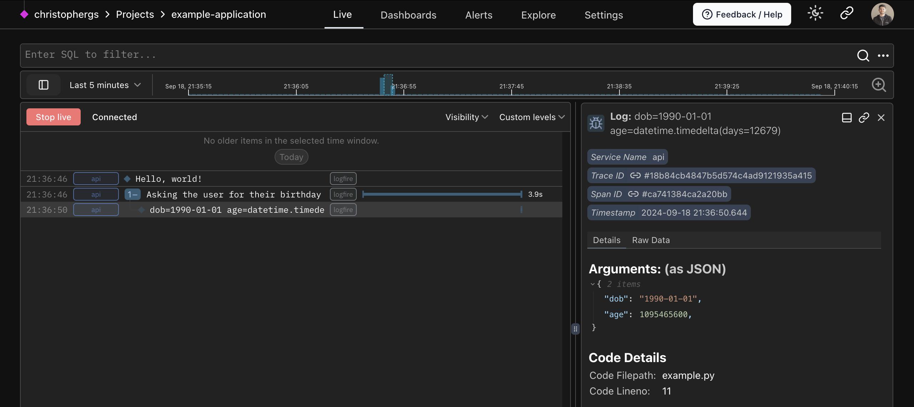

## Overview

Observability is the practice of understanding what your running software is doing from the outside, from the data it emits. That data is called **telemetry**. Logfire is built on four kinds of telemetry that work together: **spans** and **traces** show you what happened and how long it took, **metrics** reveal trends over time, and **logs** capture individual events. This page explains each one.

New to observability? The [OpenTelemetry primer](https://opentelemetry.io/docs/concepts/observability-primer/) is another good introduction.

## Concepts

| Concept | What it is |
| ------- | ---------- |
| Span    | One unit of work: a single operation, with a name, a start, and a duration |
| Trace   | A tree of spans showing the parent/child path of one request |
| Metric  | A value measured over time, such as latency, CPU load, or queue length |
| Log     | A timestamped record of a single event, with no duration |

## What is a Span?

A **span** records one unit of work: a single operation, with a name, a start, and a duration (for example, "count the files in this directory" or "read this file"). Spans are the building block of a trace, and each one appears as a single row in the Live view.

If you've used logging before, think of a span as a log with a duration and structure: as well as recording that something happened, it measures how long that something took, and it can contain other spans nested inside it.

!!! info
    Spans let you **add context** to your logs and **measure how long code takes to run**. Multiple spans combine to form a trace, giving a complete picture of an operation's journey through your system.



## What is a Trace?

A trace is a tree of spans that shows the path of one request (a client request, an LLM run, an API call) through your application.

Spans are ordered and nested: a span can contain other spans, so a trace reads like an outline of everything that happened, in order, with each step's duration. It shows the whole history of the services touched and the responses returned.

!!! info
    Traces are not limited to a single service. They can be propagated to completely different and isolated services. For example, a single trace could contain http requests to both a Python API and a SQL database.



### Example - File size counter

In this example:

1. The outer span measures the time to count the total size of files in the current directory (`cwd`).
2. Inner spans measure the time to read each individual file.
3. Finally, the total size is logged.

```py
from pathlib import Path

import logfire

logfire.configure()

cwd = Path.cwd()
total_size = 0

with logfire.span('counting size of {cwd=}', cwd=cwd):
    for path in cwd.iterdir():
        if path.is_file():
            with logfire.span('reading {path}', path=path.relative_to(cwd)):
                total_size += len(path.read_bytes())

    logfire.info('total size of {cwd} is {size} bytes', cwd=cwd, size=total_size)
```



---

### Example - Happy Birthday

In this example:

1. The outer span sets the topic: the user's birthday
2. The user input is captured in the terminal
3. `dob` (date of birth) is displayed in the span. Logfire calculates the age from the `dob` and displays age in the debug message

```py skip-run="true" skip-reason="non-deterministic"
from datetime import date

import logfire

logfire.configure()

with logfire.span('Asking the user for their {question}', question='birthday'):  # (1)!
    user_input = input('When were you born [YYYY-mm-dd]? ')
    dob = date.fromisoformat(user_input)  # (2)!
    logfire.debug('{dob=} {age=!r}', dob=dob, age=date.today() - dob)  # (3)!
```

1. Spans allow you to nest other Logfire calls, and also to measure how long code takes to run. They are the fundamental building block of traces!
2. Attempt to extract a date from the user input. If any exception is raised, the outer span will include the details of the exception.
3. This will log for example `dob=2000-01-01 age=datetime.timedelta(days=8838)` with `debug` level.



---

By instrumenting your code (adding a few lines so Logfire can record what it does) with traces and spans, you can see
how long operations take, identify bottlenecks, and get a high-level view of request flows in your system: all
invaluable for maintaining the performance and reliability of your applications.

## What is a Metric?

A metric is a calculated value measuring your application through time.

- Metrics are collected at regular intervals, such as request latency, CPU load, or queue length
- Metrics are aggregated over time
- Metrics make it easy to chart long‑term trends, establish Service‑Level Objectives (SLOs), and trigger alerts when your system drifts outside acceptable thresholds

Alongside logs and traces, metrics complete the "three pillars" of observability, giving you a continuous,
low‑overhead signal about the overall health and performance of your services.

!!! info
    Good news: Logfire's [integrations](integrations/index.md) automatically set up many common metrics for you out of the box.

    You can also explore our [standard dashboards](guides/web-ui/dashboards.md) which provide pre-built visualizations for **Web Server Metrics**, **Basic System Metrics (Logfire)** and **Basic System Metrics (OpenTelemetry)**.

### Example - Duration of HTTP requests

```python
import time

import logfire

logfire.configure()

# Create the histogram metric once at import time
request_duration = logfire.metric_histogram(
    'request_duration',
    unit='ms',  # milliseconds
    description='Duration of HTTP requests',
)


def handle_request():
    start = time.perf_counter()
    # … handle the request …
    duration_ms = (time.perf_counter() - start) * 1000
    # Record the observed latency
    request_duration.record(duration_ms)
```

Each call to `request_duration.record()` adds a sample to the histogram. On the backend you can visualise
p50/p95 latency, set SLOs, and trigger alerts whenever performance degrades. For more metrics examples
see the [adding metrics guide](guides/onboarding-checklist/add-metrics.md).

## What is a Log?

Logs record something which happened in your application. Importantly, they do not have a duration, compared to spans and traces.

A log is a timestamped text record, either structured (recommended) or unstructured, with optional metadata. Of all telemetry signals, logs are the best known: most programming languages have built-in logging, and most Python users are familiar with the standard-library [`logging`](https://docs.python.org/3/library/logging.html) module, for example.

## Next steps

- **Send your first trace**: the [quickstart](first-trace.md) gets you from install to a trace in about five minutes.
- **Instrument a framework**: [Integrations](integrations/index.md) record traces from FastAPI, Django, SQLAlchemy, HTTPX, and many more with one line each.
- **Read your traces**: the [Live view](guides/web-ui/live.md) is where traces arrive and where you explore them.
