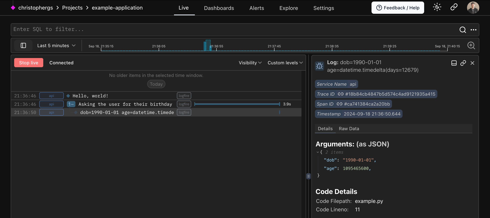

A **span** is the building block of a trace. You might also think of spans as logs with extra functionality — a single row in our live view.

!!! info
    Spans let you **add context** to your logs and **measure code execution time**. Multiple spans combine to form a trace, providing a complete picture of an operation's journey through your system.

## Example #1

In this example:

1. The outer span measures the time to count the total size of files in the current directory (`cwd`).
2. Inner spans measure the time to read each individual file.
3. Finally, the total size is logged.

```py
from pathlib import Path
import logfire

logfire.configure()

cwd = Path.cwd()
total_size = 0

with logfire.span('counting size of {cwd=}', cwd=cwd):
    for path in cwd.iterdir():
        if path.is_file():
            with logfire.span('reading {path}', path=path.relative_to(cwd)):
                total_size += len(path.read_bytes())

    logfire.info('total size of {cwd} is {size} bytes', cwd=cwd, size=total_size)
```


---

## Example #2

In this example:

1. The outer span sets the topic — the user's birthday
2. The user input is captured in the terminal
3. `dob` (date of birth) is displayed in the span
3. Logfire calculates the age from the `dob` and displays age in the debug message

```py
logfire.configure()

with logfire.span('Asking the user for their {question}', question='birthday'):  # (1)!
    user_input = input('When were you born [YYYY-mm-dd]? ')
    dob = date.fromisoformat(user_input)  # (2)!
    logfire.debug('{dob=} {age=!r}', dob=dob, age=date.today() - dob)  # (3)!
```

1. Spans allow you to nest other Logfire calls, and also to measure how long code takes to run. They are the fundamental building block of traces!
2. Attempt to extract a date from the user input. If any exception is raised, the outer span will include the details of the exception.
3. This will log for example `dob=2000-01-01 age=datetime.timedelta(days=8838)` with `debug` level.



---

By instrumenting your code with traces and spans, you can see how long operations take, identify bottlenecks,
and get a high-level view of request flows in your system — all invaluable for maintaining the performance and
reliability of your applications.
