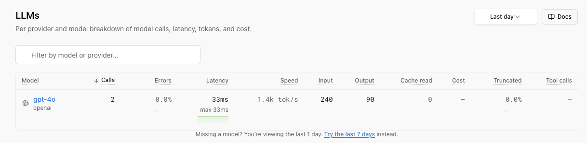

# Track and alert on LLM cost

Large language model calls are metered: every request costs money based on how many **tokens** (the few-character units a model reads and writes, and bills by) go in and come out. This guide takes you from "no idea what we're spending" to a daily cost figure you can watch on a screen and a Slack message the moment a day's spend crosses a line you set.

You'll instrument your model calls, read per-model spend in Logfire's LLMs view, write the SQL that sums cost yourself, put that number on a dashboard, and wire up an alert.

**Who this is for:** an AI engineer or engineering lead who wants to see and cap what their app spends on models, not debug a single call. **Time:** about 15 minutes.

!!! note "Cost is derived from the data you send"
    Logfire doesn't read your provider invoice. Every token count and cost figure on these pages is computed from the **spans** (the individual records of each model call) that your app sends to Logfire. If a call isn't instrumented, or its span is dropped before it reaches Logfire (for example by [sampling](../how-to-guides/sampling.md)), it won't show up in any of these numbers. What you see is an estimate of what those calls cost, priced from the open-source [`genai-prices`](https://github.com/pydantic/genai-prices) dataset: close to your bill, but not the invoice itself.

## Prerequisites

You'll need:

- **A Logfire project and its write token**: the credential your app uses to send data to Logfire. Create a project and copy its token from **Project → Settings → Write tokens** in the Logfire web app. New to Logfire? Start with [Getting Started](../index.md).
- **A model provider API key**: for this guide we use OpenAI, whose key comes from your [OpenAI dashboard](https://platform.openai.com/api-keys). The OpenAI SDK reads it from the `OPENAI_API_KEY` environment variable. The same steps work for [Anthropic](../integrations/llms/anthropic.md), [Google Gen AI](../integrations/llms/google-genai.md), [Pydantic AI](../integrations/llms/pydanticai.md), and [other providers](../guides/web-ui/llms.md#supported-instrumentations).

## 1. Instrument your model calls

Add Logfire to the app that makes the model calls. Two lines do it: `logfire.configure()` connects to your project, and `logfire.instrument_openai()` records every OpenAI call your app makes, capturing the token counts and cost of each one automatically.

Install Logfire, the OpenAI SDK, and [`genai-prices`](https://github.com/pydantic/genai-prices), the open-source dataset Logfire prices calls from. `genai-prices` isn't a hard dependency of Logfire, so install it alongside; without it, calls are still traced but `operation.cost` is omitted (it ships with Pydantic AI, so you already have it there):

```bash
pip install logfire openai genai-prices
```

Set your write token and your OpenAI key so the app can send data and make model calls (in local development you can run `logfire projects use <your-project>` instead of the token):

```bash
export LOGFIRE_TOKEN=<your write token from Project → Settings → Write tokens>
export OPENAI_API_KEY=<your key from platform.openai.com/api-keys>
```

Then instrument your calls:

```python skip-run="true" skip-reason="external-connection"
import openai

import logfire

logfire.configure()
logfire.instrument_openai()  # records every OpenAI call, with its tokens and cost

client = openai.OpenAI()
response = client.chat.completions.create(
    model='gpt-4o-mini',
    messages=[{'role': 'user', 'content': 'Please write me a limerick about Python logging.'}],
)
print(response.choices[0].message.content)
```

**What you'll see in Logfire:** open your project's [Live view](../guides/web-ui/live.md) and, within a few seconds, a span for the model call. It carries a token-usage badge (a coin icon); hover it to see the model name, input/output/total tokens, and the cost in US dollars. See [LLM panels](../guides/web-ui/llm-panels.md) for the full in-trace view of a single call.

Every supported instrumentation records the same token and cost data: swap in [`logfire.instrument_anthropic()`](../integrations/llms/anthropic.md), [`logfire.instrument_pydantic_ai()`](../integrations/llms/pydanticai.md), or any of the [others](../guides/web-ui/llms.md#supported-instrumentations).

## 2. See per-model spend in the LLMs view

Once calls are flowing, the **LLMs and providers** view (in the project sidebar; the page itself is titled **LLMs**) gives you a per-model breakdown without writing any SQL. Each row is one `(provider, model)` pair (for example `openai` / `gpt-4o`) with its call count, errors, latency, input and output tokens, and total **Cost**. Sort by cost to see which model is spending the most.



This is the fastest way to answer "where is the money going?". When you need to slice spend by day, environment, or user (or put it on a dashboard or an alert), you write the query yourself, which is the rest of this guide. See the [LLMs view guide](../guides/web-ui/llms.md) for every column and the per-model detail page.

## 3. Query cost in Explore

The [Explore](../guides/web-ui/explore.md) page lets you ask any question of your data in SQL. Your model calls live in the `records` table (one row per span) and each span's model-specific detail sits in an `attributes` column, stored as JSON. The token and cost figures follow the OpenTelemetry conventions for GenAI (generative AI) spans:

- `attributes->'gen_ai.request.model'`: the model name (e.g. `gpt-4o-mini`).
- `attributes->'gen_ai.system'`: the provider (e.g. `openai`). Some newer SDKs emit `attributes->'gen_ai.provider.name'` instead.
- `attributes->'gen_ai.usage.input_tokens'` and `attributes->'gen_ai.usage.output_tokens'`: token counts.
- `attributes->'operation.cost'`: the cost in US dollars, attached by the instrumentation for supported providers (OpenAI, Anthropic, and Pydantic AI), priced with the [`genai-prices`](https://github.com/pydantic/genai-prices) dataset (installed alongside Logfire, as above).

This query sums cost and tokens per model per day. Paste it into the query editor, pick a **Time window** (say *Last 7 days*), raise the **Limit** if you have many models, and click **Run** (or press ⌘↵):

```sql
SELECT
    date_trunc('day', start_timestamp) AS day,
    attributes->>'gen_ai.request.model' AS model,
    SUM((attributes->'operation.cost')::numeric) AS cost_usd,
    SUM((attributes->'gen_ai.usage.input_tokens')::numeric) AS input_tokens,
    SUM((attributes->'gen_ai.usage.output_tokens')::numeric) AS output_tokens
FROM records
WHERE attributes ? 'gen_ai.request.model'
GROUP BY day, model
ORDER BY day DESC, cost_usd DESC
```

A few things to know about the SQL:

- **Cast JSON values before you do math on them.** `SUM(attributes->'...')` errors, because the database doesn't know the JSON value is a number. `SUM((attributes->'...')::numeric)` converts it first. (Use `->` to keep the JSON value for casting, and `->>` to pull it out as plain text, as with `model` above.)
- **`attributes ? 'key'` filters to spans that have an attribute at all.** The `?` operator is true when the span carries that key, so `WHERE attributes ? 'gen_ai.request.model'` keeps only the model-call spans.
- **`operation.cost` is only present when the instrumentation priced the call.** If a span has no `operation.cost` attribute, the Logfire UI still shows a cost for it (computed from the tokens in your browser), but that browser-side figure **cannot be queried in SQL**. This query only sums the costs actually stored on the spans. With `genai-prices` installed (from the setup above), `operation.cost` is attached automatically for the supported providers (OpenAI, Anthropic, Pydantic AI). Keep `genai-prices` up to date for current prices. If you can't rely on `operation.cost`, sum the token columns instead and multiply by your own per-token rates.

**What you'll see in Logfire:** a table with one row per model per day, ordered so today's biggest spender is at the top.

## 4. Put daily spend on a dashboard

A one-off query answers the question once. To keep the answer in front of you, add it to a [dashboard](../guides/web-ui/dashboards.md): a saved screen of charts, each powered by a SQL query, that updates as new data arrives.

Logfire ships a **standard dashboard** for exactly this. Turn on **LLM tokens and costs** (from the dashboards list) for a ready-made breakdown of token usage and cost by model, no query to write. If it's close but not quite what you want, use it as a starting point for a custom chart.

For a custom spend-over-time chart, create a dashboard, add a time-series chart, and use the query below. Dashboards bucket time with the `$resolution` variable, which adjusts to the chart's time range automatically, so each point is spend per bucket, not per calendar day. For fixed one-day totals regardless of range, swap in `time_bucket('1 day', start_timestamp)`:

```sql
SELECT
    time_bucket($resolution, start_timestamp) AS x,
    attributes->>'gen_ai.request.model' AS model,
    SUM((attributes->'operation.cost')::numeric) AS cost_usd
FROM records
WHERE attributes ? 'gen_ai.request.model'
GROUP BY x, model
ORDER BY x
```

See **[Write dashboard queries](../how-to-guides/write-dashboard-queries.md)** for the full walkthrough: creating the dashboard, choosing a chart type, and adding filters so viewers can narrow to one service or environment.

## 5. Alert when spend crosses a threshold

A dashboard shows spend when you look at it. An [alert](../guides/web-ui/alerts.md) tells you without looking: it's a SQL query Logfire runs on a schedule, and when the query returns rows, Logfire sends a notification. Write the query so that **rows mean "spend is too high"**, and you'll hear about a runaway bill instead of finding it later.

In the sidebar, go to **Alerts** under **Notify**, click **New alert**, pick **Custom query**, and enter a query that returns a row only when the spend in your alert window exceeds your threshold (here, 50 US dollars):

```sql
SELECT
    SUM((attributes->'operation.cost')::numeric) AS cost_usd
FROM records
WHERE attributes ? 'gen_ai.request.model'
HAVING SUM((attributes->'operation.cost')::numeric) > 50
```

Under **When this alert fires**, set **Fire when** to **the query starts having results** (so you're pinged once when spend crosses the line, not on every check while it stays over), set **Look at rows from** to the window you're capping (the last 24 hours is a rolling window, not a calendar day; for a strict daily reset, filter `start_timestamp` to today in your timezone), and **Check every** to how often to run it. Under **Send notifications to**, add a channel: **Slack**, **Opsgenie**, or a **webhook** of your own. An alert with no channel still records its history in Logfire but won't notify anyone. Click **Create alert**.

**What you'll see in Logfire:** the alert appears on the Alerts list showing its recent status. When a run's total crosses your threshold, the query returns its row and every channel you attached gets pinged.

!!! tip "Cap per-model spend"
    To alert on one specific model instead of the total, add `attributes->>'gen_ai.request.model' = 'gpt-4o'` to the `WHERE` clause. To get separate rows per model, use `GROUP BY attributes->>'gen_ai.request.model'` with the `HAVING` threshold: each model over the line becomes its own row, and the alert fires.

## The payoff

You now have a full loop around LLM spend, built from the same spans your app already sends:

- **See it**: per-model cost in the LLMs view, and any single call's tokens and cost in an LLM panel.
- **Slice it**: cost per model per day (or per environment, or per user) with SQL in Explore.
- **Watch it**: a daily-spend chart on a dashboard you glance at.
- **Cap it**: an alert that pings Slack when a day's bill crosses your threshold.

The key insight: because cost is derived from the spans you send, the same instrumentation that makes your model calls debuggable also makes them budgetable. One `instrument_openai()` call feeds all four surfaces.

## Troubleshooting

- **`operation.cost` is empty in Explore?** `genai-prices` isn't installed, so nothing prices the spans. Install it (`pip install genai-prices`). The browser UI still shows a cost, but a span without `operation.cost` can't be summed in SQL.
- **No rows in the LLMs view?** Data hasn't arrived yet, or `LOGFIRE_TOKEN` or your provider key isn't set. Make a call and wait a few seconds.

## What's next

- **[LLMs view](../guides/web-ui/llms.md)**: every per-model column, the detail page, and how the `gen_ai.*` attributes drive it.
- **[LLM panels](../guides/web-ui/llm-panels.md)**: inspect a single call's conversation, tokens, and cost, and how costs are calculated.
- **[Alerts](../guides/web-ui/alerts.md)**: firing modes, delivery channels, and setting up Slack.
- **[Explore](../guides/web-ui/explore.md)** and the **[SQL reference](../reference/sql.md)**: the tables, columns, and functions your queries can use.
