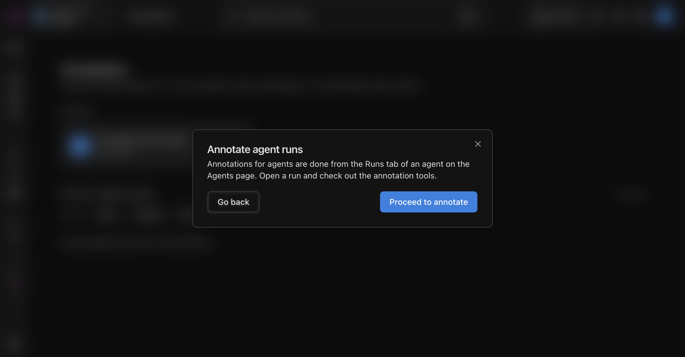
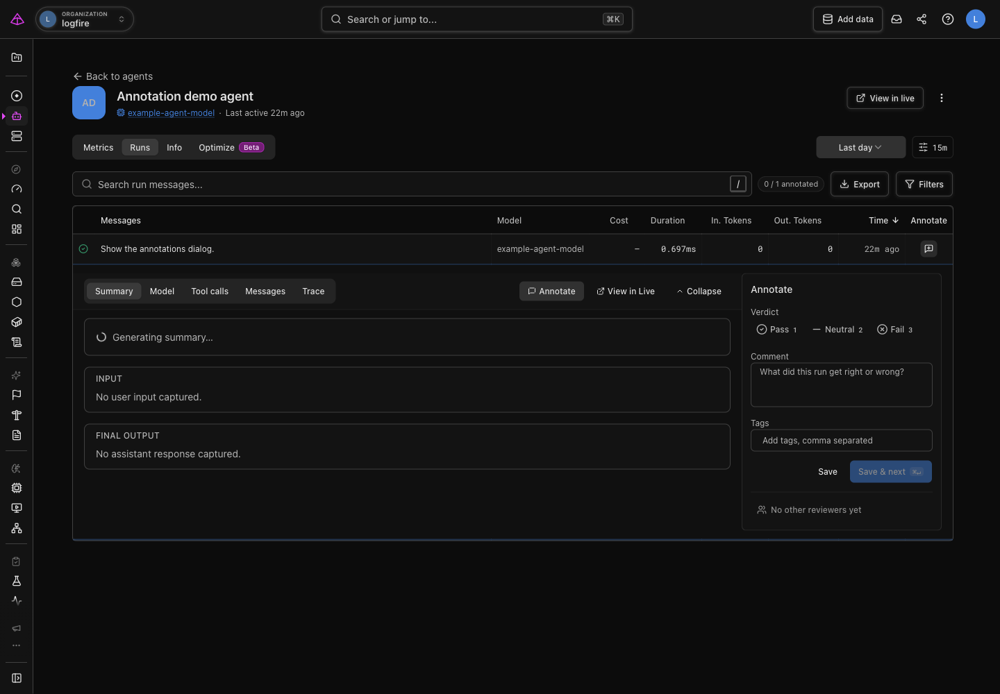

# Annotate an agent run

Review an agent interaction in context, then save a verdict, comment, and tags that explain what it got right or wrong.

An agent **run** is one end-to-end invocation of your agent, including its messages, model calls, and tool calls. Annotate a run when you need a human judgment that automated checks cannot provide, such as whether an answer was helpful, safe, or on-topic. The result is a [score](human-review.md), one saved quality rating for an output, that you can compare with your automated evaluations.

!!! note "Run annotations are in Beta"

    Run-level annotations are behind the `run_annotations` feature flag and may change. Span annotations are generally available.

## Open the run you want to review

1. In the Logfire web UI, open **Annotations** under **AI Evaluations**.
2. Under **Agents**, select the agent whose runs you want to review.
3. Select **Proceed to annotate**. Logfire takes you to that agent's **Runs** tab, where you can inspect the interaction before recording your judgment.

4. Find the run you want to review. Select the row to inspect its input, final output, model calls, tool calls, and trace. You can also select **Add annotation** in the run's row.
5. Select **Annotate** to open the annotation panel.

## Record your judgment

Choose a verdict, then add enough context for someone else to understand the decision:

- **Pass**: the run met the criterion you are reviewing.
- **Neutral**: the run is neither clearly good nor clearly bad, or does not have enough information for a pass or fail.
- **Fail**: the run did not meet the criterion you are reviewing.

Use **Comment** to state the evidence you found in the run. Add **Tags** when you want to group related reviews, such as `hallucination`, `tone`, or `tool-error`. Select **Save** to store the annotation, or **Save & next** to continue through the remaining runs.

## Verify the annotation

After you save, the Runs tab's annotated count increases and the run shows its annotation. Return to **Annotations** to see the saved review in **Recent annotations**, where you can filter by verdict.

## Troubleshooting

### I cannot find an agent or run

The agent needs recorded runs in the selected time range. Send or wait for an agent interaction, then adjust the time range on the agent's Runs tab if needed.

### I do not see the annotation controls

Run annotations require the `run_annotations` feature flag. Ask a project administrator to enable it for your project.

## Next steps

- [Human review](human-review.md): understand how annotations, queues, and end-user feedback become scores.
- [Run an evaluation](evals-in-code.md): compare a fixed dataset against your scoring criteria.
- [Live Evaluations](live-evals.md): score production traffic automatically, then use annotations for the cases that need human review.
