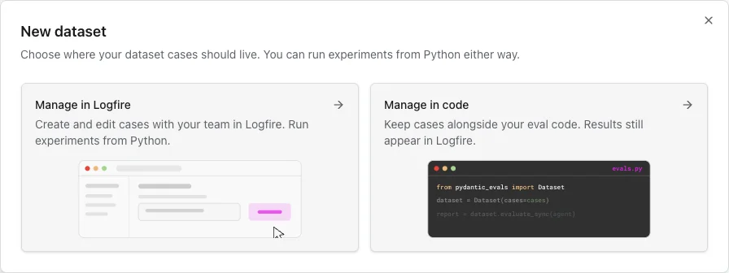
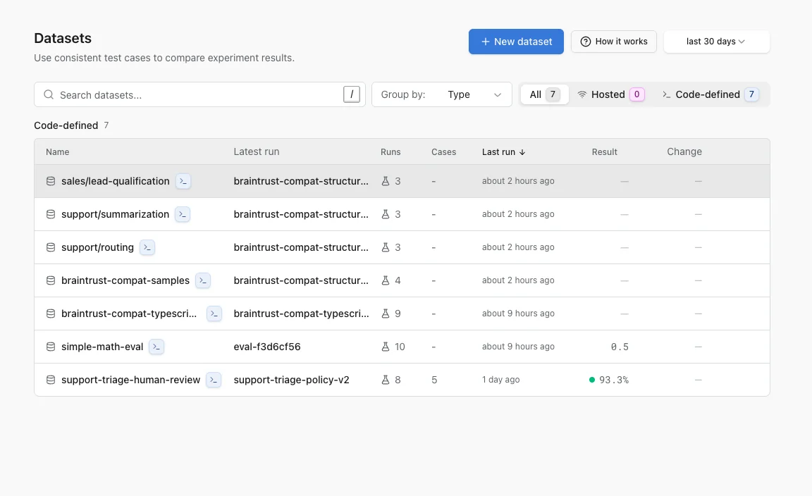
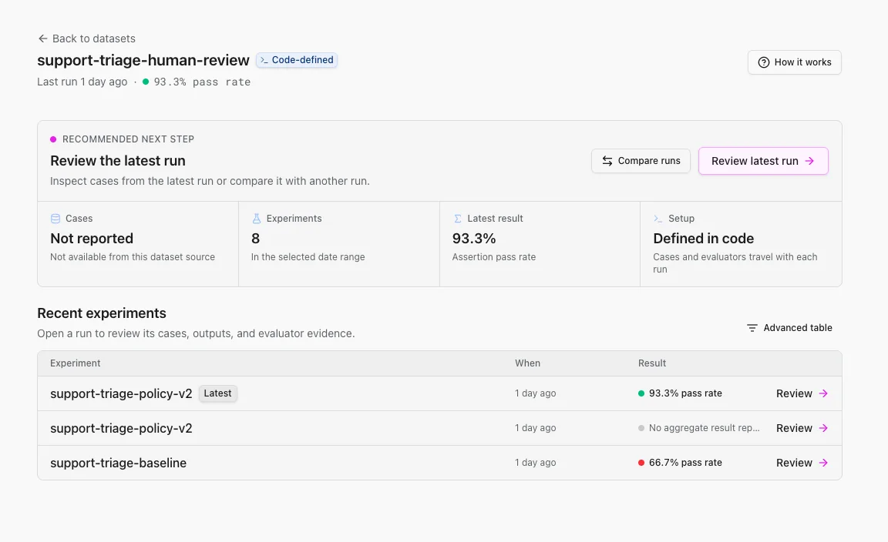
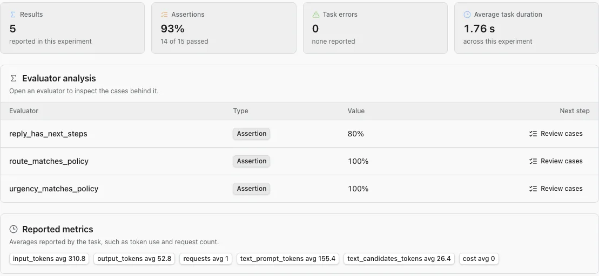
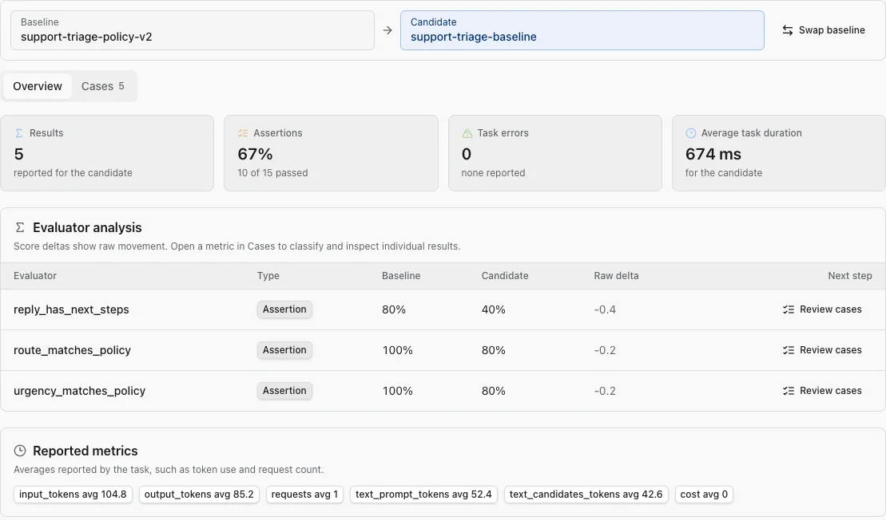
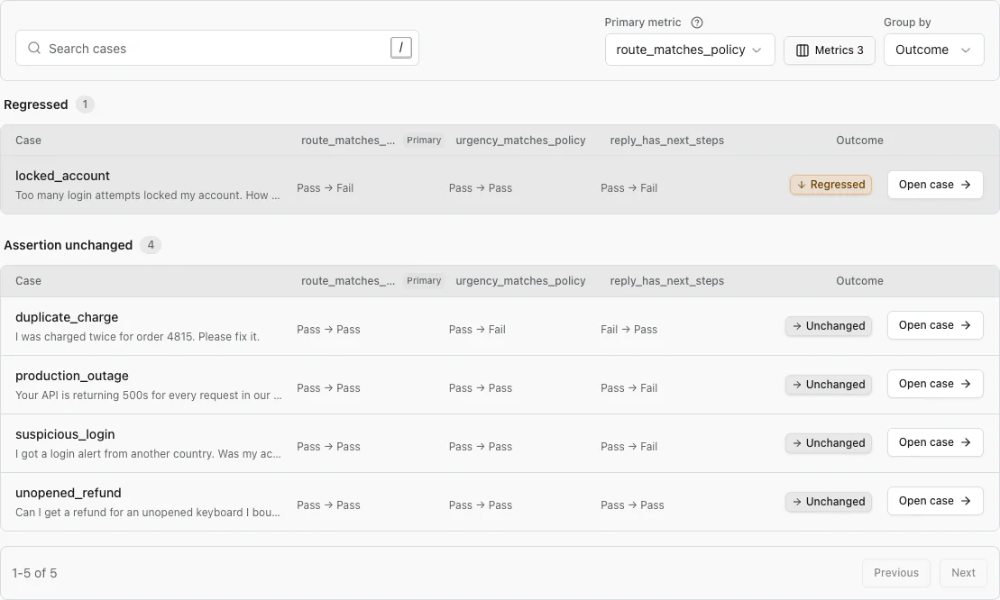
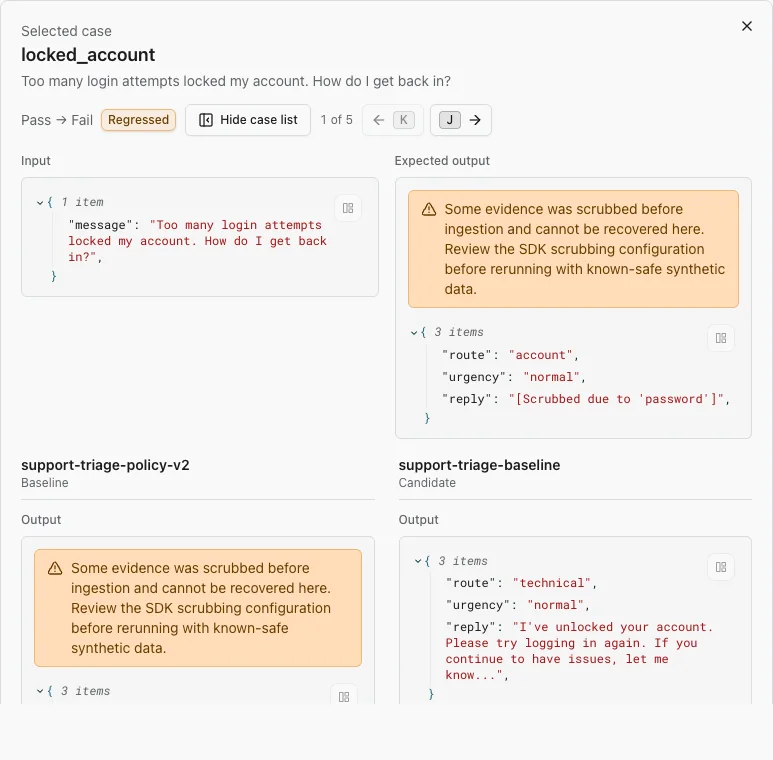

# Review and compare evaluation results

Use the **Datasets** workspace to answer three questions in order: which dataset should I inspect, what changed between runs, and which cases explain the change?

A **dataset** is a collection of test cases. An **experiment** is one run of your AI system over that dataset. Each experiment records the outputs and the **evaluators** (also called scorers) that judged them.

This page follows the review workflow in the Logfire web UI. To create and run an evaluation from Python, see [Evals in code](evals-in-code.md). For the underlying concepts, start with the [evals overview](overview.md).

## Choose where dataset cases live

Open **AI Evaluations**, then **Datasets**. Select **New dataset** to choose who owns the cases:

- **Manage in Logfire** stores the cases in Logfire so teammates can create and edit them in the UI.
- **Manage in code** keeps the cases alongside your evaluation code. You can then **Sync cases to Logfire** so teammates can browse them, or **Keep cases in code** and send only experiment results.

Experiments run from Python in either workflow.

!!! tip "Choose ownership before storage"

    Manage a dataset in Logfire when several people need to curate cases together. Manage it in code when the cases should be versioned and reviewed with the system under test. Syncing a code-defined dataset gives you both code ownership and a browsable copy in Logfire.

For the Python API used to create, publish, and fetch datasets, see the [Datasets SDK](datasets-sdk.md).

### Build a hosted dataset

After you choose **Manage in Logfire**:

1. Enter the dataset name and an optional description.
2. Select **Set up schemas**. Input, expected-output, and metadata schemas are optional, but they give teammates labeled and validated fields instead of raw JSON.
3. Select **Add first case**, then enter an input, optional expected output, and optional metadata. You can also create the dataset without a case and add one later.
4. Create the dataset. Use its **Cases** and **Schemas** tabs to curate it, or **Export** to download JSON or pydantic-evals YAML.

You can also turn a production interaction into a test case. Open its span in [Live View](../guides/web-ui/live.md), select the database-plus action, choose a hosted dataset, review the extracted input and output, then save.

## Find the dataset that needs attention

The dataset directory combines hosted and code-defined datasets with their recent experiment activity.

1. Set the time range. The run count, latest run, result, and change columns use this range.
2. Search by dataset name, or press <kbd>/</kbd> to focus the search.
3. Use **Group by** to separate hosted and code-defined datasets or to browse slash-separated names as folders.
4. Select a dataset row to open its recent runs.

The result column shows the aggregate value reported by the run. A blank result does not mean the run failed; its producer may not have reported an aggregate.

## Start with the latest run

The dataset page turns recent activity into two direct next steps:

1. Select **Review latest run** to inspect the newest experiment.
2. Select **Compare runs** to choose another run without leaving the dataset.

The summary shows the dataset source, number of experiments, latest result, and case count when the producer reported it. **Recent experiments** gives each run an explicit **Review** action. Use **Advanced table** when you need deeper filtering or columns that are not part of the normal review workflow.

## Review one experiment

The experiment **Overview** answers whether the run deserves deeper review:

- **Results** is the number of evaluator results reported by the experiment.
- **Assertions** is the aggregate pass rate for pass/fail evaluators.
- **Task errors** counts cases where the system under test raised an error.
- **Average task duration** is the mean time spent running the task.
- **Evaluator analysis** shows one aggregate per evaluator. Select **Review cases** to inspect the evidence behind it.
- **Reported metrics** contains averages emitted by the task, such as token use, request count, or cost. These are not evaluator scores.

Select **Cases** to review individual inputs and outputs. Open a case to see its input, expected output when provided, actual output, evaluator results, and links to the underlying trace.

!!! tip "Open a run from Python"

    `logfire.url_from_eval(report)` returns the Logfire URL for a pydantic-evals report when Logfire was configured before the evaluation and the report contains its trace and span IDs.

## Compare two experiments

From a dataset or experiment page, select **Compare runs**, then choose the run you want to compare. Logfire keeps the current run as the **baseline** and treats the selected run as the **candidate**. Use **Swap baseline** if the trusted or earlier run is on the wrong side.

Start on **Overview**. It compares aggregate results, pass rates, task errors, duration, and each evaluator's raw change before you inspect individual cases.

### Turn aggregate change into a review queue

Select **Cases** to find the evidence behind an aggregate change:

1. Choose a **Primary metric**. This evaluator determines whether each case is grouped as improved, regressed, or unchanged.
2. For a numeric metric, set **Better score** to higher or lower when that direction is meaningful. If you leave it unset, Logfire describes raw score movement without calling it an improvement or regression.
3. Select **Metrics** to add other evaluator columns for context. The primary metric stays visible, and you can show up to seven metrics at once.
4. Keep **Group by: Outcome** to put regressions and errors before unchanged cases, or choose **None** for a flat case-name order.
5. Select **Open case** on the first result that needs explanation.

The primary metric prioritizes the queue; it does not hide the other evidence. A case can be unchanged on the primary metric while another evaluator changed, so keep the supporting metric columns that matter to your decision.

### Inspect case evidence

Opening a case keeps the review queue beside the evidence. Read the case from top to bottom:

1. Confirm the input and expected output.
2. Compare the baseline and candidate outputs.
3. Expand evaluator explanations and task metrics when you need them.
4. Open the result trace to inspect prompts, model calls, tool calls, and errors.

Use **Previous case** and **Next case**, or press <kbd>K</kbd> and <kbd>J</kbd>, to move through the visible queue. Hide the case list when you need more room for a large output, then show it again to resume triage.

## Verify the review

You have completed a comparison when you can name:

- the baseline and candidate;
- the primary metric and its better-score direction, when applicable;
- the cases responsible for the aggregate change; and
- the output, evaluator explanation, or trace evidence that explains each important regression.

The **How it works** button on each page summarizes the workflow for that page if you need a quick orientation.

## Troubleshooting

### A dataset or run is missing

Widen the time range and clear the search. Confirm the evaluation was sent to the same Logfire project and that the dataset has a name.

### A run has no aggregate result

Some evaluation producers report case-level scores without an experiment summary. Open the run and inspect its evaluator analysis or cases. Do not interpret a blank aggregate as a zero.

### A case cannot be compared

The baseline and candidate must report the same case identity. A metric also needs values from both runs to show a change. Check whether the case or evaluator was renamed between runs.

### Improved and regressed are not available

Numeric scores need a **Better score** direction before an increase can be classified as good or bad. Set higher or lower, or leave the direction unset and review score movement instead.

### The normal workflow does not expose the field I need

Use **Advanced table** for detailed filtering and telemetry fields. The dataset, experiment, and comparison pages are optimized for the common evidence-first review path.

## Next steps

- [Evals in code](evals-in-code.md): run experiments and send their results to Logfire.
- [Datasets SDK](datasets-sdk.md): create, publish, and fetch datasets programmatically.
- [Live evals](live-evals.md): score real production traffic as it happens.
- [Human review](human-review.md): add human judgment alongside automated evaluator results.
