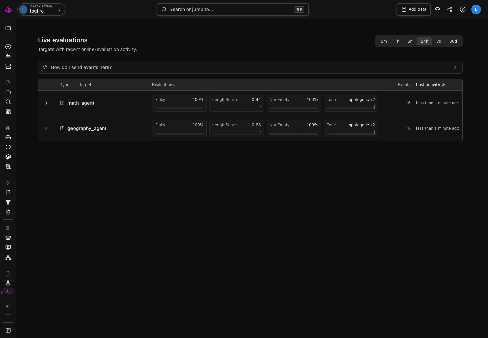
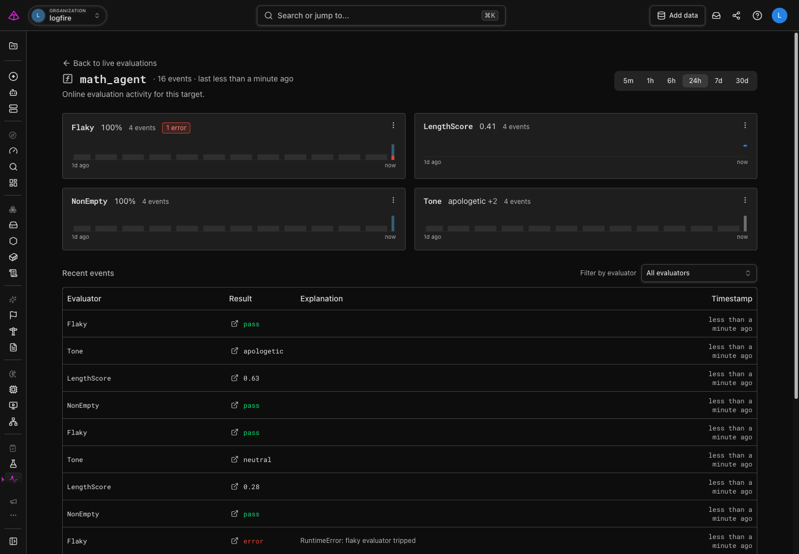

# Monitor live AI quality

Use **Evals: Live Monitoring** to watch the results of [online evaluations](https://pydantic.dev/docs/ai/evals/online-evaluation/) running against real traffic. An online evaluation scores an agent or function after it runs, so it helps you notice a production regression, investigate an unexpected result, or follow a new evaluator rollout.

This page is for monitoring results that already reach Logfire. To add an evaluator to your application, follow the [Pydantic AI online evaluation guide](https://pydantic.dev/docs/ai/evals/online-evaluation/). For a curated test set before deployment, use [offline evaluations](overview.md) instead.

Live Evaluations reads [`gen_ai.evaluation.result`](https://github.com/open-telemetry/semantic-conventions-genai/blob/main/docs/gen-ai/gen-ai-events.md#event-gen_aievaluationresult) OpenTelemetry log events that include a target and evaluation name. The [`@evaluate` decorator](https://pydantic.dev/docs/ai/evals/online-evaluation/#quick-start) for functions and the [`OnlineEvaluation` capability](https://pydantic.dev/docs/ai/evals/online-evaluation/#agent-integration) for Pydantic AI agents emit these events by default.

## Find the signal

Open **Evals: Live Monitoring** from the sidebar. The target list shows agents and functions with recent online-evaluation activity. A target is the agent or function that produced an evaluation result.

1. Choose a time range at the top of the page. Start with **24h** for a normal operating view, then narrow it when investigating a recent deployment or broaden it to compare a longer period.
2. Find the target you want to inspect. Each row shows the target type, its evaluators, the number of events, and when the last event arrived.
3. Read the evaluator summaries. They show a pass rate for pass/fail checks, an average for numeric scores, or one label plus the number of other labels seen. The small activity bars show when results arrived in the selected time range.



The target list is a fast health check, not the whole story. Use the chevron beside a target to expand its evaluator breakdown without leaving the page. Open the target when a summary changes or looks unfamiliar.

A target seen within the last 30 days remains in the list even when it has no events in the selected time range. It appears with zero events and no current score, so narrowing the range does not hide configured evaluators that are currently quiet.

## Investigate an evaluator

Select a target to open its detail page. It brings together the evaluation results for that target in the selected time range.

1. Start with the evaluator cards. They show the current summary, recent activity, and any errors raised while running that evaluator.
2. Review **Recent events** for the individual results and their explanations. Use the evaluator filter to focus on one check.
3. Select the trace link on an event to open it in Live View. A trace is the record of the request that produced the evaluated result. It lets you inspect the evaluation event and any prompt, response, tool-call, or other context that your application recorded.



An evaluator error is different from a failed evaluation: it means the evaluator itself could not produce a result. Open its trace and explanation first, then decide whether the application behavior or the evaluator needs attention.

## Interpret result shapes

The page presents a result according to the value returned by the evaluator:

| Evaluator output | Target-list and detail-page summary |
| --- | --- |
| `bool` | Pass rate, with individual `pass` or `fail` results |
| Number | Average score over the selected time range |
| String | One label, plus the number of other labels seen |

An evaluator that returns multiple named scores appears as one result for each score. If you deploy a new evaluator version, use the detail page to compare the version badges and recent events while both versions are running.

Live Evaluations groups results by target and evaluation name, regardless of the evaluator source or configuration. Give results distinct names when they should appear as separate summaries.

## Record end-user feedback

Use a score to record feedback such as thumbs-up/down or a satisfaction rating. Unlike a [human annotation](human-review.md), this records an end user's experience, not a review against your team's criteria.

[Pydantic Evals](https://pydantic.dev/docs/ai/evals/online-evaluation/) emits evaluation events automatically when evaluators run. For feedback you have already collected, emit the same `gen_ai.evaluation.result` event directly through OpenTelemetry, the open industry standard for collecting traces, metrics, and logs. You do not need to run an evaluator.

Install `logfire` with `pip install logfire`. Set `LOGFIRE_TOKEN` to a write token from **Project Settings > Write Tokens** in the project that receives your application's data.

!!! note "Feedback is sent to Logfire"

    Running this example sends a demonstration response span and a feedback score to your Logfire project. A span is one unit of work: a single operation, with a name, a start, and a duration.

### Link feedback to the original response

`response_context` is a variable you create with [`logfire.get_context()`](../reference/api/propagate.md), not a value returned automatically by your agent. It contains tracing metadata, including the trace and span identifiers, and you can save it as JSON.

Call `get_context()` while the original response span is active. If you wrap response generation in `logfire.span(...)`, generate the response and capture its context inside the same `with` block. Calling `get_context()` later in the feedback request captures that request's context, not the original response's.

This runnable example captures the context and sends feedback after the demonstration span has finished. It uses one process and does not call an agent:

```python
from opentelemetry._logs import SeverityNumber, get_logger

import logfire

logfire.configure()

with logfire.span('Demonstration agent response'):
    response_context = logfire.get_context()

# Later, when the user selects thumbs-up:
with logfire.attach_context(response_context):
    get_logger('my_app.feedback').emit(
        event_name='gen_ai.evaluation.result',
        severity_number=SeverityNumber.INFO,
        body='User feedback: helpful',
        attributes={
            'gen_ai.evaluation.target': 'support-agent',
            'gen_ai.evaluation.name': 'user_helpfulness',
            'gen_ai.evaluation.score.value': 1.0,
            'gen_ai.agent.name': 'support-agent',
        },
    )
```

Use `1.0` for thumbs-up and `0.0` for thumbs-down. For a satisfaction rating, send the numeric rating and keep its scale consistent. Use your agent's name as the target and a distinct evaluation name such as `user_helpfulness` so user feedback stays separate from automated checks.

### Receive feedback in a separate request

In your application, feedback usually arrives in a later request:

1. Before returning the response, save its captured context server-side with the response ID. Use a database or another shared store so a different worker can retrieve it after the original request finishes. Keeping it only in a local variable is not enough.
2. Send the response ID to the browser with the answer. When the user gives feedback, send that ID and their rating back to your application.
3. Authenticate the user and check that they may give feedback on that response. Retrieve the saved context for the authorized response. Do not accept arbitrary trace context from the browser.
4. In the feedback request, use `logfire.attach_context(saved_context)` around the event emission shown above. Configure this process to send data to the same Logfire project as the original response.

Restoring the saved context links feedback to the original response even after the span has finished or the process that generated it has exited. It does not rerun the agent or reopen the span.

### Check the result in Logfire

Open **Evals: Live Monitoring** and select `support-agent`:

- **Recent events** shows `user_helpfulness` with a score of `1.00` for the example above.
- Binary `0`/`1` scores appear as a pass percentage in the summary. For thumbs-up/down, this is the percentage of positive feedback: one thumbs-up shows `100%`; one thumbs-up and one thumbs-down show `50%`.
- The event's **Open trace in live view** link opens the trace containing **Demonstration agent response**.

If the result does not appear, check the write token and time range as described in [Troubleshoot missing or unexpected results](#troubleshoot-missing-or-unexpected-results).

## Hide evaluators without deleting telemetry

Use a hide rule when an old experiment, test evaluator, or retired version makes the monitoring view harder to read. Open an evaluator's overflow menu on the target detail page and choose the matching hide action. You can hide that evaluator for the target or data that arrived before the current time while allowing new events to remain visible. When the selected range contains one recorded evaluator version, the menu also offers an action for that version.

Hide rules affect **Evals: Live Monitoring** only. They do not delete telemetry, change traces, or remove evaluation events from alerts and SQL queries.

Rules created from an evaluator's overflow menu are scoped to that target. On the **Hidden Evaluators** project settings page, you can add, edit, and remove rules, or leave the target empty to match evaluators across the project. Every populated field in one rule must match an event; an event is hidden when any active rule matches it. Removing a rule makes its matching entries visible again.

## Verify your setup

After adding online evaluations to an application and sending traffic through it, you should see:

- a target row for the evaluated agent or function;
- one summary for each evaluator or named score; and
- a recent event that opens the parent trace in Live View.

If all three appear, Logfire is receiving evaluation results and preserving their link to the request that produced them.

## Troubleshoot missing or unexpected results

**No evaluation activity yet:** Confirm the application is configured to send telemetry to the intended Logfire project, then exercise the evaluated code path. Try a wider time range before assuming no events arrived.

**An evaluator shows an error:** Open its recent event and follow the trace link. The event explanation and trace identify whether the evaluator raised or the application result failed the check.

**A result appears under an unfamiliar target:** Check the target name passed by your evaluation integration. The page groups results by that agent or function name.

**A function inside an agent has type `function`:** This is expected for the `@evaluate` decorator, which keeps the decorated function as its target even when the function runs inside a Pydantic AI agent. The `OnlineEvaluation` capability emits results for the agent target.

## Next steps

- [Configure online evaluations in Pydantic AI](https://pydantic.dev/docs/ai/evals/online-evaluation/)
- [Run offline evaluations against a dataset](overview.md)
- [Add human judgment with annotations and review](human-review.md)
