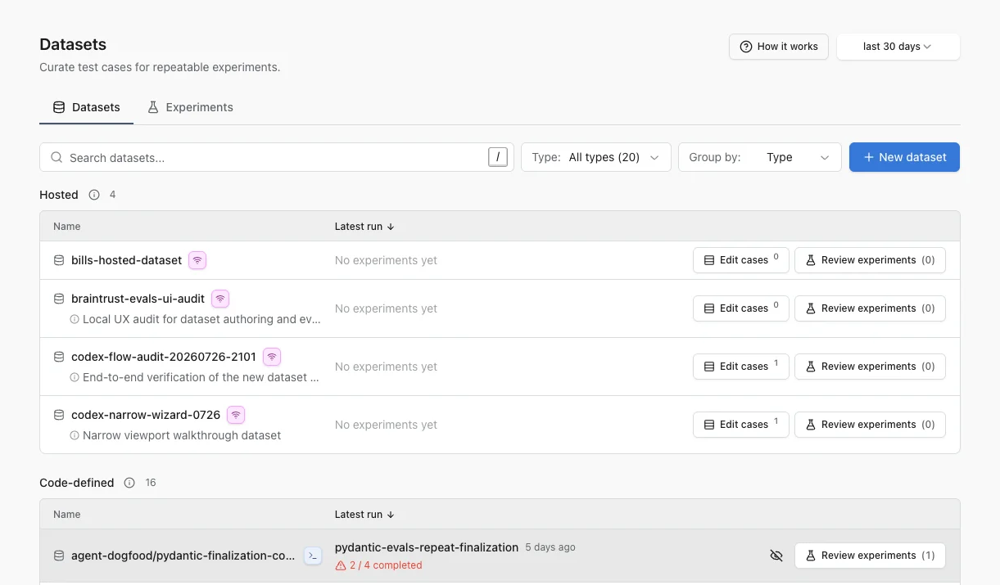
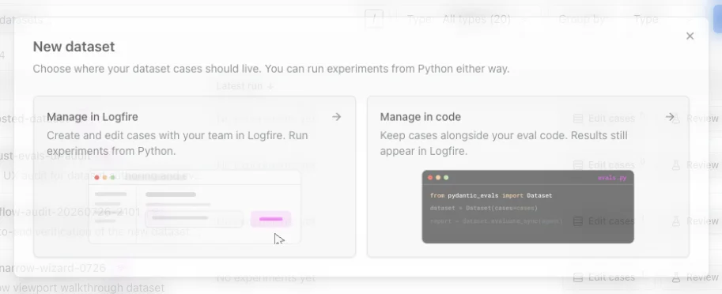
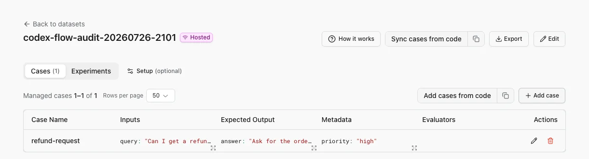

# Manage datasets

Build a dataset, a stable collection of test cases that you can run repeatedly as your agent, model, or prompt changes.

Open a project, then select **AI Evaluations** > **Datasets & experiments**. The **Datasets** tab shows hosted and code-defined datasets in the selected time range.

## Find the dataset you need

Use the controls above the list to narrow a large project:

- Search for a dataset name.
- Filter **Type** to **Hosted** or **Code-defined**.
- Set **Group by** to **Type**, **Path prefix**, or **None**.
- Change the time range if an older dataset is missing.

Choose stable, descriptive names. Use names such as `support/routing` and `support/response-quality` when path-prefix grouping will help your team navigate related datasets.

Each row shows the actions available for that dataset. **Edit cases** is available when cases are hosted in Logfire. **Review experiments** opens the runs associated with that dataset.

If code creates many temporary dataset names, select **Hide for me** on entries you do not need. This changes only your view. Use **Hidden** above the list to restore them later.

## Choose how to manage a new dataset

Select **New dataset**, then choose where the source of truth should live:

- **Manage in Logfire** when teammates need to curate cases in the web UI or you want a shared hosted dataset.
- **Manage in code** when cases belong with the source and review process for your application.

If you manage the dataset in code, choose whether to **Sync cases to Logfire** or **Keep cases in code**. Experiment results can appear in Logfire with either choice when you configure Logfire for the run. Syncing also makes the cases available to browse and edit in Logfire.

## Create a hosted dataset

The hosted-dataset flow has three steps:

1. **Dataset**: enter a stable name and an optional description.
2. **Schemas**: optionally define JSON schemas for inputs, expected outputs, and metadata.
3. **First case**: optionally add an initial input, expected output, and metadata.

You can skip schemas and the first case. Add them later when the shape becomes clear.

After creation, use the **Cases** tab to maintain the dataset:

- **Add case** creates a case in the web UI.
- **Add cases from code** shows the code needed to publish cases.
- **Sync cases from code** imports code-defined cases into the hosted dataset.
- **Export** downloads the cases for reuse outside Logfire.
- **Edit** changes the dataset name, description, or schemas.

If Logfire already discovered a code-defined dataset with the same name, creating its hosted counterpart can import the latest cases instead of starting empty. Review the imported cases before relying on them as a shared test set.

## Add a case from a production trace

Production failures and surprising outputs make useful regression cases:

1. Open [Live view](../guides/web-ui/live.md) and select the span you want to preserve.
2. Select the database icon (**+**) in the span details.
3. Choose an existing hosted dataset or create one.
4. Review the extracted input, expected output, and metadata, then save the case.

The case keeps a link to its source trace, so reviewers can inspect the original behavior.

## Verify the dataset

Before running an experiment, confirm that:

- the dataset has a stable name that future runs will reuse;
- hosted cases have the expected input and optional expected output;
- schemas describe the data you want teammates to enter;
- the dataset appears in the intended path-prefix group;
- **Review experiments** opens the expected run history.

## Troubleshooting

### A code-defined dataset has no browsable cases

This is expected when the cases remain only in code. Use **Sync cases to Logfire**, or create a hosted dataset with the same name and import the latest cases.

### A dataset is missing

Widen the time range and clear the type filter. Also check **Hidden** if you previously hid the dataset for yourself.

### The list contains many one-off datasets

Use **Group by: Path prefix** for consistently named datasets. Hide temporary entries for yourself, then change the code to reuse stable names for future runs.

## Next steps

[Run an eval](evals-in-code.md) against the dataset, then [review the experiment](review-experiments.md) in Logfire.
