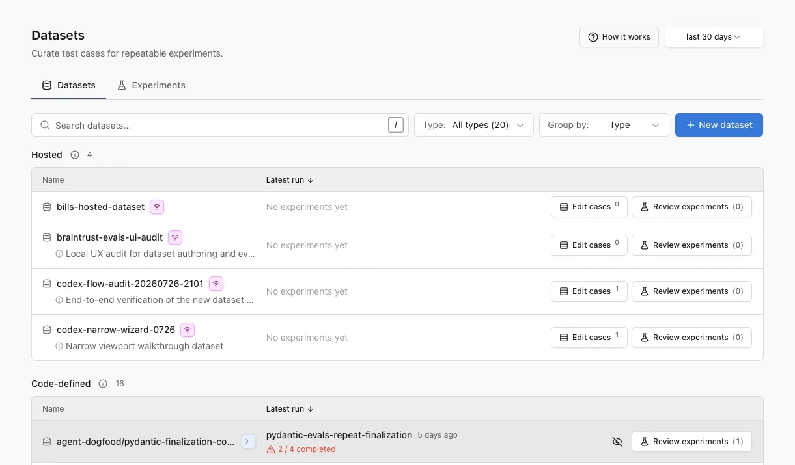
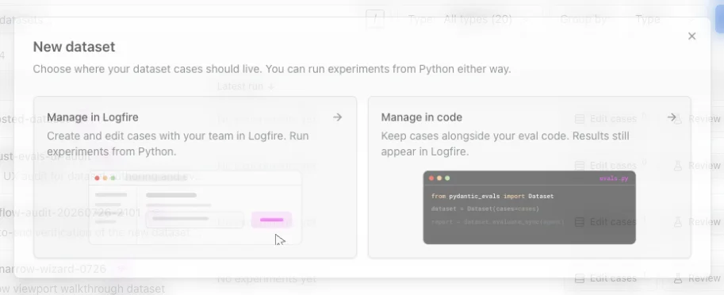
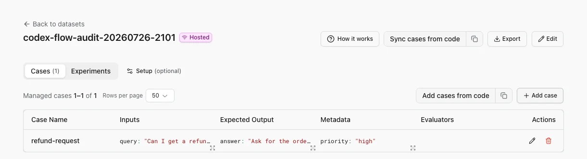

# Manage datasets

Build a dataset, a stable collection of test cases that you can run repeatedly as your agent, model, or prompt changes.

Open a project, then select **AI Evaluations** > **Datasets & experiments**. The **Datasets** tab lists both kinds of dataset together.

## Understand what the list contains

The list combines two sources, keyed on the dataset name:

- **Hosted** datasets are records stored on Logfire. They are always listed, whatever time range you have selected.
- **Code-defined** datasets are not stored as records at all. Logfire derives them from the experiments that ran against them, so a code-defined dataset appears once an experiment reports its name, and only while that experiment falls inside the selected time range.

The selected time range controls the experiment counts and results shown for both kinds. It controls whether the dataset row itself exists only for code-defined datasets.

A name that exists in both sources is **one row, not two**. Creating a hosted dataset named `support-routing` when your code already runs experiments under that name merges them: the row shows the hosted cases and the experiment history together, marked **Hosted**. This is why stable names matter. A name that changes between runs produces a new row each time instead of accumulating history under one.

## Find the dataset you need

Use the controls above the list to narrow a large project:

- Search for a dataset name.
- Filter **Type** to **Hosted** or **Code-defined**.
- Set **Group by** to **Type**, **Path prefix**, or **None**.
- Change the time range if an older code-defined dataset is missing.

Choose stable, descriptive names. Hosted dataset names must start with a letter or number and can contain only letters, numbers, dots, underscores, and hyphens. Code-defined names can contain `/` for path-prefix grouping, but a name containing `/` cannot currently be reused by a hosted dataset.



Each row shows the actions available for that dataset. **Edit cases** is available when cases are hosted in Logfire. **Review experiments** opens the runs associated with that dataset.

If code creates many temporary dataset names, select **Hide for me** on entries you do not need. This changes only your view. Use **Hidden** above the list to restore them later.

## Choose how to manage a new dataset

Select **New dataset**, then choose where the source of truth should live:

- **Manage in Logfire** when teammates need to curate cases in the web UI or you want a shared hosted dataset.
- **Manage in code** when cases belong with the source and review process for your application.

If you manage the dataset in code, choose whether to **Sync cases to Logfire** or **Keep cases in code**. Experiment results can appear in Logfire with either choice when you configure Logfire for the run. Syncing also makes the cases available to browse and edit in Logfire.



## Create a hosted dataset

The hosted-dataset flow has three steps:

1. **Dataset**: enter a stable, hosted-compatible name and an optional description.
2. **Schemas**: optionally define JSON schemas for inputs, expected outputs, and metadata.
3. **First case**: optionally add an initial input, expected output, and metadata.

You can skip schemas and the first case. Add them later when the shape becomes clear.

After creation, use these controls to maintain the dataset:

- On the **Cases** tab, **Add case** creates a case in the web UI and **Add cases from code** opens a prefilled `add_cases(...)` snippet.
- In the dataset header, **Sync cases from code** opens a prefilled `push_dataset(...)` snippet, **Export** downloads the cases, and **Edit** changes the dataset name, description, or schemas.



**Add cases from code** and **Sync cases from code** both open a code snippet for you to run. Neither transfers anything on its own. Both arrive prefilled with the dataset's name and the type names taken from its schemas. `add_cases(...)` sends the cases you pass in one import request, updating any that match an existing case name. A named update replaces that case's stored content with the submitted case rather than merging individual fields. `push_dataset(...)` first creates or updates the hosted dataset, then calls the same case-import path. On an existing dataset, it updates schemas for the non-`None` generic types in the local `Dataset` and replaces the dataset-level evaluator lists.

Neither call deletes a case. One you remove from your local dataset stays in the hosted one until you delete it there, so a hosted dataset can accumulate cases your code no longer defines. `push_dataset(...)` is also not one atomic operation: the dataset update can succeed even if the later case import fails.

Dataset-level `evaluators` and `report_evaluators` are overwritten rather than merged, so removing one locally and pushing again clears it on the server. Case-level evaluators are replaced only for cases included in the push; an omitted hosted case and its evaluators remain unchanged. See the [Datasets SDK](datasets-sdk.md) for both calls.

If Logfire already discovered a code-defined dataset with the same name, creating its hosted counterpart can import the latest cases instead of starting empty. Review the imported cases before relying on them as a shared test set.

## How cases get into a hosted dataset

Cases reach a hosted dataset four ways. They combine freely in one dataset:

| Path | Volume | Use it when |
| --- | --- | --- |
| [Live view](#add-a-case-from-a-production-trace) | One case per span | A real request is worth keeping as a regression case |
| **Add case** on the [Cases tab](#create-a-hosted-dataset) | One case at a time | You are hand-writing a specific edge case |
| Create a matching hosted dataset | Bulk | A code-defined dataset already has experiment cases that you want to copy into its hosted counterpart |
| [The SDK](datasets-sdk.md) | Bulk | Cases are generated, migrated, or already in code |

Adding from Live view turns production behavior into a test case. When you create a hosted dataset with the exact name of a code-defined dataset, Logfire can copy cases from its latest experiment. The code snippets provide the general bulk path for generated or migrated cases and run from your machine rather than in the browser.

A hosted dataset holds at most **10,000 cases**, counted as the cases a write would create. Updating a case that already matches by name does not consume capacity, so a dataset sitting at the limit can still be re-pushed; a case with no name always counts as new. A single import request that would take the dataset past 10,000 is rejected without writing any cases, so a larger collection needs splitting across datasets.

### Schemas are enforced on case writes

If a dataset defines schemas, they are enforced rather than used only as a hint for teammates. Logfire validates a case when you add or import it. A case update validates the fields included in that update. This applies through the UI and SDK alike. A bulk import request is rejected in full rather than partially applied, but a higher-level workflow such as `push_dataset(...)` can contain more than one request.

The error names the failing field and the reason, for example:

```text
Schema validation failed: inputs.question: 123 is not of type 'string'
```

Two details matter when you plan a schema:

- Inputs are required when creating or importing a case. Expected output and metadata are optional. Their schemas constrain submitted values, except that `null` metadata is treated as absent. An explicit JSON `null` expected output marked as present is a value and is validated.
- Schemas are enforced from the moment you define them, but they are not applied retroactively. Cases that predate a schema stay as they are. Because an update checks only the submitted fields, an old mismatch is detected when that incompatible field is submitted again, not when an unrelated field changes.

Define schemas once the shape of a case has settled. While the shape is still moving, a schema rejects each write that has drifted from it, so it is usually easier to add cases first and describe them once the pattern is clear.

## Add a case from a production trace

Production failures and surprising outputs make useful regression cases:

1. Open [Live view](../guides/web-ui/live.md) and select the span you want to preserve.
2. Select the database icon (**+**) in the span details.
3. Choose an existing hosted dataset or create one.
4. Review the extracted input, expected output, and metadata, then save the case.

The case keeps a link to its source trace, so reviewers can inspect the original behavior.

## Verify the dataset

Before running an experiment, confirm that:

- the dataset has a stable name that future runs will reuse;
- hosted cases have the expected input and optional expected output;
- schemas match the cases already in the dataset, so later writes are not rejected;
- a code-defined dataset appears in the intended path-prefix group, if its name uses `/`;
- **Review experiments** opens the expected run history.

## Troubleshooting

### A code-defined dataset has no browsable cases

This is expected when the cases remain only in code. Use **Sync cases to Logfire**, or create a hosted dataset with the same name and import the latest cases.

### A dataset is missing

Widen the time range and clear the type filter. Also check **Hidden** if you previously hid the dataset for yourself.

The code-defined half of the list is capped at 1,000 names: if the project has more, it keeps the most recently active ones and an older name can fall outside the cap. Hosted datasets are not capped. Search by name rather than scrolling, because the search runs before the cap is applied and so reaches names the list itself does not show.

A code-defined dataset also disappears once all of its experiments are archived, because nothing is left to derive it from. Hosted datasets are unaffected. Restore the dataset by unarchiving an experiment, or create a hosted dataset with that name to keep it in the list permanently.

### A dataset is named `Untitled`

An experiment that reports no dataset name is grouped under a single placeholder rather than being dropped. Every unnamed run in the project collects into that one row, so it is a mixture rather than a dataset. Set a `name` on the `Dataset` in your eval code to separate the runs.

### The list contains many one-off datasets

Use **Group by: Path prefix** for consistently named datasets. Hide temporary entries for yourself, then change the code to reuse stable names for future runs.

### Adding a case fails validation

The dataset has schemas and a submitted case field does not match one of them. The error names the field and the reason. Either correct the case, or relax the schema under **Edit** if the dataset's shape has genuinely changed. Existing cases are not rechecked when you change a schema, and partial updates validate only the fields they submit, so a dataset can hold cases that would no longer be accepted in full.

## Next steps

[Run an eval](evals-in-code.md) against the dataset, then [review the experiment](review-experiments.md) in Logfire.
