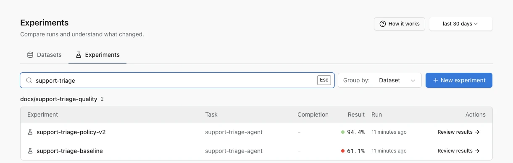
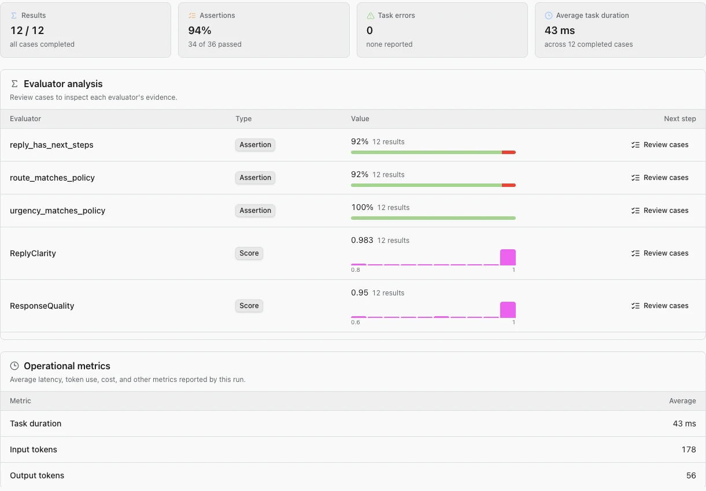
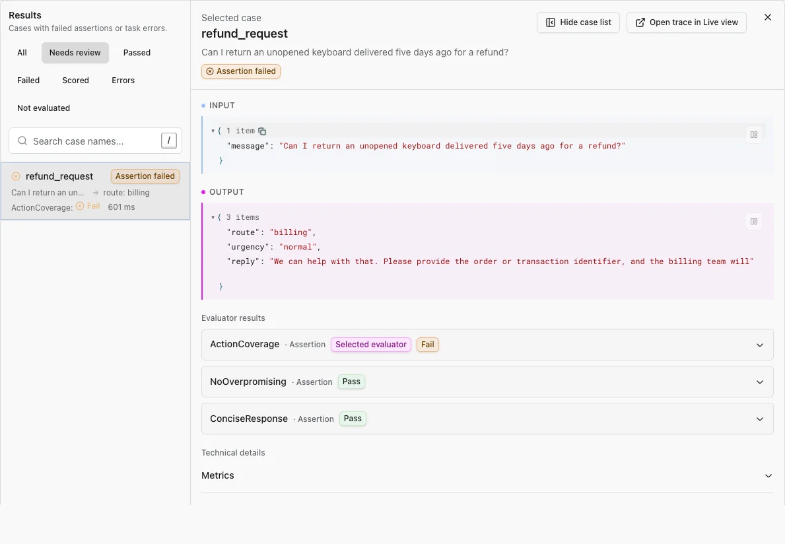
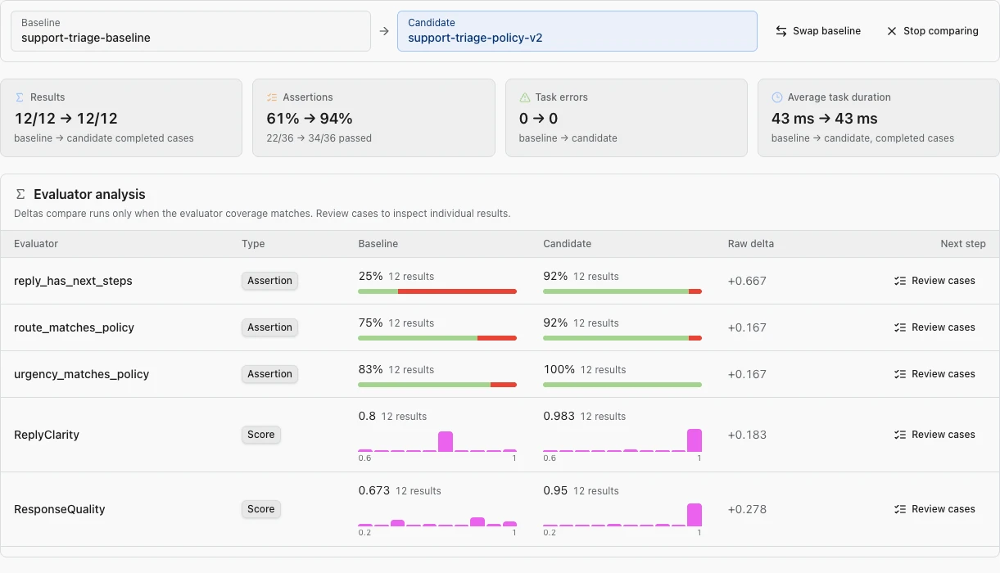
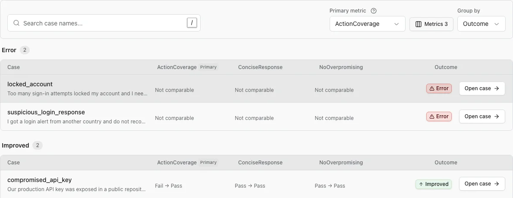

# Review experiments

Turn an experiment result into a specific decision: keep a change, revise it, or investigate the evaluator.

An experiment is one run of your AI system over a dataset. An evaluator judges each output and records an assertion or score.

Open a project, then select **AI Evaluations** > **Datasets & experiments** > **Experiments**.

## Find the run

The Experiments page lists runs in the selected time range. Search by experiment name, group runs by dataset, and select **Review results** on the run you want to investigate.

Use a descriptive experiment name for the change under test, such as `candidate-routing-prompt-v2`. The dataset identifies what you tested; the experiment name identifies the version or hypothesis you tested.

To start another run, select **New experiment**. Logfire shows setup instructions and example code because the task itself runs in your application or eval suite. The new result appears on this page after the run sends its data to Logfire.

## Read the overview first

The **Overview** tab answers whether the run completed and where to investigate:

- **Results** show how many dataset cases produced results.
- **Assertions** summarize boolean evaluator outcomes.
- **Task errors** count cases where the task under test raised an error.
- **Average task duration** helps identify a latency change.
- **Evaluator analysis** shows each evaluator separately, including its pass rate or average score.
- **Operational metrics** report task duration, tokens, and cost when the run provides them.

Aggregate results are a triage tool, not the final decision. A higher average can hide an important regression, and a lower score can reveal a better evaluator rather than a worse agent.

## Review case evidence

Open the **Cases** tab, then start with **Needs review**, **Failed**, or **Errors**. Search by case name when you know the scenario. Select **Open case** to inspect the evidence.

Read each case in this order:

1. **Input**: confirm what the task received.
2. **Output**: inspect what the task returned.
3. **Evaluator results**: check which assertion or score changed and read its reason when available.
4. **Technical details**: inspect expected output, metadata, duration, tokens, and cost.
5. **Open trace in Live view**: follow model calls, tool calls, and exceptions when the output does not explain the result.

Use **Prev** and **Next**, or the displayed keyboard shortcuts, to work through the current filtered list without returning to the table.

## Compare a candidate with a baseline

From an experiment result, select **Compare runs**. The current run remains the candidate. Choose a baseline from another run of the same dataset.

Start on **Overview** to compare completion, assertions, task errors, evaluator aggregates, and operational metrics.

Then open **Cases**:

- Set **Primary metric** to the evaluator that should determine improved, regressed, and unchanged groups.
- For a numeric primary metric, set **Better score** to **Higher** or **Lower**. Leave it at **Not set** to group cases by raw score movement.
- Add other **Metrics** as supporting columns. The table can show up to seven.
- Set **Group by** to **Outcome** to put regressions and errors ahead of unchanged cases.
- Open a case to compare its baseline and candidate outputs with the evaluator evidence.

Metric direction matters. A positive raw delta is not always an improvement: higher latency, token use, or cost can be worse. Set **Better score** to match the metric's meaning, then use the outcome group rather than interpreting the sign alone.

## Decide what to change

Use the aggregate view to find a signal, then use cases to explain it:

1. Inspect every regression, task error, and changed evaluator result that matters to the product.
2. Decide whether the task or the evaluator is wrong.
3. Change one meaningful variable, such as a system prompt instruction, tool description, or model.
4. Run the same dataset again and compare the new candidate with the previous run.

Keeping the dataset and evaluators stable makes the comparison interpretable. If you change them, treat coverage changes and newly evaluated cases separately from task-quality changes.

## Verify the conclusion

Before accepting a candidate, confirm that:

- the baseline and candidate use the intended dataset;
- both runs cover the cases and evaluators you expected;
- task errors did not move into a different outcome group;
- important regressions have been inspected at case level;
- duration, token, and cost changes are acceptable;
- the evaluator's direction matches the meaning of its score.

## Troubleshooting

### A run is missing

Widen the time range, clear the search, and confirm that the eval sent data to the same Logfire project you are viewing.

### Completion says `Not reported`

The eval producer did not report that the run finished. You can still review the case results Logfire received, but Logfire cannot confirm that they represent the complete run.

### A case is not comparable

One run may be missing the case or evaluator. Treat this as a coverage change. Do not classify it as a quality regression without inspecting what changed.

### A result looks incomplete

Open its trace in Live view. The trace shows model calls, tool calls, evaluator spans, and exceptions that may not fit in the result summary.

## Next steps

Add newly discovered failures to a [hosted dataset](manage-datasets.md), refine the task or evaluator, and [run the next experiment](evals-in-code.md).
