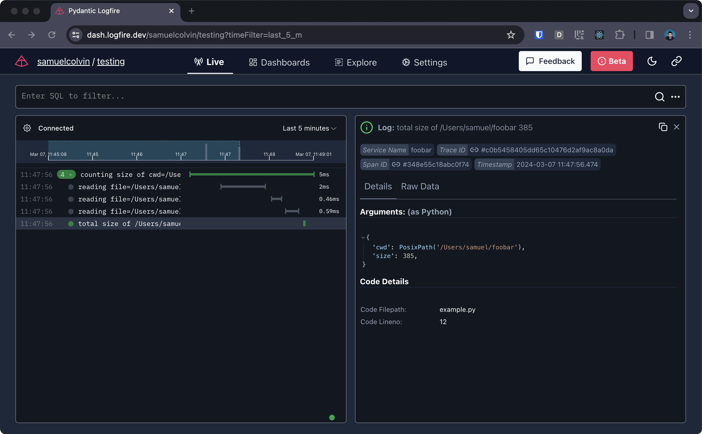

In this page, you will find step-by-step instructions to get started with **Logfire**.

## Installation {#install}

To install the latest version of **Logfire**, run the following command:

{{ install_logfire() }}

=== "Conda"
    If you have used [`conda`](https://docs.conda.io/en/latest/) to create your virtual environment, you can install `logfire` using:
    ```bash
    conda install logfire -c conda-forge
    ```

## Authenticate

To authenticate your local environment with **Logfire**, run:

```bash
logfire auth
```

This will open a browser window where you can sign up or log in to [dash.logfire.dev](https://dash.logfire.dev).
Once authentication is successful, credentials will be stored in `~/.logfire/default.toml`.

## Usage

To use **Logfire**, it's simple as importing, and calling the desired function:

```py
import logfire

logfire.info('Hello, {name}!', name='world') # (1)!
```

1. This will log `Hello world!` with `info` level.

!!! info
    We have all the [log levels][logfire.Logfire] available for you to use.

You can also use spans to contextualize your logs, and record how long parts of your code take to run.

Lots of spans combine together to form a trace, which is a complete picture of a execution journey through your system.

```py
from pathlib import Path
import logfire

cwd = Path.cwd()
total_size = 0
with logfire.span('counting size of {cwd=}', cwd=cwd):
    for path in cwd.iterdir():
        if path.is_file():
            with logfire.span('reading {file=}', file=path):
                total_size += len(path.read_bytes())

    logfire.info('total size of {cwd} {size}', cwd=cwd, size=total_size)
```

Will show in **Logfire** like this:



[conda]: https://conda.io/projects/conda/en/latest/user-guide/install/index.html
