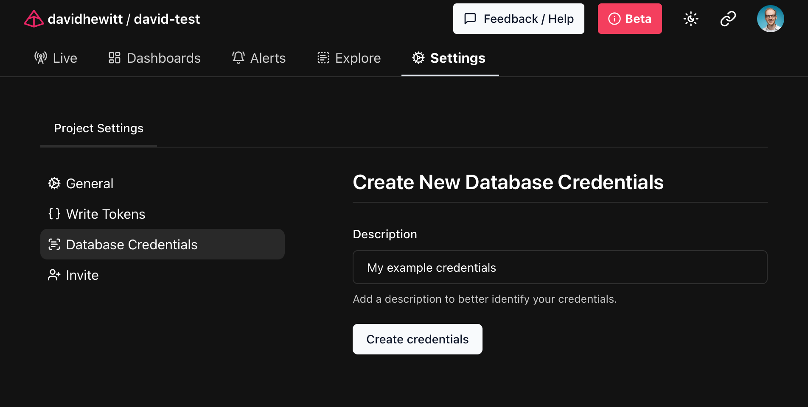

# Direct Database Connections

The Logfire platform allows you to connect and run SQL queries against your data using PostgreSQL syntax.

By doing this, you can connect your existing tools such as Grafana, Metabase, Superset, or anything else with support for querying PostgreSQL sources.

## Generating credentials

To connect, you'll first need to generate generate Database Credentials from your project page at `https://logfire.pydantic.dev/<organization>/<project>/settings/database-credentials`



The credentials generated are a PostgreSQL URI which can be used as a connection string for compatible tools. These will only be shown by the Logfire platform once, so save them to a secure location for future use!

## Example: pgcli

`pgcli` is a command-line tool to access PostgreSQL databases.

Using the credentials generated in the previous step as the argument to `pgcli`, you can connect directly to logfire:

```
$ pgcli postgresql://<user>:<password>@db.logfire.dev:5432/proj_david-test  # REDACTED
Version: 4.0.1
Home: http://pgcli.com
proj_david-test> select start_timestamp, message from records limit 10;
+-------------------------------+----------------------------------------+
| start_timestamp               | message                                |
|-------------------------------+----------------------------------------|
| 2024-04-28 10:50:41.681886+00 | action=view-faq size=549 i=0           |
| 2024-04-28 10:50:41.711747+00 | GET /contact/ http send response.body  |
| 2024-04-28 10:50:41.665576+00 | GET /contact/                          |
| 2024-04-28 10:50:41.711119+00 | GET /contact/ http send response.start |
| 2024-04-28 10:50:41.709458+00 | response 500                           |
| 2024-04-28 10:50:38.50534+00  | action=view-cart size=517 i=0          |
| 2024-04-28 10:50:39.446668+00 | action=view-faq size=637 i=2           |
| 2024-04-28 10:50:38.681198+00 | action=view-terms size=216 i=3         |
| 2024-04-28 10:50:39.416706+00 | action=view-product size=380 i=0       |
| 2024-04-28 10:50:38.394237+00 | sub-sub-sub-action=logout              |
+-------------------------------+----------------------------------------+
SELECT 10
Time: 0.218s
```

With the flexibility of PostgreSQL access available to you, we can't wait to hear what you do with the Logfire platform!
