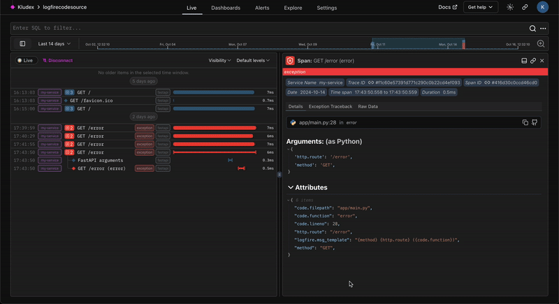

!!! warning "Experimental"
    This feature is experimental and may change in the future.

    Please give us feedback on [Slack][slack].

We support linking to the source code on GitHub, or any other VCS provider.



## Usage

To enable source code linking with Logfire, you need to configure your project. Here's how:

```python
import logfire

logfire.configure(
    code_source=logfire.CodeSource(
        repository='https://github.com/pydantic/logfire',
        revision='main',
        root_path='.',
    )
)
```

You can check more about it on the [`logfire.CodeSource`][logfire.CodeSource] on our API reference.

| Parameter | Description |
| --- | --- |
| `repository` | The URL of the repository e.g. `https://github.com/pydantic/logfire` |
| `revision` | The specific branch, tag, or commit hash to link to e.g. `main` |
| `root_path` | The path to the root of the repository. If your code is in a subdirectory, you can specify it here. |

## Alternative Configuration

You can configure these settings using the [`OTEL_RESOURCE_ATTRIBUTES`][otel-resource-attributes] environment variable:

```
OTEL_RESOURCE_ATTRIBUTES=vcs.repository.url.full=https://github.com/pydantic/platform
OTEL_RESOURCE_ATTRIBUTES=${OTEL_RESOURCE_ATTRIBUTES},vcs.repository.ref.revision=main
OTEL_RESOURCE_ATTRIBUTES=${OTEL_RESOURCE_ATTRIBUTES},vcs.root.path=.
```

[slack]: https://join.slack.com/t/pydanticlogfire/shared_invite/zt-2b57ljub4-936siSpHANKxoY4dna7qng
[otel-resource-attributes]: https://opentelemetry.io/docs/specs/otel/configuration/sdk-environment-variables/#general-sdk-configuration
