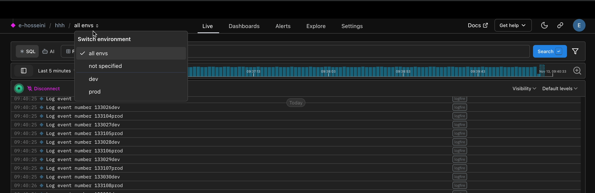

As a developer, we find ourselves working on differents environments for a project: local, production, sometimes staging, and depending on your company deployment strategy... You can have even more! 😅

With **Logfire** you can distinguish which environment you are sending data to.
You just need to set the `environment` parameter in [`logfire.configure()`][logfire.configure]

    ```py title="main.py"
    import logfire

    logfire.configure(environment='local')  # (1)!
    ```
(1) Usually you would retrieve the environment information from an environment variable.

Under the hood, this sets the OTel [`deployment.environment.name`](https://opentelemetry.io/docs/specs/semconv/resource/deployment-environment/).
Note that you can also set this via the `LOGFIRE_ENVIRONMENT` environment variable.

#### Setting environments in other languages

If you are using languages other than Python, you can set the environment like this:
`OTEL_RESOURCE_ATTRIBUTES="deployment.environment.name=prod"`

---

Once set, you will see your environment in the Logfire UI `all envs` dropdown, which appears
on the [Live View](../web-ui/live.md), [Dashboards](../web-ui/dashboards.md) and [Explore](../web-ui/explore.md) pages:



Note that by default there are system generated environments:

- `all envs`: Searches will include everything, including spans that had no environment set.
- `not specified`: Searches will *only* include spans that had no environment set

So `not specified` is a subset of `all envs`.

Any environments you create via the SDK will appear below the system generated environments.
When you select an environment, all subsequent queries (e.g. on live view, dashboards or explore)
will filter by that environment.

## Can I create an environment in the UI?

No, you cannot create or delete set environments via the UI, instead use the SDK.

## How do I delete an environment?

Once an environment has been configured and received by logfire, technically it’s available for
the length of the data retention period while that environment exists in the data.
You can however add new ones, and change the configuration of which data is assigned to which
environment name.

## Should I use environments or projects?

Environments are more lightweight than projects. Projects give you the ability to assign specific
user groups and permissions levels (see this [organization structure diagram](../../reference/organization-structure.md)
for details). So if you need to allow different team members to view dev vs. prod traces, then projects would be a better fit.
