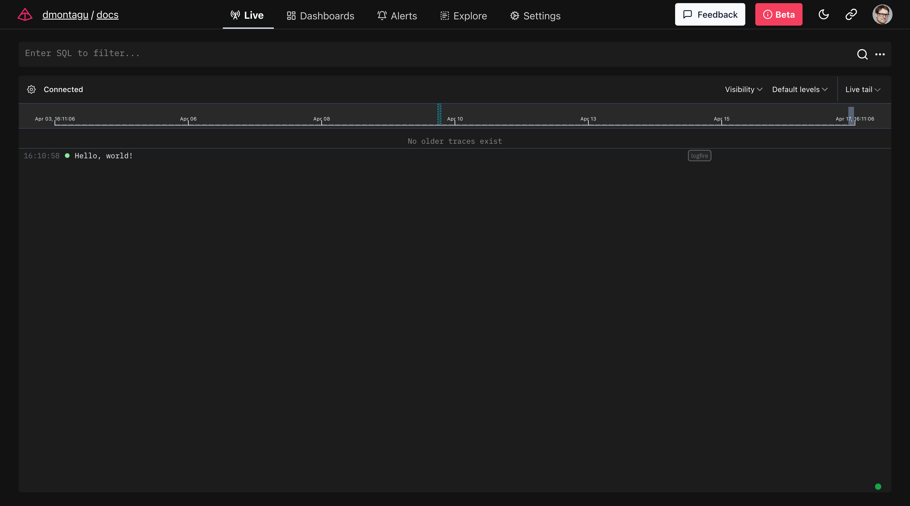

This guide will walk you through getting started with **Logfire**.
You'll learn how to install Logfire, authenticate your local environment,
and use traces and spans to instrument your code for observability.

## OpenTelemetry Concepts

Before diving in, let's briefly cover two fundamental OpenTelemetry concepts:

- **Traces:** A trace represents the entire journey of a request or operation as it moves through a
  (possibly distributed) system. It's composed of one or more spans.
- **Spans:** A span represents a unit of work within a trace, and are a way to track the execution of your code.
  Unlike traditional logs, which contain a message at a single moment in time, spans can be nested to form a tree-like
  structure, with a root span representing the overall operation, and child spans representing sub-operations.
  Spans are used to measure timing and record metadata about the work being performed.

In Logfire, we'll frequently visualize traces as a tree of its spans:


Using traces and spans, you can gain valuable insights into your system's behavior and performance.

## Installation {#install}

To install the latest version of **Logfire**, run:

{{ install_logfire() }}

=== "Conda"
    If you have used [`conda`](https://docs.conda.io/en/latest/) to create your virtual environment, you can
    install `logfire` using:
    ```bash
    conda install logfire -c conda-forge
    ```

## Authentication

Authenticate your local environment with **Logfire** by running:

```bash
logfire auth
```

This opens a browser window to sign up or log in at [dash.logfire.dev](https://dash.logfire.dev).
Upon successful authentication, credentials are stored in `~/.logfire/default.toml`.

## Basic Usage

The first time you use Logfire in a new environment, you'll need to set up a project. A Logfire project is like a
namespace for organizing your data. All data sent to Logfire must be associated with a project.

To use Logfire, simply import it and call the desired logging function:

```py
import logfire

logfire.info('Hello, {name}!', name='world')  # (1)!
```

1. This will log `Hello world!` with `info` level.

!!! note

    Other [log levels][logfire.Logfire] are also available to use, including `trace`, `debug`, `notice`, `warn`,
    `error`, and `fatal`.

If you don't have existing credentials for a Logfire project, you'll see a prompt in your terminal to create a new
project:

```bash
No Logfire project credentials found.
All data sent to Logfire must be associated with a project.

The project will be created in the organization "dmontagu". Continue? [y/n] (y):
Enter the project name (platform): my-project
Project initialized successfully. You will be able to view it at: http://dash.logfire.dev/dmontagu/my-project
Press Enter to continue:
```

Here's what happens:

1. Logfire detects that no project credentials exist and prompts you to create a new project.
2. You're asked to confirm the organization where the project will be created (defaulting to your personal
   organization).
3. You enter a name for your new project (defaulting to the name of the folder your script is running from).
4. Logfire initializes the project and provides the URL where you can view your project's data.
5. Press Enter to continue, and the script will proceed.

After this one-time setup, Logfire will use the newly created project credentials for subsequent Python runs from the
same directory.

Once you've created a project (or if you already had one), you should see:

```bash
Logfire project URL: http://dash.logfire.dev/dmontagu/my-project
19:52:12.323 Hello, world!
```

Logfire will always start by displaying the URL of your project, and (with default configuration) will also provide a
basic display in the terminal of the logs you are sending to Logfire.



## Tracing with Spans

Spans let you add context to your logs and measure code execution time. Multiple spans combine to form a trace,
providing a complete picture of an operation's journey through your system.

```py
from pathlib import Path
import logfire

cwd = Path.cwd()
total_size = 0

with logfire.span('counting size of {cwd=}', cwd=cwd):
    for path in cwd.iterdir():
        if path.is_file():
            with logfire.span('reading {file}', file=path):
                total_size += len(path.read_bytes())

    logfire.info('total size of {cwd} is {size} bytes', cwd=cwd, size=total_size)
```

In this example:

1. The outer span measures the time to count the total size of files in the current directory (`cwd`).
2. Inner spans measure the time to read each individual file.
3. Finally, the total size is logged.


By instrumenting your code with traces and spans, you can see how long operations take, identify bottlenecks,
and get a high-level view of request flows in your system — all invaluable for maintaining the performance and
reliability of your applications.

[conda]: https://conda.io/projects/conda/en/latest/user-guide/install/index.html
