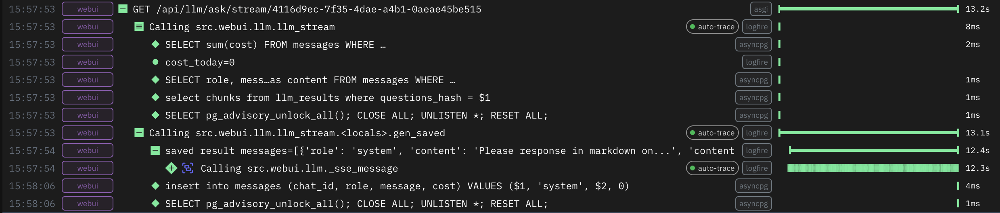
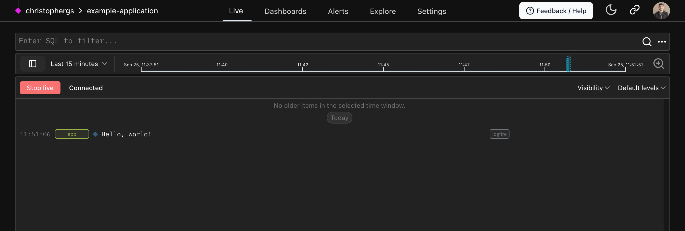
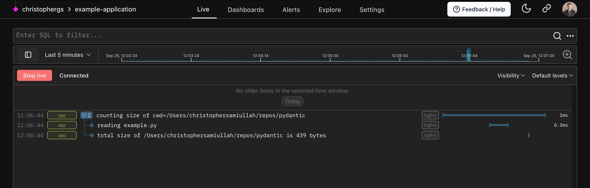

This guide will walk you through getting started with **Logfire**.
You'll learn how to install Logfire, authenticate your local environment,
and use traces and spans to instrument your code for observability.

## OpenTelemetry Concepts

Before diving in, let's briefly cover two fundamental OpenTelemetry concepts:

- **Traces:** A trace represents the entire journey of a request or operation as it moves through a
  (possibly distributed) system. It's composed of one or more spans.
- **Spans:** A span represents a unit of work within a trace, and are a way to track the execution of your code.
  Unlike traditional logs, which contain a message at a single moment in time, spans can be nested to form a tree-like
  structure, with a root span representing the overall operation, and child spans representing sub-operations.
  Spans are used to measure timing and record metadata about the work being performed.

In Logfire, we'll frequently visualize traces as a tree of its spans:



Using traces and spans, you can gain valuable insights into your system's behavior and performance.

## Installation {#install}

To install the latest version of **Logfire**, run:

{{ install_logfire() }}

## Authentication

Authenticate your local environment with **Logfire** by running:

```bash
logfire auth
```

This opens a browser window to sign up or log in at [logfire.pydantic.dev](https://logfire.pydantic.dev).
Upon successful authentication, credentials are stored in `~/.logfire/default.toml`.

## Basic Usage

The first time you use **Logfire** in a new environment, you'll need to set up a project.
A **Logfire** project is a namespace for organizing your data. All data sent to **Logfire** must be associated with a project.

To use **Logfire**, it's simple as:

```py
import logfire

logfire.configure()  # (1)!
logfire.info('Hello, {name}!', name='world')  # (2)!
```

1. The `configure()` should be called once before logging to initialize **Logfire**.
2. This will log `Hello world!` with `info` level.

!!! note

    Other [log levels][logfire.Logfire] are also available to use, including `trace`, `debug`, `notice`, `warn`,
    `error`, and `fatal`.

If you don't have existing credentials for a project, you'll be prompted to select one of your projects, or create a new one:


If you don't have any projects yet, write `"n"` and `"Enter"` to create a new project.

You'll then be asked to select your organization, and to provide a name for your new project:


You have created a new project in **Logfire**! :partying_face:

After this one-time setup, **Logfire** will use the newly created project credentials for subsequent Python runs from the
same directory.

??? success "You can also create a project via Web UI..."
    To create a new project within the UI, you can follow these steps:

    1. Go to the [Logfire Web UI](https://logfire.pydantic.dev).

    

    2. Click on the `New Project` button, fill the form that appears, and click `Create Project`.

    

    Done! You have created a new project in **Logfire**! :sunglasses:

??? success "You can also create a project via CLI..."
    Check the [SDK CLI documentation](../../reference/cli.md#create-projects-new) for more information on how to create a project via CLI.

Once you've created a project, you should see:

```bash
Logfire project URL: https://logfire.pydantic.dev/dmontagu/my-project
19:52:12.323 Hello, world!
```

**Logfire** will always start by displaying the URL of your project, and (with default configuration) will also provide a
basic display in the terminal of the logs you are sending to Logfire.



## Tracing with Spans

Spans let you add context to your logs and measure code execution time. Multiple spans combine to form a trace,
providing a complete picture of an operation's journey through your system.

```py
from pathlib import Path
import logfire

cwd = Path.cwd()
total_size = 0

logfire.configure()

with logfire.span('counting size of {cwd=}', cwd=cwd):
    for path in cwd.iterdir():
        if path.is_file():
            with logfire.span('reading {file}', file=path):
                total_size += len(path.read_bytes())

    logfire.info('total size of {cwd} is {size} bytes', cwd=cwd, size=total_size)
```

In this example:

1. The outer span measures the time to count the total size of files in the current directory (`cwd`).
2. Inner spans measure the time to read each individual file.
3. Finally, the total size is logged.



By instrumenting your code with traces and spans, you can see how long operations take, identify bottlenecks,
and get a high-level view of request flows in your system — all invaluable for maintaining the performance and
reliability of your applications.

[conda]: https://conda.io/projects/conda/en/latest/user-guide/install/index.html
