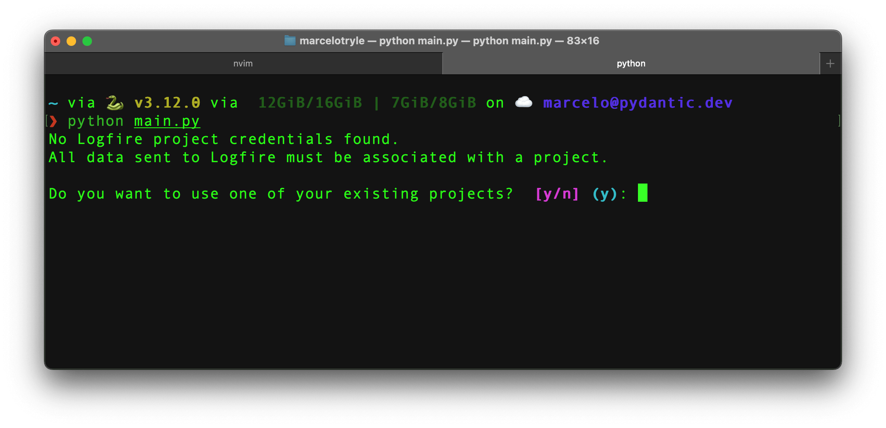
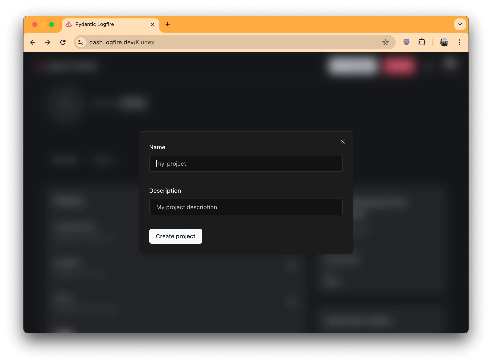

Since you are already authenticated, you can now create a new project in **Logfire**.

To create a new project, you can import `logfire`, and call [`logfire.configure()`][logfire.configure].

```py
import logfire

logfire.configure()
```

You'll then be prompted to select one of your projects, or create a new one:



If you don't have any projects yet, write `"n"` and `"Enter"` to create a new project.

You'll then be asked to select your organization, and to provide a name for your new project:


You have created a new project in **Logfire**! :partying_face:

??? success "You can also create a project via Web UI..."
    To create a new project within the UI, you can follow these steps:

    1. Go to the [Logfire Web UI](https://dash.logfire.dev/).

    

    2. Click on the `New Project` button, fill the form that appears, and click `Create Project`.

    

    Done! You have created a new project in **Logfire**! :sunglasses:

??? success "You can also create a project via CLI..."
    Check the [SDK CLI documentation](../../reference/cli.md#create-projects-new) for more information on how to create a project via CLI.
