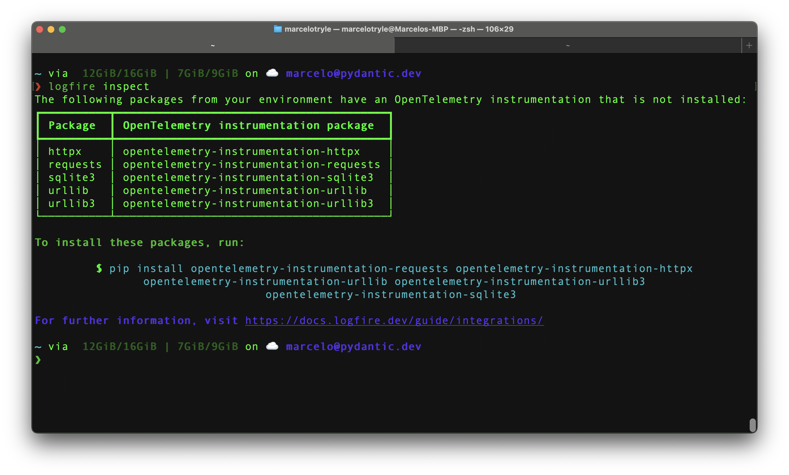
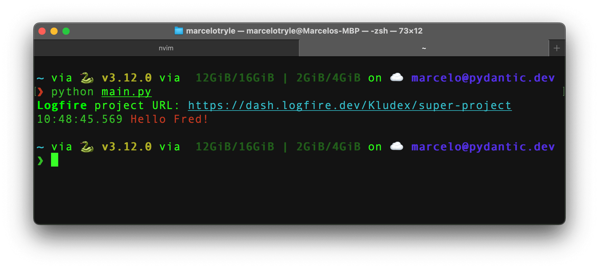
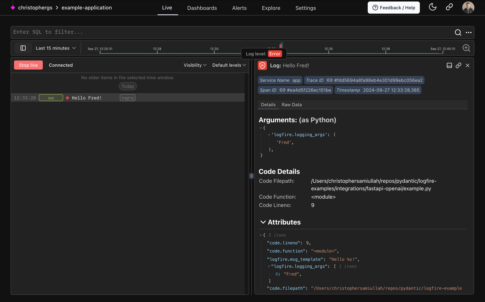

This step assumes you've already [sent your first trace](../../first-trace.md), which installs the SDK and calls
`logfire.configure()`. Here we integrate **Logfire** more fully with your application: the instrumentation packages for
the libraries you already use, and your existing logging.

## OpenTelemetry Instrumentation

**Logfire** works with any [OpenTelemetry] instrumentation package (a plug-in that automatically traces a specific
library or framework), and includes a CLI command that highlights instrumentation your project is missing.

To inspect your project, run the following command:

```bash
logfire inspect
```

This lists the packages you need to install for OpenTelemetry instrumentation:



To install the missing packages, copy the command provided by the `inspect` command, and run it in your terminal.

Each instrumentation package has its own way to be configured. Check our [Integrations][integrations] page to
learn how to configure them.


## Logging Integration (Optional)

!!! warning "Attention"
    If you are creating a new application or are not using a logging system, you can skip this step.

    You should use **Logfire** itself to collect logs from your application.

    All the standard logging methods are supported e.g. [`logfire.info()`][logfire.Logfire.info].

There are many logging systems within the Python ecosystem, and **Logfire** provides integrations for the most popular ones:
[Standard Library Logging](../../integrations/logging.md), [Loguru](../../integrations/loguru.md), and
[Structlog](../../integrations/structlog.md).

### Standard Library

To integrate **Logfire** with the standard library logging module, you can use the
[`LogfireLoggingHandler`][logfire.integrations.logging.LogfireLoggingHandler] class.

The minimal configuration would be the following:

```py hl_lines="5-6" skip-run="true" skip-reason="global-state"
from logging import basicConfig

import logfire

logfire.configure()
basicConfig(handlers=[logfire.LogfireLoggingHandler()])
```

Now imagine, that you have a logger in your application:

```py title="main.py" hl_lines="8-9" skip-run="true" skip-reason="global-state"
from logging import basicConfig, getLogger

import logfire

logfire.configure()
basicConfig(handlers=[logfire.LogfireLoggingHandler()])

logger = getLogger(__name__)
logger.error('Hello %s!', 'Fred')
```

If we run the above code, with `python main.py`, we will see the following output:



If you go to the link, you will see the `"Hello Fred!"` log in the Web UI:



### Loguru

To integrate with Loguru, check out the [Loguru] page.

### Structlog

To integrate with Structlog, check out the [Structlog] page.

## Next step

**[Add manual tracing](add-manual-tracing.md)**: create your own spans and logs to record exactly the operations you care about.

[inspect-command]: ../../reference/cli.md#inspect-inspect
[integrations]: ../../integrations/index.md
[OpenTelemetry]: https://opentelemetry.io/
[Loguru]: ../../integrations/loguru.md
[Structlog]: ../../integrations/structlog.md
