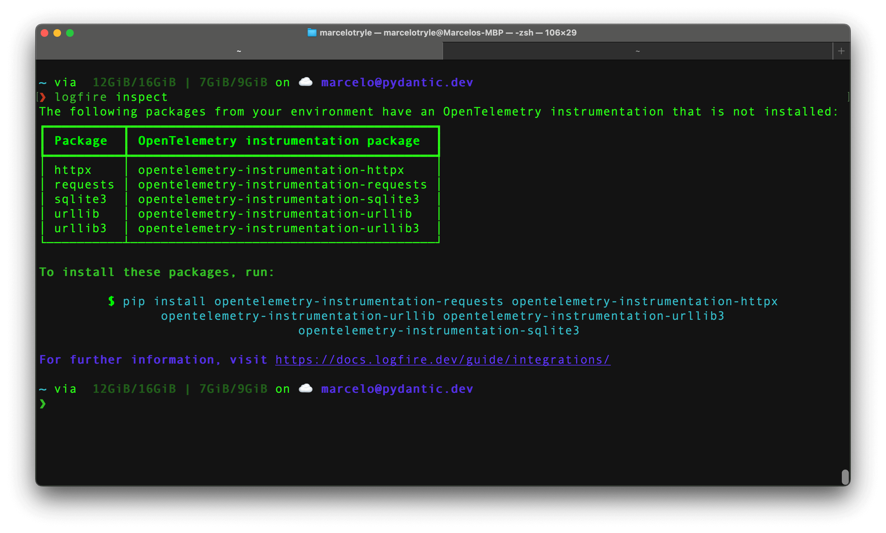
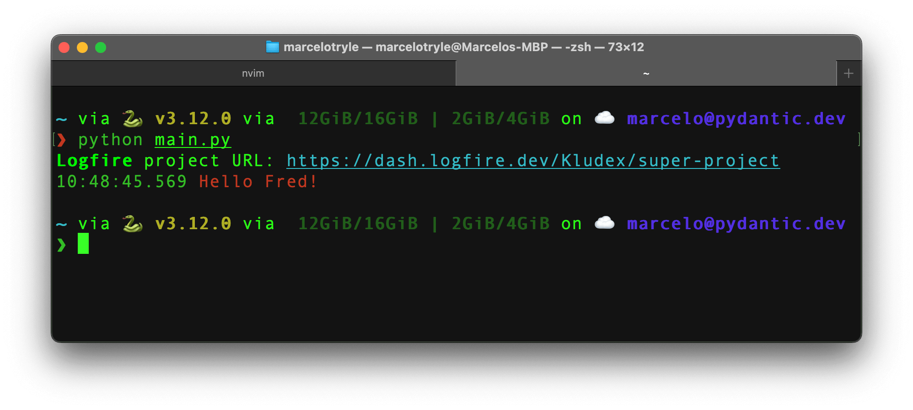
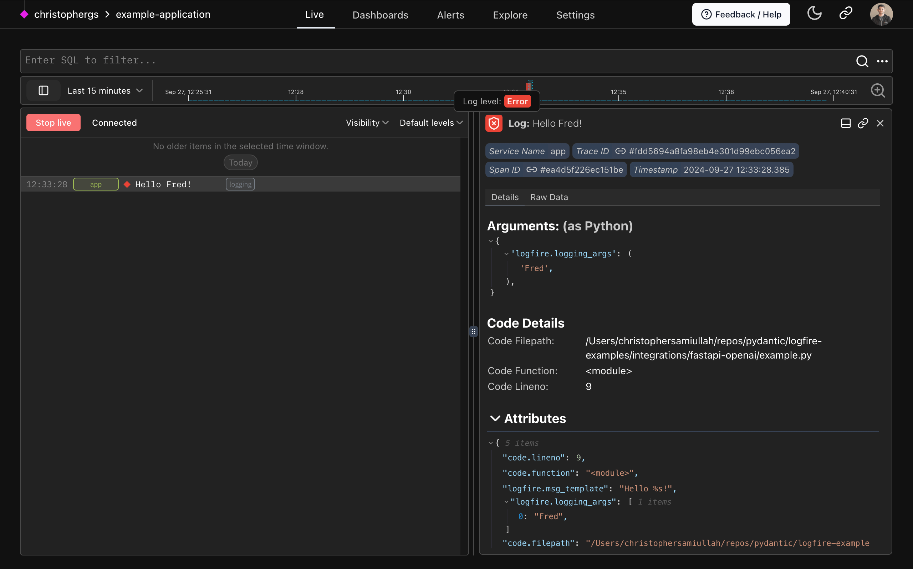

In this section, we'll focus on integrating **Logfire** with your application.

## OpenTelemetry Instrumentation

Harnessing the power of [OpenTelemetry], **Logfire** not only offers broad compatibility with any [OpenTelemetry]
instrumentation package, but also includes a user-friendly CLI command that effortlessly highlights any
missing components in your project.

To inspect your project, run the following command:

```bash
logfire inspect
```

This will output the projects you need to install to have optimal OpenTelemetry instrumentation:



To install the missing packages, copy the command provided by the `inspect` command, and run it in your terminal.

Each instrumentation package has its own way to be configured. Check our [Integrations][integrations] page to
learn how to configure them.


## Logging Integration (Optional)

!!! warning "Attention"
    If you are creating a new application or are not using a logging system, you can skip this step.

    You should use **Logfire** itself to collect logs from your application.

    All the standard logging methods are supported e.g. [`logfire.info()`][logfire.Logfire.info].

There are many logging systems within the Python ecosystem, and **Logfire** provides integrations for the most popular ones:
[Standard Library Logging](../../integrations/logging.md), [Loguru](../../integrations/loguru.md), and
[Structlog](../../integrations/structlog.md).

### Standard Library

To integrate **Logfire** with the standard library logging module, you can use the
[`LogfireLoggingHandler`][logfire.integrations.logging.LogfireLoggingHandler] class.

The minimal configuration would be the following:

```py hl_lines="5"
from logging import basicConfig

import logfire

logfire.configure()
basicConfig(handlers=[logfire.LogfireLoggingHandler()])
```

Now imagine, that you have a logger in your application:

```py hl_lines="7-8" title="main.py"
from logging import basicConfig, getLogger

import logfire

logfire.configure()
basicConfig(handlers=[logfire.LogfireLoggingHandler()])

logger = getLogger(__name__)
logger.error("Hello %s!", "Fred")
```

If we run the above code, with `python main.py`, we will see the following output:



If you go to the link, you will see the `"Hello Fred!"` log in the Web UI:



It is simple as that! Cool, right? 🤘

### Loguru

To integrate with Loguru, check out the [Loguru] page.

### Structlog

To integrate with Structlog, check out the [Structlog] page.

[inspect-command]: ../../reference/cli.md#inspect-inspect
[integrations]: ../../integrations/index.md
[OpenTelemetry]: https://opentelemetry.io/
[Loguru]: ../../integrations/loguru.md
[Structlog]: ../../integrations/structlog.md
