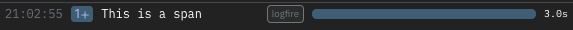
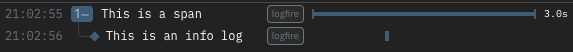
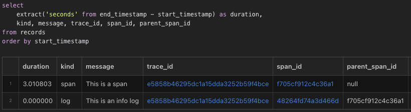

# Spans, logs, and traces

Here's a simple example of using Logfire:

```python
import time

import logfire

logfire.configure()

with logfire.span('This is a span'):
    time.sleep(1)
    logfire.info('This is an info log')
    time.sleep(2)
```

If you run this it should print something like:

```
Logfire project URL: https://logfire.pydantic.dev/my_username/my_project_name
21:02:55.078 This is a span
21:02:56.084   This is an info log
```

Opening the project URL should show something like this in the live view:



The blue box with `1+` means that the span contains 1 direct child. Clicking on that box expands the span to reveal its children:



Note that:

1. Any spans or logs created inside the `with logfire.span(...):` block will be children of that span. This lets you organize your logs nicely in a structured tree. You can also see this parent-child relationship in the console logs based on the indentation.
2. Spans have a start and an end time, and thus a duration. This span took 3 seconds to complete.
3. For logs, the start and end time are the same, so they don't have a duration. But you can still see in the UI that the log was created 1 second after the span started and 2 seconds before it ended.

If you click on the 'Explore' link in the top navbar, you can write SQL to explore further, e.g:



Note:

1. Spans and logs are stored together in the same `records` table.
2. The `parent_span_id` of the log is the `span_id` of the span.
3. Both have the same `trace_id`. You can click on it to open a new tab in the Live view filtered to that _trace_.

A _trace_ is a tree of spans/logs sharing the same root. Whenever you create a new span/log when there's no active span, a new trace is created. If it's a span, any descendants of that span will be part of the same trace. To keep your logs organized nicely into traces, it's best to create spans at the top level representing high level operations such as handling web server requests.

# Attributes
