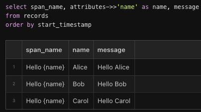

# Spans, logs, and traces

Here's a simple example of using Logfire:

```python
import time

import logfire

logfire.configure()

with logfire.span('This is a span'):
    time.sleep(1)
    logfire.info('This is an info log')
    time.sleep(2)
```

If you run this it should print something like:

```
Logfire project URL: https://logfire.pydantic.dev/my_username/my_project_name
21:02:55.078 This is a span
21:02:56.084   This is an info log
```

Opening the project URL should show something like this in the live view:


The blue box with `1+` means that the span contains 1 direct child. Clicking on that box expands the span to reveal its children:


Note that:

1. Any spans or logs created inside the `with logfire.span(...):` block will be children of that span. This lets you organize your logs nicely in a structured tree. You can also see this parent-child relationship in the console logs based on the indentation.
2. Spans have a start and an end time, and thus a duration. This span took 3 seconds to complete.
3. For logs, the start and end time are the same, so they don't have a duration. But you can still see in the UI that the log was created 1 second after the span started and 2 seconds before it ended.

If you click on the 'Explore' link in the top navbar, you can write SQL to explore further, e.g:


Note:

1. Spans and logs are stored together in the same `records` table.
2. The `parent_span_id` of the log is the `span_id` of the span.
3. Both have the same `trace_id`. You can click on it to open a new tab in the Live view filtered to that _trace_.

A _trace_ is a tree of spans/logs sharing the same root. Whenever you create a new span/log when there's no active span, a new trace is created. If it's a span, any descendants of that span will be part of the same trace. To keep your logs organized nicely into traces, it's best to create spans at the top level representing high level operations such as handling web server requests.

# Attributes

Spans and logs can have structured data attached to them, e.g:

```python
logfire.info('Hello', name='world')
```

If you click on the 'Hello' log in the Live view, you should see this in the details panel on the right:


This data is stored in the `attributes` column in the `records` table as JSON. You can use e.g. `attributes->>'name' = 'world'` in the SQL filter at the top of the Live view to show only this log. This is used as the `WHERE` clause of a SQL query on the `records` table.

Both spans and logs can have attributes containing arbitrary values which will be intelligently serialized to JSON as needed. You can pass any keyword arguments to set attributes as long as they don't start with an underscore (`_`). That namespace is reserved for other keyword arguments with logfire-specific meanings.

Sometimes it's useful to attach an attribute to a span after it's been created but before it's finished. You can do this by calling the `span.set_attribute` method:

```python
with logfire.span('Calculating...') as span:
    result = 1 + 2
    span.set_attribute('result', result)
```

# Messages and span names

If you run this code:

```python
import logfire

logfire.configure()

for name in ['Alice', 'Bob', 'Carol']:
    logfire.info('Hello {name}', name=name)
```



Here you can see that:

1. The first argument `'Hello {name}'` becomes the value of the `span_name` column. You can use this to find all records coming from the same code even if the messages are different, e.g. with the SQL filter `span_name = 'Hello {name}'`.
2. The span name is also used as a `str.format`-style template which is formatted with the attributes to produce the `message` column. The message is what's shown in the console logs and the Live view.

You can also set `span.message` after a span is started but before it's finished, e.g:

```python
with logfire.span('Calculating...') as span:
    result = 1 + 2
    span.message = f'Calculated: {result}'
```

You could use `message` to filter for related records, e.g. `message like 'Hello%'`, but filtering on the `span_name` column is more efficient because it's indexed. Similarly, it's better to use `span_name = 'Hello {name}' and attributes->>'name' = 'Alice'` than `message = 'Hello Alice'`.

To allow efficiently filtering for related records, span names should be _low cardinality_, meaning they shouldn't vary too much. For example, this would be bad:

```python
name = get_username()
logfire.info('Hello ' + name, name=name)
```

because now the `span_name` column will have a different value for every username. But this would be fine:

```python
word = 'Goodbye' if leaving else 'Hello'
logfire.info(word + ' {name}', name=name)
```

because now the `span_name` column will only have two values (`'Goodbye {name}'` and `'Hello {name}'`) and it's both easier and more efficient to filter on `span_name = 'Hello {name}'` than `span_name = '{word} {name}' and attributes->>'word' = 'Hello'`.

You can use the `_span_name` argument when you want the span name to be different from the message template, e.g:

```python
logfire.info('Hello {name}', name='world', _span_name='Hello')
```

This will set the `span_name` to `'Hello'` and the `message` to `'Hello world'`. Note that the `_span_name` argument starts with an underscore to distinguish it from attributes.

# f-strings
