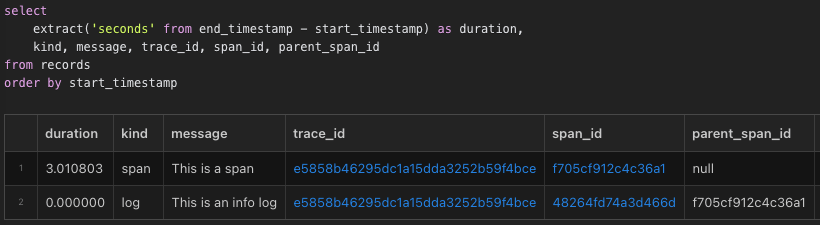
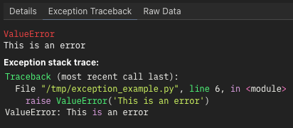

# Spans, logs, and traces

Here's a simple example of using Logfire:

```python
import time

import logfire

logfire.configure()

with logfire.span('This is a span'):
    time.sleep(1)
    logfire.info('This is an info log')
    time.sleep(2)
```

If you run this it should print something like:

```
Logfire project URL: https://logfire.pydantic.dev/my_username/my_project_name
21:02:55.078 This is a span
21:02:56.084   This is an info log
```

Opening the project URL should show something like this in the live view:


The blue box with `1+` means that the span contains 1 direct child. Clicking on that box expands the span to reveal its children:


Note that:

1. Any spans or logs created inside the `with logfire.span(...):` block will be children of that span. This lets you organize your logs nicely in a structured tree. You can also see this parent-child relationship in the console logs based on the indentation.
2. Spans have a start and an end time, and thus a duration. This span took 3 seconds to complete.
3. For logs, the start and end time are the same, so they don't have a duration. But you can still see in the UI that the log was created 1 second after the span started and 2 seconds before it ended.

If you click on the 'Explore' link in the top navbar, you can write SQL to explore further, e.g:



Note:

1. Spans and logs are stored together in the same `records` table.
2. The `parent_span_id` of the log is the `span_id` of the span.
3. Both have the same `trace_id`. You can click on it to open a new tab in the Live view filtered to that _trace_.

A _trace_ is a tree of spans/logs sharing the same root. Whenever you create a new span/log when there's no active span, a new trace is created. If it's a span, any descendants of that span will be part of the same trace. To keep your logs organized nicely into traces, it's best to create spans at the top level representing high level operations such as handling web server requests.

# Attributes

Spans and logs can have structured data attached to them, e.g:

```python
logfire.info('Hello', name='world')
```

If you click on the 'Hello' log in the Live view, you should see this in the details panel on the right:


This data is stored in the `attributes` column in the `records` table as JSON. You can use e.g. `attributes->>'name' = 'world'` in the SQL filter at the top of the Live view to show only this log. This is used as the `WHERE` clause of a SQL query on the `records` table.

Both spans and logs can have attributes containing arbitrary values which will be intelligently serialized to JSON as needed. You can pass any keyword arguments to set attributes as long as they don't start with an underscore (`_`). That namespace is reserved for other keyword arguments with logfire-specific meanings.

Sometimes it's useful to attach an attribute to a span after it's been created but before it's finished. You can do this by calling the `span.set_attribute` method:

```python
with logfire.span('Calculating...') as span:
    result = 1 + 2
    span.set_attribute('result', result)
```

# Messages and span names

If you run this code:

```python
import logfire

logfire.configure()

for name in ['Alice', 'Bob', 'Carol']:
    logfire.info('Hello {name}', name=name)
```


Here you can see that:

1. The first argument `'Hello {name}'` becomes the value of the `span_name` column. You can use this to find all records coming from the same code even if the messages are different, e.g. with the SQL filter `span_name = 'Hello {name}'`.
2. The span name is also used as a `str.format`-style template which is formatted with the attributes to produce the `message` column. The message is what's shown in the console logs and the Live view.

You can also set `span.message` after a span is started but before it's finished, e.g:

```python
with logfire.span('Calculating...') as span:
    result = 1 + 2
    span.message = f'Calculated: {result}'
```

You could use `message` to filter for related records, e.g. `message like 'Hello%'`, but filtering on the `span_name` column is more efficient because it's indexed. Similarly, it's better to use `span_name = 'Hello {name}' and attributes->>'name' = 'Alice'` than `message = 'Hello Alice'`.

To allow efficiently filtering for related records, span names should be _low cardinality_, meaning they shouldn't vary too much. For example, this would be bad:

```python
name = get_username()
logfire.info('Hello ' + name, name=name)
```

because now the `span_name` column will have a different value for every username. But this would be fine:

```python
word = 'Goodbye' if leaving else 'Hello'
logfire.info(word + ' {name}', name=name)
```

because now the `span_name` column will only have two values (`'Goodbye {name}'` and `'Hello {name}'`) and it's both easier and more efficient to filter on `span_name = 'Hello {name}'` than `span_name = '{word} {name}' and attributes->>'word' = 'Hello'`.

You can use the `_span_name` argument when you want the span name to be different from the message template, e.g:

```python
logfire.info('Hello {name}', name='world', _span_name='Hello')
```

This will set the `span_name` to `'Hello'` and the `message` to `'Hello world'`. Note that the `_span_name` argument starts with an underscore to distinguish it from attributes.

# f-strings

Instead of this:

```python
logfire.info('Hello {name}', name=name)
```

it's much more convenient to use an f-string to avoid repeating `name` three times:

```python
logfire.info(f'Hello {name}')
```

Contrary to the previous section, this _will_ work well in Python 3.11+ because Logfire will use special magic to both set the `span_name` to `'Hello {name}'` and set the `name` attribute to the value of the `name` variable, so it's equivalent to the previous snippet. Here's what you need to know about this:

- The feature is enabled by default in Python 3.11+. You can disable it with `logfire.configure(inspect_arguments=False)`. You can also enable it in Python 3.9 and 3.10, but it's more likely to not work correctly.
- Inspecting arguments is expected to always work under normal circumstances. The main caveat is that the source code must be available, so e.g. deploying only `.pyc` files will cause it to fail.
- If inspecting arguments fails, you will get a warning, and the f-string argument will be treated as a normal string. This means you will get high-cardinality span names such as `'Hello Alice'` and no `name` attribute, but the information won't be completely lost.
- If inspecting arguments is enabled, then arguments will be inspected regardless of whether f-strings are being used. So if you write `logfire.info('Hello {name}', name=name)` and inspecting arguments fails, then you will still get a warning and `'Hello {name}'` will be used as the message rather than formatting it.
- The values inside f-strings are evaluated and formatted by Logfire a second time. This means you should avoid code like `logfire.info(f'Hello {get_username()}')` if `get_username()` (or the string conversion of whatever it returns) is expensive or has side effects.
- The first argument must be an actual f-string. `logfire.info(f'Hello {name}')` will work, but `message = f'Hello {name}'; logfire.info(message)` will not, nor will `logfire.info('Hello ' + name)`.
- Inspecting arguments is cached so that the performance overhead of repeatedly inspecting the same f-string is minimal. However, there is a non-negligible overhead of parsing a large source file the first time arguments need to be inspected inside it. Either way, avoiding this overhead requires disabling inspecting arguments entirely, not merely avoiding f-strings.

# Exceptions

The `logfire.span` context manager will automatically record any exceptions that cause it to exit, e.g:

```python
import logfire

logfire.configure()

with logfire.span('This is a span'):
    raise ValueError('This is an error')
```

If you click on the span in the Live view, the panel on the right will have an 'Exception Traceback' tab:



Exceptions which are caught and not re-raised will not be recorded, e.g:

```python
with logfire.span('This is a span'):
    try:
        raise ValueError('This is an acceptable error not worth recording')
    except ValueError:
        pass
```

If you want to record a handled exception, use the `span.record_exception` method:

```python
with logfire.span('This is a span') as span:
    try:
        raise ValueError('Catch this error, but record it')
    except ValueError as e:
        span.record_exception(e)
```

Alternatively, if you only want to log exceptions without creating a span for the normal case, you can use `logfire.exception`:

```python
try:
    raise ValueError('This is an error')
except ValueError:
    logfire.exception('Something went wrong')
```

`logfire.exception(...)` is equivalent to `logfire.error(..., _exc_info=True)`. You can also use `_exc_info` with the other logging methods if you want to record a traceback in a log with a non-error level. You can set `_exc_info` to a specific exception object if it's not the one being handled. Don't forget the leading underscore!

# Convenient function spans with `@logfire.instrument`

Often you want to wrap a whole function in a span. Instead of doing this:

```python
def my_function(x, y):
    with logfire.span('my_function', x=x, y=y):
        ...
```

you can use the [`@logfire.instrument`][logfire.Logfire.instrument] decorator:

```python
@logfire.instrument()
def my_function(x, y):
    ...
```

By default, this will add the function arguments to the span as attributes.
To disable this (e.g. if the arguments are large objects not worth collecting), use `instrument(extract_args=False)`.

The default span name will be something like `Calling module_name.my_function`.
You can pass an alternative span name as the first argument to `instrument`, and it can even be a template
into which arguments will be formatted, e.g:

```python
@logfire.instrument('Applying my_function to {x=} and {y=}')
def my_function(x, y):
    ...

my_function(3, 4)
# Logs: Applying my_function to x=3 and y=4
```

!!! note

    - The [`@logfire.instrument`][logfire.Logfire.instrument] decorator MUST be applied first, i.e., UNDER any other decorators.
    - The source code of the function MUST be accessible.

# Log levels

The following methods exist for creating logs with different levels:

- `logfire.trace`
- `logfire.debug`
- `logfire.info`
- `logfire.notice`
- `logfire.warn`
- `logfire.error`
- `logfire.fatal`

By default, `trace` and `debug` logs are hidden. You can change this by clicking the 'Default levels' dropdown in the Live view:


You can also set the minimum level used for console logging with `logfire.configure`, e.g:

```python
import logfire

logfire.configure(console=logfire.ConsoleOptions(min_log_level='debug'))
```

To log a message with a variable level you can use `logfire.log`, e.g. `logfire.log('info', 'This is an info log')` is equivalent to `logfire.info('This is an info log')`.

Spans are level `info` by default. You can change this with the `_level` argument, e.g. `with logfire.span('This is a debug span', _level='debug'):`. You can also change the level after the span has started but before it's finished with `span.set_level`, e.g:

```python
with logfire.span('Doing a thing') as span:
    success = do_thing()
    if not success:
        span.set_level('error')
```
