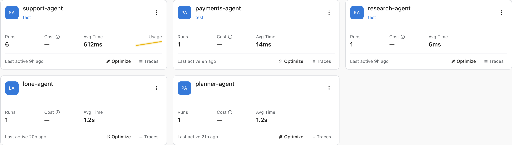
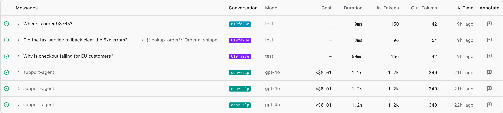
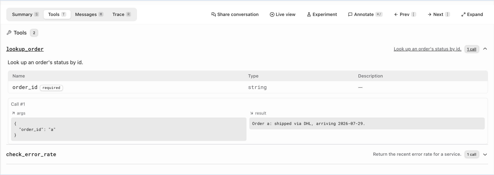
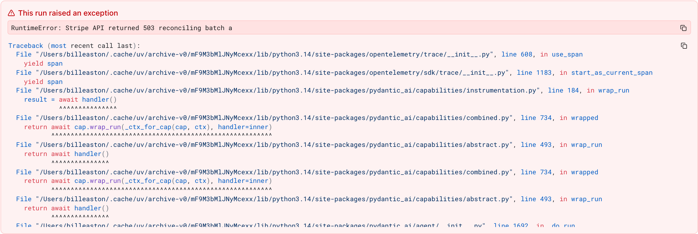

# Agents

The **Agents view** is the entry point for finding and inspecting the AI agents running in your application. Logfire discovers an agent automatically from your traces: any span that follows the [OpenTelemetry semantic conventions for generative AI (GenAI) agents](https://github.com/open-telemetry/semantic-conventions-genai/blob/main/docs/gen-ai/gen-ai-agent-spans.md), specifically an `invoke_agent` operation (`gen_ai.operation.name = 'invoke_agent'`), becomes an agent run. [Pydantic AI](https://ai.pydantic.dev) emits these spans natively, and any other SDK that follows the conventions appears here too.

You'll find Agents in the project sidebar. The time picker is shared with the rest of the observability surfaces.

## The Agents list

Each agent detected in the selected time window appears as one row, with its run count, cost, token usage, and when it was last active. Click a row to open that agent's detail page.

If you don't see an agent you expect, widen the time range: the list only reflects agent activity in the current window.

## Agent detail

The detail page has three tabs:

- **Metrics**: run volume, error rate, latency, cost, and token usage for the agent over time.
- **Runs**: every individual run of the agent (see below).
- **Info**: the agent's model, tools, and other metadata.

## The Runs tab

The Runs table lists one row per agent run, newest first, with:

- **Messages**: a preview of the run's latest user prompt and its final output. For a run that continues a conversation, this is the current turn's question, not the conversation's opening message.
- **Conversation**: a colored chip grouping runs that belong to the same conversation. Click a chip to filter the table to that conversation. Runs are grouped by `gen_ai.conversation.id`; Pydantic AI sets this per run and carries it forward when you pass `message_history`, so a multi-turn conversation stays together.
- **Model**, **Cost**, **Duration**, **In / Out tokens**, and **Time**.

Search the message text, or open **Filters** to narrow by model, cost, duration, token counts, or annotation state. Failed runs are marked with an error icon.

## Reviewing a single run

Click a row (or its `>` chevron) to expand the run detail inline; the **Expand** button opens the same view full screen. Move between runs with the **Prev / Next** buttons or the `[` and `]` keys, and jump between tabs with `S` / `T` / `M` / `R`.

A run detail has four tabs:

- **Summary**: a strip of the run's provider, model, token usage, cost, and duration; an AI-generated summary of what the run did (when AI features are enabled for your project); and the run's input and final output.
- **Tools**: a combined view of the tools the agent had available and how it used them. Each tool shows its parameter schema and a count of how many times it was called, and expands to the arguments and result of every call.
- **Messages**: the full conversation for the run.
- **Trace**: the underlying span tree, so you can drop into the raw trace.

If a run failed, a banner at the top of the Summary tab surfaces the exception type, message, and traceback, so you can see why it failed without leaving the page.

## Annotating a run

From a run's detail panel you can record a human judgment of its quality: a verdict, category, tags, and a comment. See [Annotate an agent run](../../evaluate/annotate-agent-runs.md) for the full workflow. Those ratings are the same [scores](../../evaluate/human-review.md) that power your [evaluations](../../evaluate/overview.md). Run-level annotations are in Beta (the `run_annotations` feature flag).

## Next steps

- [Annotate an agent run](../../evaluate/annotate-agent-runs.md): record a verdict, comment, and tags on a run.
- [Human Review](../../evaluate/human-review.md): the wider picture on scoring AI outputs by hand.
- [Pydantic AI](https://ai.pydantic.dev): the agent framework that emits these spans natively.
