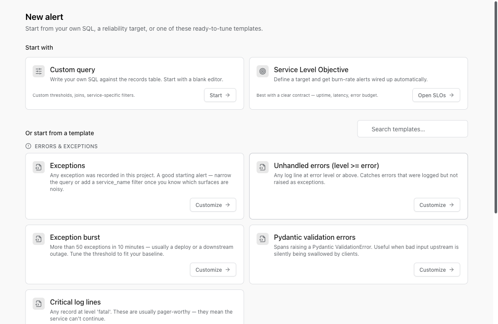

With **Logfire**, use Alerts to notify you when certain conditions are met.


## Create an alert

Let's see in practice how to create an alert.

1. Go to the **Alerts** section in the left sidebar.
2. Click the **New alert** button. You'll land on a picker offering three starting points:
    - **Custom query** — start from a blank SQL editor (use this if your scenario isn't covered below).
    - **Service Level Objective** — define a reliability target and Logfire wires up the burn-rate alerts automatically. Best when you have a clear contract (uptime, latency, error budget).
    - **Templates** — ready-to-tune alerts for common cases: exceptions, HTTP 5xx, slow database queries, LLM errors, queue backlog, and more. Each one prefills the name, description, query, and evaluation timing — you just tune the threshold and pick a channel.



Click **Customize** on any template (or **Start** on the custom-query card) to open the create form.


The **Query** field is where you define the conditions that will trigger the alert.
For example, you can set up an alert to notify you when the number of errors in your logs exceeds a certain threshold.

On our example, we're going to set up an alert that will trigger when an exception occurs in the `api` service
and the route is `/members/{user_id}`.

```sql
SELECT trace_id, exception_type, exception_message FROM records  -- (1)!
WHERE
    is_exception and
    service_name = 'api' and
    attributes->>'http.route' = '/members/{user_id}'  -- (2)!
```

1. The `SELECT ... FROM records` statement is the base query that will be executed. The **records** table contains the spans and logs data. `trace_id` links to the trace in the live view when viewing the alert run results in the web UI.
2. The `attributes` field is a JSON field that contains additional information about the record. In this case, we're using the `http.route` attribute to filter the records by route.

The **When this alert fires** section controls the evaluation: a **Fire when** condition (see [Notification modes](#notification-modes) below), a **Look at rows from** lookback window, and a **Check every** cadence. A friendly preview line under the controls spells out the resulting behavior in plain English.

The **Send notifications to** section is where you pick one or more notification channels. Without a channel the alert still evaluates and shows up on the Alerts page — it just won't notify anyone outside Logfire.

After filling in the form, click **Create alert**. And... Alert created! :tada:

## Notification modes

The **"Notify me when"** setting controls when you receive notifications. There are four modes:

### The query has any results

This is the default mode. You'll receive a notification **every time** the alert runs and the query returns one or more rows. This is useful for simple threshold alerts where you always want to be notified.

**Example use case:** Alert me every 5 minutes if there are any 5xx errors.

### The query starts or stops having results

You'll receive a notification when the query **transitions** between having results and not. If your query is written so that rows indicate a problem (e.g., selecting error spans), this means you'll be notified both when the issue starts and when it resolves.

**Example use case:** Alert me when my API starts experiencing high latency (over 1 second), and again when it recovers.

### The query starts having results

Same as above, but you'll **only** be notified on the transition from no rows to rows — not the other direction. If rows indicate a problem, this means you'll hear about the onset but not the resolution.

**Example use case:** Alert me when my service starts throwing exceptions, but don't notify me when it stops — I'll check resolution on my own schedule.

### The query's results change

You'll receive a notification whenever the **actual data** returned by the query changes between consecutive runs. This is more granular than the previous mode — it detects changes in the result set itself, not just whether there are results.

**Example use case:** Detect when a service goes down by querying for health check spans and [using a `CASE` expression](../../how-to-guides/detect-service-is-down.md) to return `'up'` or `'down'`. You'll be notified when the status changes in either direction.

## The Alerts overview

After creating an alert, you'll land on the Alerts overview page. The top of the page shows:

- **State tiles** — Firing, Flapping, OK, Snoozed, No data. Click a tile to filter the table to just those alerts. Hover any tile for a definition (e.g. *Flapping = 3+ firing↔clear crossings in the last 20 buckets*).
- **Alert activity** — a stacked bar chart of how many alerts were firing during each one-hour bucket. The y-axis is floored at 0–10 so a quiet day with a single firing doesn't look like an incident.

The list below has one row per alert with:

- **State** — a colored dot + label (`• Firing`, `• OK`, `• Snoozed`, `• Flapping`, `• No data`).
- **Activity** — a per-row sparkline of recent firings. Hover any bar to see whether the bucket was clear, snoozed, before the alert existed, or the alert was disabled during it.
- **Channels**, **Last run**, **Next run** — when the alert last ran and when it's scheduled next. For a disabled alert this reads *disabled*; for a snoozed one it shows when notifications resume (e.g. *after 23 minutes*).

Group the list by state, channel, or snooze status with the **Group by** dropdown, or filter by name with the search input.

## Snoozing

Use the **Snooze** action on a row to mute notifications until a deadline you pick (30m, 1h, 4h, 1d, 3d, 1w, or a custom timestamp). Evaluation keeps running on the normal cadence — the timeline and Runs history record what fired during the mute — but the worker drops the notification. Snoozed alerts appear in the list with a `• Snoozed` pill and a *Next run after X* timestamp, and notifications resume automatically when the snooze expires.

You can also select multiple rows with the checkboxes and snooze them together — a floating action bar appears at the bottom of the screen with **Snooze selected** and **Clear**.

## Edit an alert

Click an alert's name to open the detail page. The top of the page summarizes the current state in plain English (e.g. *"Firing — 1 match in the last run"* or *"Snoozed until Jun 27, 2026 at 14:30 — notifications paused, evaluation continues."*) and surfaces the right action inline (Unsnooze when snoozed, Snooze otherwise).

Below the status callout, a **Setup** card shows the firing condition, schedule, notification channels, environment filter, and the SQL query (collapsed by default). A **Runs history** list at the bottom shows every run in the selected time window — expand a row to see the matched rows.

Use the **Edit alert** button in the header to change the query, channels, or evaluation timing. Toggle the **Active** switch in the edit form to disable the alert without deleting it.

[Slack format]: https://api.slack.com/reference/surfaces/formatting
