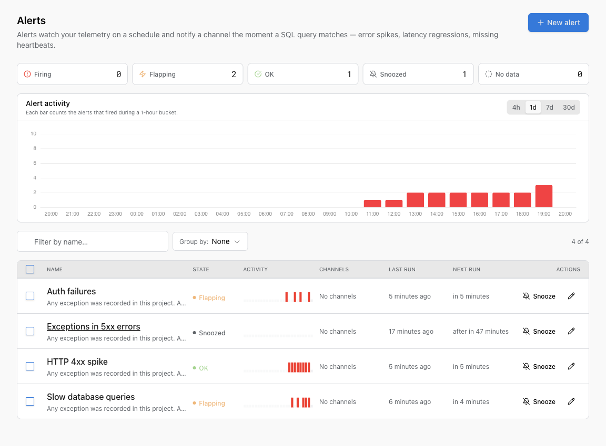
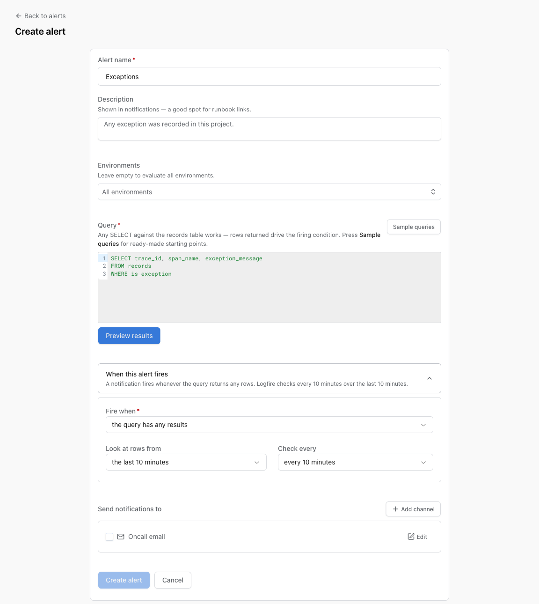
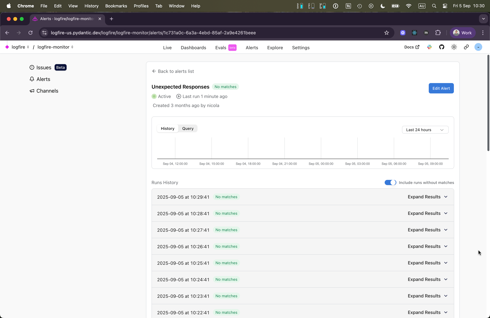
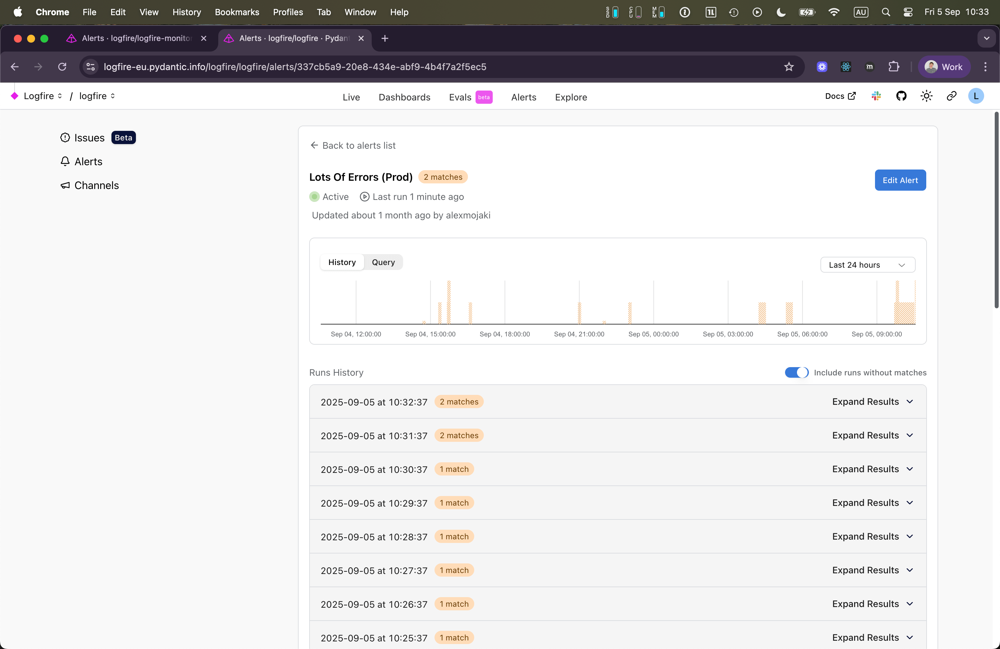
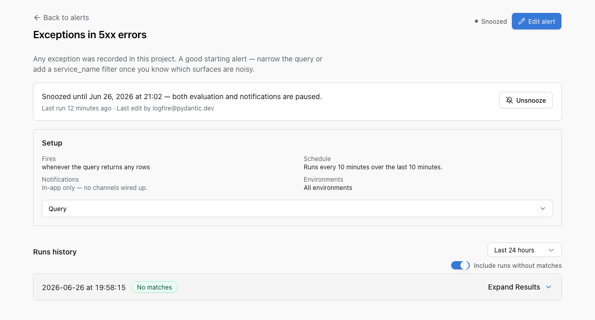

With **Logfire**, use Alerts to notify you when certain conditions are met.



## Create an alert

Let's see in practice how to create an alert.

1. Go to the **Alerts** tab in the left sidebar.
2. Click the **Create alert** button.

Then you'll see the following form:



The **Query** field is where you define the conditions that will trigger the alert.
For example, you can set up an alert to notify you when the number of errors in your logs exceeds a certain threshold.

On our example, we're going to set up an alert that will trigger when an exception occurs in the `api` service
and the route is `/members/{user_id}`.

```sql
SELECT trace_id, exception_type, exception_message FROM records  -- (1)!
WHERE
    is_exception and
    service_name = 'api' and
    attributes->>'http.route' = '/members/{user_id}'  -- (2)!
```

1. The `SELECT ... FROM records` statement is the base query that will be executed. The **records** table contains the spans and logs data. `trace_id` links to the trace in the live view when viewing the alert run results in the web UI.
2. The `attributes` field is a JSON field that contains additional information about the record. In this case, we're using the `http.route` attribute to filter the records by route.

The **Time window** field allows you to specify the time range over which the query will be executed.

The **Webhook URL** field is where you can specify a URL to which the alert will send a POST request when triggered.
For now, **Logfire** alerts only send the requests in [Slack format].

??? tip "Get a Slack webhook URL"
    To get a Slack webhook URL, follow the instructions in the [Slack documentation](https://api.slack.com/messaging/webhooks).

After filling in the form, click the **Create alert** button. And... Alert created! :tada:

## Notification modes

The **"Notify me when"** setting controls when you receive notifications. There are three modes:

### The query has any results

This is the default mode. You'll receive a notification **every time** the alert runs and the query returns one or more rows. This is useful for simple threshold alerts where you always want to be notified.

**Example use case:** Alert me every 5 minutes if there are any 5xx errors.

### The query starts or stops having results

You'll only receive a notification when the alert **transitions** between states — when the query goes from returning no rows to returning rows, or vice versa. This is useful when you want to know about the **onset** of an issue without getting repeated notifications while it persists.

**Example use case:** Alert me when my API starts experiencing high latency (over 1 second), but don't keep alerting me while the issue is ongoing. You'll get one notification when the problem starts, and another when it resolves.

??? tip "Avoiding the resolution notification"
    This mode sends a notification both when the issue starts **and** when it ends. If you only want to be notified when the issue starts (and not when it resolves), use the **"the query starts having results"** mode instead.

### The query starts having results

You'll receive a notification **only** when the alert transitions from returning no rows to returning rows. Unlike "starts or stops having results", you will **not** be notified when the issue resolves (rows → no rows). This is useful when you want to know about the onset of an issue without any follow-up notifications.

**Example use case:** Alert me when my service starts throwing exceptions, but don't notify me when it stops — I'll check resolution on my own schedule.

### The query's results change

You'll receive a notification whenever the **actual data** returned by the query changes between consecutive runs. This is more granular than the previous mode — it detects changes in the result set itself, not just whether there are results.

**Example use case:** Detect when a service goes down by querying for health check spans and [using a `CASE` expression](../../how-to-guides/detect-service-is-down.md) to return `'up'` or `'down'`. You'll be notified when the status changes in either direction.

## Alert History

After creating an alert, you'll be redirected to the alerts' list. There you can see the alerts you've created and their status.

If the query was not matched in the last time window, you'll see **no matches** next to the alert name, and no results in the histogram table of the selected time period.



Otherwise, you'll see the number of matches highlighted in orange.



In this case, you'll also receive a notification in the Webhook URL you've set up.

## Edit an alert

You can configure an alert by clicking on the **Configuration** button on the right side of the alert.



You can update the alert, or delete it by clicking the **Delete** button. If instead of deleting the alert, you want to disable it, you can click on the **Active** switch.

[Slack format]: https://api.slack.com/reference/surfaces/formatting
