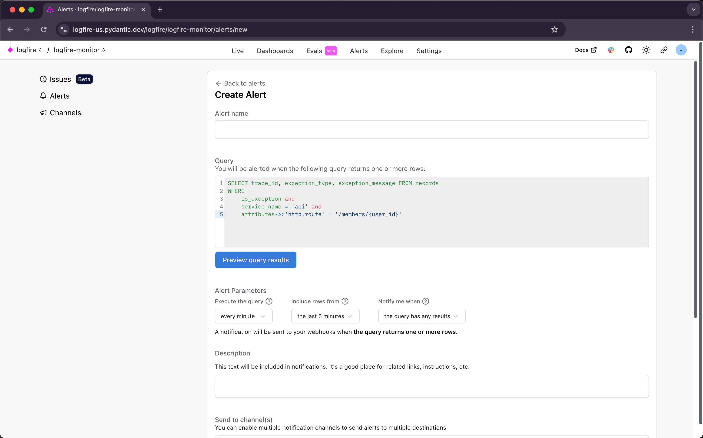
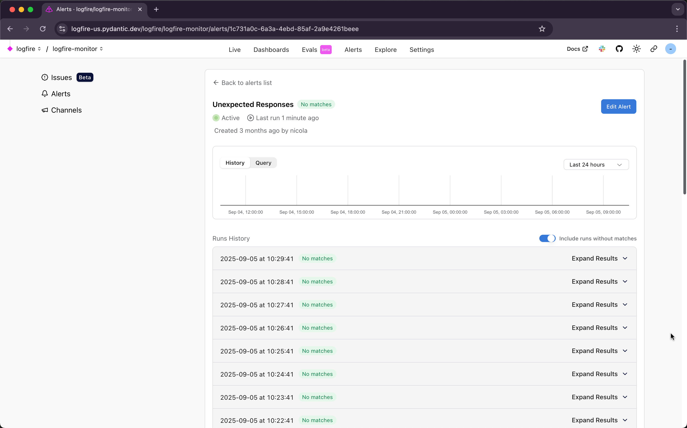
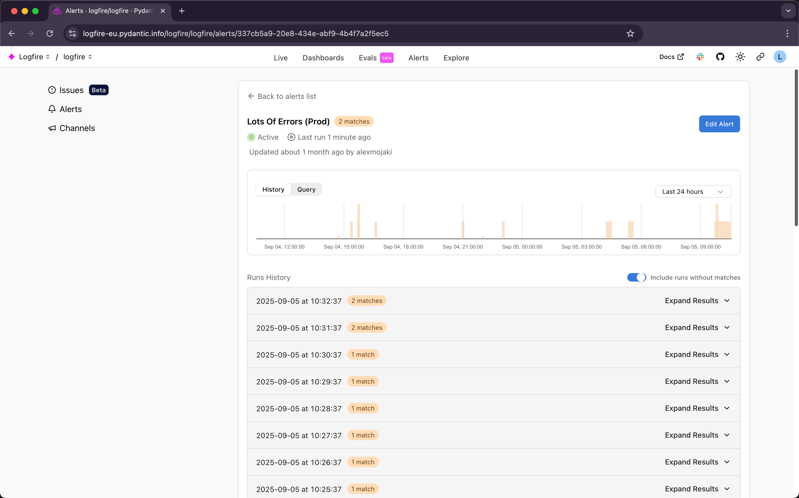
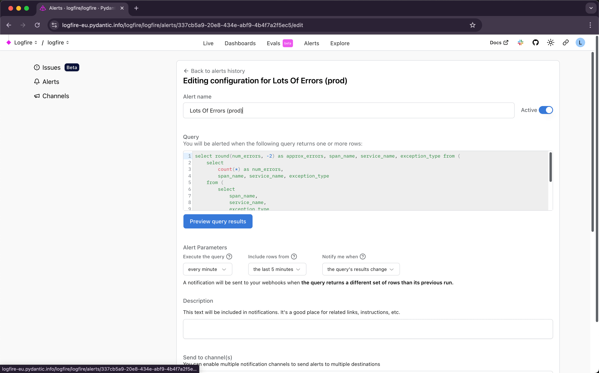

!!! warning "Alerts in Beta"
    The Alerts feature is still under construction, it could break or behave in unexpected ways.

    Please [create an issue](https://github.com/pydantic/logfire/issues/new/choose){:target="\_blank"}
    if you find bugs, get frustrated, or have questions.

With **Logfire**, you can set up alerts to notify you when certain conditions are met.


## Create an alert

Let's see in practice how to create an alert.

1. Go to the **Alerts** tab in the left sidebar.
2. Click the **Create alert** button.

Then you'll see the following form:



The **Query** field is where you define the conditions that will trigger the alert.
For example, you can set up an alert to notify you when the number of errors in your logs exceeds a certain threshold.

On our example, we're going to set up an alert that will trigger when an exception occurs in the `api` service
and the route is `/members/{user_id}`.

```sql
SELECT * FROM records  -- (1)!
WHERE
    is_exception and  -- (2)!
    service_name = 'api' and  -- (3)!
    attributes->>'http.route' = '/members/{user_id}'  -- (4)!
```

1. The `SELECT * FROM records` statement is the base query that will be executed. The **records** table contains the spans and logs data.

    You can use this table to filter the data you want to analyze.

2. The `is_exception` field is a boolean field that indicates whether the record is an exception.
3. The `service_name` field contains the name of the service that generated the record.
4. The `attributes` field is a [JSONB] field that contains additional information about the record.
5. In this case, we're using the `http.route` attribute to filter the records by route.

The **Time window** field allows you to specify the time range over which the query will be executed.

The **Webhook URL** field is where you can specify a URL to which the alert will send a POST request when triggered.
For now, **Logfire** alerts only send the requests in [Slack format].

??? tip "Get a Slack webhook URL"
    To get a Slack webhook URL, follow the instructions in the [Slack documentation](https://api.slack.com/messaging/webhooks).

After filling in the form, click the **Create alert** button. And... Alert created! :tada:

## Alert History

After creating an alert, you'll be redirected to the alerts' list. There you can see the alerts you've created and their status.

If the query was not matched in the last time window, you'll see a 0 in the **Matches** column, and a green circle next to the alert name.



Otherwise, you'll see the number of matches and a red circle.



In this case, you'll also receive a notification in the Webhook URL you've set up.

## Edit an alert

You can configure an alert by clicking on the **Configuration** button on the right side of the alert.



You can update the alert, or delete it by clicking the **Delete** button. If instead of deleting the alert, you want to disable it, you can click on the **Active** switch.

[Slack format]: https://api.slack.com/reference/surfaces/formatting
[JSONB]: https://www.postgresql.org/docs/current/datatype-json.html
