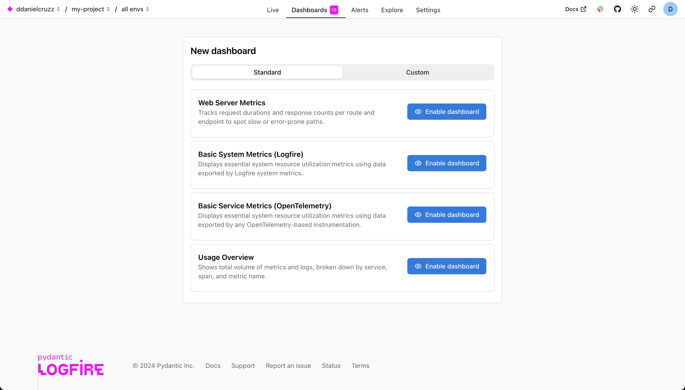
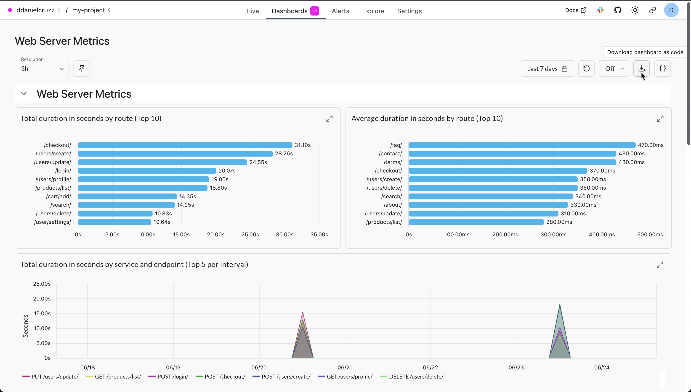
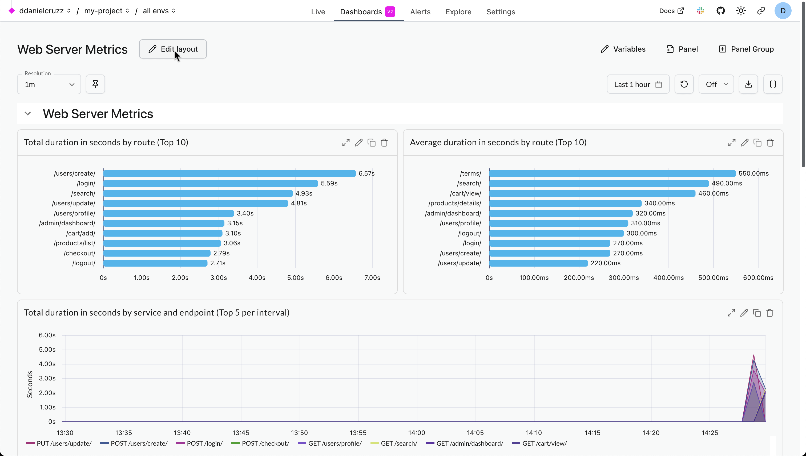
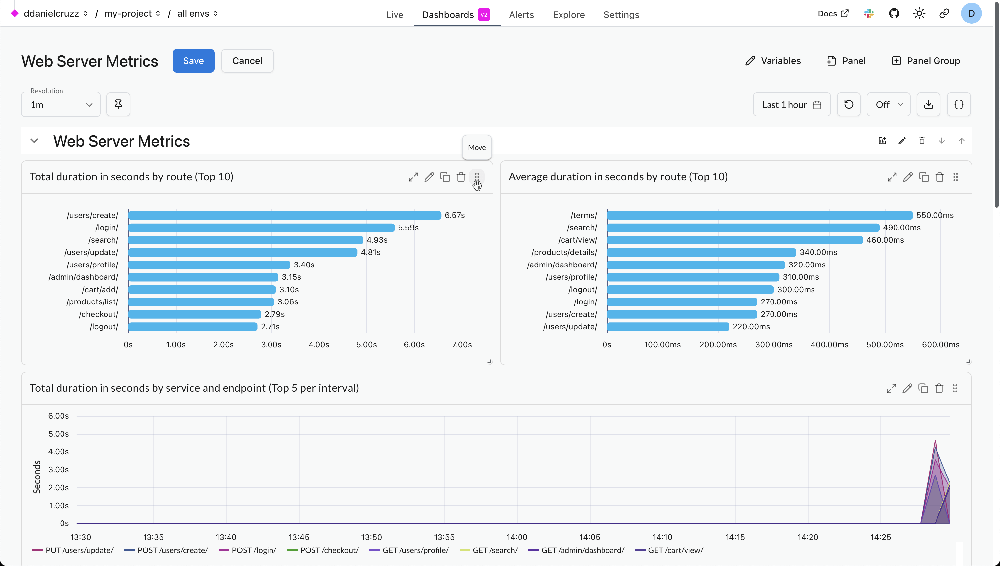

# Dashboards

This guide explains how to use dashboards in the Logfire UI to visualize your observability data. Dashboards allow you to create custom visualizations using SQL queries.

## Overview

There are two types of dashboards:

* **Standard dashboards**: Pre-configured dashboards created and maintained by the Logfire team, providing you with continuous updates and improvements without any effort on your part. You can enable or disable them for your project, but you can't modify them directly.
* **Custom dashboards**: Dashboards that you create and maintain. They are fully editable and customizable, allowing you to define queries, layouts, chart types, and variables.

In general, it's a good idea to start with standard dashboards. If they don't meet your needs, you can either use one as a [template for a custom dashboard](#using-a-standard-dashboard-as-a-template) or build a new one from scratch.

## Standard Dashboards

### Usage Overview

This dashboard is recommended for all users to [manage their costs](../../logfire-costs.md#standard-usage-dashboard).
It breaks down your data by [service](../../reference/sql.md#service_name), [scope](../../reference/sql.md#otel_scope_name) (i.e. instrumentation), and [`span_name`](../../reference/sql.md#span_name)/`metric_name` for `records`/`metrics` respectively.
This lets you see which services and operations are generating the most data.

### Web Server Metrics

This dashboard gives an overview of how long each of your web server endpoints takes to respond to requests and how often they succeed and fail. It relies on the standard OpenTelemetry http.server.duration metric which is collected by many instrumentation libraries, including those for FastAPI, Flask, Django, ASGI, and WSGI. Each chart is both a timeline and a breakdown by endpoint. Hover over each chart to see the most impactful endpoint at the top of the tooltip. The charts show:

- **Total duration:** Endpoints which need to either be optimized or called less often.
- **Average duration:** Endpoints which are slow on average and need to be optimized.
- **2xx request count:** Number of successful requests (HTTP status code between 200 and 299) per endpoint.
- **5xx request count:** Number of server errors (HTTP status code of 500 or greater) per endpoint.
- **4xx request count:** Number of bad requests (HTTP status code between 400 and 499) per endpoint.

### Basic System Metrics

This dashboard shows essential system resource utilization metrics. It comes in two variants:

- **Basic System Metrics (Logfire):** Uses the data exported by [`logfire.instrument_system_metrics()`](../../integrations/system-metrics.md).
- **Basic System Metrics (OpenTelemetry):** Uses data exported by any OpenTelemetry-based instrumentation following the standard semantic conventions.

Both variants include the following metrics:

* **Number of Processes:** Total number of running processes on the system.
* **System CPU usage %:** Percentage of total available processing power utilized by the whole system, i.e. the average across all CPU cores.
* **Process CPU usage %:** CPU used by a single process, where e.g. using 2 CPU cores to full capacity would result in a value of 200%.
* **Memory Usage %:** Percentage of memory currently in use by the system.
* **Swap Usage %:** Percentage of swap space currently in use by the system.

### Enabling a Standard Dashboard

To enable a standard dashboard:

1. Go to the **Dashboards** tab in the top navigation bar.
2. Click the **+ Dashboard** button.
3. Browse the list of available dashboards under the **Standard** tab.

4. Click **Enable dashboard** to add it to your project.

You can view and interact with standard dashboards, but you cannot edit them.

### Using a Standard Dashboard as a Template

You can use any standard dashboard as a template by exporting it to JSON and then importing it from JSON for a new custom dashboard.

1. From a standard dashboard, click the **Download dashboard as code** icon in the toolbar on the top right. This will download a JSON file to your machine.

2. Go to the **Custom** tab and select the **Import JSON** option.
3. Import the file you downloaded. This creates a new, fully editable custom dashboard from the template.

---

## Creating custom dashboards

To create a dashboard from scratch:

1. Click the **+ Dashboard** button.
2. Select the **Custom** tab.

Custom dashboards are structured in a hierarchy:

- Dashboard
    - Panel Group (1 or more)
        - Panel (1 or more)
            - Chart (1 only, a [specific type](#chart-types))

  By default, new dashboards start with one panel group.


You can add more panel groups to better organize your dashboard. This is useful for grouping related visualizations, effectively allowing you to have multiple views within a single dashboard.

To add a new group, click the **Panel Group** button in the top right. You can name the group and set whether it should be expanded or collapsed by default when the dashboard loads.

To add a new visualization, you add a panel to a group. Click the **Panel** button in the top right. Inside each panel, you'll configure a chart and the SQL query that powers it.

You can rearrange and resize panels by dragging and dropping them after clicking the **Edit layout** button.

### Chart Types

Logfire uses SQL as the query language for dashboard visualizations. Each chart in your dashboard requires one of two types of queries:

* **Time Series Query**: This query type is for visualizing data over time. It must include a timestamp in the selected columns, typically `time_bucket($resolution, start_timestamp)` when querying `records` or `time_bucket($resolution, recorded_timestamp)` when querying `metrics` - see [below](#resolution-variable). This will be used as the x-axis.

* **Non-Time Series Query**: This query type is for displaying data where the evolution of data over time is not the primary focus, e.g., a bar chart showing your top slowest endpoints.

Here's a list of the chart types and the query type they require.

| Chart Type  | Query Type          |
| ----------- | ------------------  |
| Time Series | `Time Series Query`    |
| Table       | `Non Time Series Query` |
| Bar Chart   | `Non Time Series Query`
| Pie Chart   | `Non Time Series Query`
| Values      | `Non Time Series Query`


To configure a chart:

1. Choose the chart type.
2. Write your SQL query.
3. Customize the formatting, labels, and appearance.

---

### Variables

You can define variables to make dashboards dynamic.

#### Variable Types

* **Text variable**: Allows users to enter any string value.
* **List variable**: Allows users to select a value from a predefined list.

To add variables to a custom dashboard:

1. Open the dashboard you want to edit.
2. Click **Variables** in the top right to open the variable settings panel.
3. Click **+ Add variable**.
4. Define and configure your variables.

Once defined, variables can be referenced in SQL queries using the format `$your_variable_name`

---

## Writing Queries

As mentioned in the [Chart Types](#chart-types) section, there are two main types of queries you'll write for dashboards. Here are some useful examples for each type.

### Time Series Queries

These queries visualize data over time and must include a timestamp column.

**Request count over time:**
```sql
SELECT
    time_bucket($resolution, start_timestamp) AS x,
    count() as count
FROM records
GROUP BY x
```

### Non Time Series Queries

These queries focus on aggregating data without the time dimension, perfect for tables, bar charts, and pie charts.

**Most common operations:**
```sql
SELECT
    COUNT() AS count,
    span_name
FROM records
GROUP BY span_name
ORDER BY count DESC
LIMIT 10
```

For comprehensive examples, advanced patterns, and chart-specific configuration tips, see the [Writing SQL Queries for Dashboards](../../how-to-guides/write-dashboard-queries.md) guide.

Please also refer to the [SQL Reference](../../reference/sql.md) and [Metrics Schema](../../guides/web-ui/explore.md#metrics-schema) for more information on the data available to you.

---

### Variable Usage

You can reference dashboard variables in SQL queries using the `$variable` syntax:

```sql
SELECT count() FROM records WHERE service_name = $service_name
```

Variables can only be used in SQL queries. They cannot be used in chart titles or other non-query fields.

### Resolution Variable

All dashboards have access to a special `$resolution` variable that can be used in your queries. This value is dynamically selected based on the dashboard's time duration to ensure optimal performance and data density. You can use it for time bucketing:

```sql
SELECT
  time_bucket($resolution, start_timestamp) AS x,
  count(1) as count
FROM records
GROUP BY x;
```

---

## Editing the layout

You can edit the layout of a dashboard by clicking the **Edit layout** button in the top left. This will allow you to drag panels to move and resize them. You can also reorder panel groups . Once you're done making changes, click the **Save** button to persist your changes.



### Move panels

While in **Edit layout** mode, you can move panels by dragging them from the top right corner.



### Resize panels

While in **Edit layout** mode, you can resize panels by dragging the bottom right corner.


### Reorder panel groups

While in **Edit layout** mode, you can reorder panel groups by clicking the up and down arrows in the top right corner of each panel group.


## Duration, and Refresh

Each dashboard has settings for:

* **Duration**: Controls the time window for the data shown. You can select from predefined ranges like `last 5 minutes`, `last 15 minutes`, `last 30 minutes`, `last 6 hours` up to `last 14 days`, or specify a custom time range.
* **Refresh Interval**: Sets how often the dashboard automatically refreshes its data. Options include `off`, `5s`, `10s`, `15s`, `30s`, and `1m`.
The duration and refresh settings are in the top-right corner of the dashboard view.
