# Dashboards

This guide explains how to use dashboards in the Logfire UI to visualize your observability data. Dashboards allow you to create custom visualizations using SQL queries.

## Overview

There are two types of dashboards:

- **Standard dashboards**: Pre-configured dashboards created and maintained by the Logfire team, providing you with continuous updates and improvements without any effort on your part. You can enable or disable them for your project, but you can't modify them directly. To change one, [clone it](#using-a-standard-dashboard-as-a-template) into a custom dashboard.
- **Custom dashboards**: Dashboards that you create and maintain. They are fully editable and customizable, allowing you to define queries, layouts, chart types, and variables.

In general, it's a good idea to start with standard dashboards. If they don't meet your needs, you can either use one as a [template for a custom dashboard](#using-a-standard-dashboard-as-a-template) or build a new one from scratch.

## Standard Dashboards

### Usage Overview

This dashboard is recommended for all users to [manage their costs](../../logfire-costs.md#standard-usage-dashboard).
It breaks down your data by [environment](../../reference/sql.md#deployment_environment), [service](../../reference/sql.md#service_name), [scope](../../reference/sql.md#otel_scope_name) (i.e. instrumentation), and [`span_name`](../../reference/sql.md#span_name)/`metric_name` for `records`/`metrics` respectively.
This lets you see which services and operations are generating the most data.

### Exceptions

This dashboard is recommended for all users, especially for monitoring Python applications. It shows the most common exceptions grouped by [service](../../reference/sql.md#service_name), [scope](../../reference/sql.md#otel_scope_name) (i.e. instrumentation), [`span_name`](../../reference/sql.md#span_name), and [`exception_type`](../../reference/sql.md#exception_type). You can also filter by any of these four columns in the variable fields at the top.

Within each row you can also see the most common [`message`](../../reference/sql.md#message) and [`exception_message`](../../reference/sql.md#exception_message) values. These are more variable (higher cardinality) which is why they don't each produce a new row. If there are multiple different values, each will be shown with a count in brackets at the start, on a separate line. **Double-click on a cell to see all the values within.** Note that `message` is often just the same as `span_name`.

Exceptions are usually errors, but not always. Some exceptions are special-cased and set the [`level`](../../reference/sql.md#level) to `warn`. By default, the dashboard is filtered to `level >= 'error'`, set the 'Errors only' dropdown to 'No' to see all exceptions.

Finally, scroll all the way to the right to see the 'SQL filter to copy to Live View' column to investigate the details of any group.

### Web Server Metrics

This dashboard gives an overview of how long each of your web server endpoints takes to respond to requests and how often they succeed and fail. It relies on the standard OpenTelemetry `http.server.duration`/`http.server.request.duration` metric which is collected by many instrumentation libraries, including those for FastAPI, Flask, Django, ASGI, and WSGI. The charts give a breakdown by endpoint (and sometimes status code) both overall and over time. Hover over each time series to see the most impactful endpoint at the top of the tooltip. The charts show:

- **Total duration:** Endpoints which need to either be optimized or called less often.
- **Average duration:** Endpoints which are slow on average and need to be optimized.
- **2xx request count:** Number of successful requests (HTTP status code between 200 and 299) per endpoint.
- **5xx request count:** Number of server errors (HTTP status code of 500 or greater) per endpoint.
- **4xx request count:** Number of bad requests (HTTP status code between 400 and 499) per endpoint.

!!! note
    Metrics sent through an OpenTelemetry Collector (a separate program that gathers and forwards telemetry) or another OpenTelemetry Protocol (OTLP) exporter must use delta temporality. Delta values report only the change during each collection interval. If the metrics reach Logfire as cumulative values, you can still query them in Explore, but the dashboard stays empty. When an OpenTelemetry SDK creates the metrics, set `OTEL_EXPORTER_OTLP_METRICS_TEMPORALITY_PREFERENCE=delta` in the application process. This configures the SDK before it sends metrics either directly to Logfire or through a Collector; do not set it on the Collector process. If you cannot configure the source, use the Collector's [cumulative-to-delta processor](https://github.com/open-telemetry/opentelemetry-collector-contrib/tree/main/processor/cumulativetodeltaprocessor).

### LLM Tokens and Costs

This dashboard breaks down input and output LLM token usage by model. It comes in two variants. Both have the same charts, but they use different data sources:

- **LLM Tokens and Costs (from `records`):** Uses data from the `records` table, specifically span [attributes](../../reference/sql.md#attributes) following OpenTelemetry conventions. This variant works with more instrumentations, as some don't emit metrics. It's also easier to [use as a template](#using-a-standard-dashboard-as-a-template) if you want to filter by other attributes.
- **LLM Tokens and Costs (from `metrics`):** Uses data from the `metrics` table, specifically the [`gen_ai.client.token.usage`](https://opentelemetry.io/docs/specs/semconv/gen-ai/gen-ai-metrics/#metric-gen_aiclienttokenusage) metric. This variant is more performant, so you can load data over bigger time ranges more quickly. It's also more accurate if your spans are [sampled](../../how-to-guides/sampling.md).

If you're only using the [Pydantic AI](../../integrations/llms/pydanticai.md) instrumentation, we recommend using the `metrics` variant. Otherwise we suggest enabling both variants and checking. If they look roughly identical (some small differences are expected), you can disable the `records` variant to improve performance.

The [Pydantic AI](../../integrations/llms/pydanticai.md) instrumentation also records costs in the `operation.cost` span attribute on records (since [v1.0.0](https://github.com/pydantic/pydantic-ai/releases/tag/v1.0.0)) and the `operation.cost` metric (since [v1.0.11](https://github.com/pydantic/pydantic-ai/releases/tag/v1.0.11)). The dashboards contain charts for these in a second panel group at the bottom. The metrics dashboard has more charts than the records chart in this section, but they're still very similar. We're working on adding support for other instrumentations to record costs in the same way.

### Basic System Metrics

This dashboard shows essential system resource utilization metrics. It comes in two variants:

- **Basic System Metrics (Logfire):** Uses the data exported by [`logfire.instrument_system_metrics()`](../../integrations/system-metrics.md).
- **Basic System Metrics (OpenTelemetry):** Uses data exported by any OpenTelemetry-based instrumentation following the standard semantic conventions.

Both variants include the following metrics:

- **Number of Processes:** Total number of running processes on the system.
- **System CPU usage %:** Percentage of total available processing power used by the whole system, i.e. the average across all CPU cores.
- **Process CPU usage %:** CPU used by a single process, where e.g. using 2 CPU cores to full capacity would result in a value of 200%.
- **Memory Usage %:** Percentage of memory currently in use by the system.
- **Swap Usage %:** Percentage of swap space currently in use by the system.

### Enabling a Standard Dashboard

To enable a standard dashboard:

1. Open <OpenInLogfire path="dashboards" variant="inline" label="Dashboards" /> for your project.
2. Click the **+ Dashboard** button.
3. Browse the available dashboards under the **Agents**, **Infrastructure**, and **Logfire** tabs.
4. Click **Enable dashboard** to add it to your project.

You can view and interact with standard dashboards, but you cannot edit them.

To enable dashboards and alerts for infrastructure services such as Redis, PostgreSQL, and Kafka, select **Integrations** under **Misc** in your project's sidebar. Choose the service, then select **Install**. See [Integrations](integrations.md) for setup, detection, and alert configuration.

### Using a standard dashboard as a template

Standard dashboards are read-only, so they show a **Standard** badge next to their title. To get a copy you can edit:

1. Open the standard dashboard and click **Clone** in the toolbar on the top right.
2. Enter a name for the copy. It defaults to "Copy of" followed by the original name.
3. Confirm. Logfire creates a new custom dashboard with the same panels, variables, and layout, and opens it.

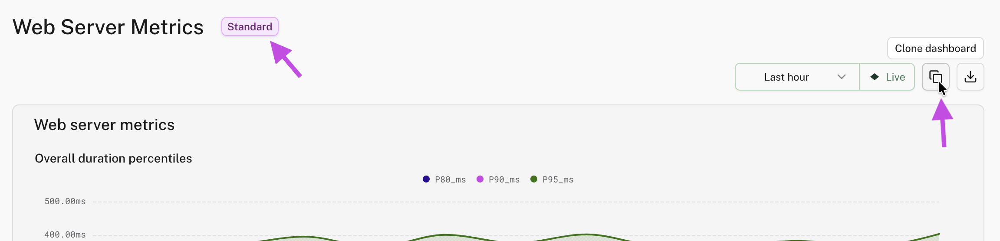

The copy is a snapshot. It doesn't receive the updates the Logfire team makes to the original standard dashboard.

**Clone** is also available on custom dashboards, which is useful for trying out changes without touching the original. To copy a dashboard into another project, or to keep it in version control, [export it as JSON](#exporting-and-editing-the-dashboard-as-json) instead.

---

## Creating custom dashboards

To create a dashboard from scratch:

1. Click the **+ Dashboard** button.
2. Select the **Custom** tab.
3. Choose to start from scratch or to import JSON, enter a name, and create the dashboard.

Custom dashboards are structured in a hierarchy:

- Dashboard
  - Panel Group (1 or more)
    - Panel (1 or more)
      - Chart (1 only, a [specific type](#chart-types))

  By default, new dashboards start with one panel group.

A new dashboard opens in view mode. Click **Edit** in the top right to enter edit mode, where you add panels and groups, define variables, and arrange the layout. Nothing is saved until you click **Save**. See [Editing a dashboard](#editing-a-dashboard) for all the edit mode controls.

You can add more panel groups to better organize your dashboard. This is useful for grouping related visualizations, effectively allowing you to have multiple views within a single dashboard.

To add a new group, click **Panel Group** in the edit toolbar. You can name the group and set whether it starts expanded or collapsed when the dashboard loads. A dashboard with a single group always shows that group expanded.

To add a new visualization, add a panel to a group by clicking **Panel** in the edit toolbar. Inside each panel, you configure a chart and the SQL query that powers it.

### Chart Types

Logfire uses SQL as the query language for dashboard visualizations. Each chart in your dashboard requires one of two types of queries:

- **Time Series Query**: This query type is for visualizing data over time. It must include a timestamp in the selected columns, typically `time_bucket($resolution, start_timestamp)` when querying `records` or `time_bucket($resolution, recorded_timestamp)` when querying `metrics` - see [below](#resolution-variable). This will be used as the x-axis.

- **Non-Time Series Query**: This query type is for displaying data where the evolution of data over time is not the primary focus, e.g., a bar chart showing your top slowest endpoints.

Here's a list of the chart types and the query type they require.

| Chart Type  | Query Type              |
| ----------- | ----------------------- |
| Time Series | `Time Series Query`     |
| Table       | `Non Time Series Query` |
| Bar Chart   | `Non Time Series Query` |
| Pie Chart   | `Non Time Series Query` |
| Values      | `Non Time Series Query` |

To configure a chart:

1. Choose the chart type.
2. Write your SQL query.
3. Customize the formatting, labels, and appearance.

#### Values panels

A Values panel shows one or more single numbers, such as a request count or an error rate. It has no header: the panel title is shown with the number. When a query returns several values, each value has its own formatting settings.

To show at a glance whether a number is healthy, set a **warning** and a **critical** threshold in the panel settings. A status bar above the value turns green, yellow, or red as the value crosses them. If the critical threshold is lower than the warning threshold, Logfire treats lower values as worse, which suits a cache hit rate or a free memory percentage.

<!-- TODO screenshot: a row of Values panels with status bars in green, yellow, and red -->

---

### Variables

Variables let you change what a dashboard shows without editing its queries. You define a variable once, reference it in your SQL queries as `$variable_name`, and Logfire adds a selector for it to the top of the dashboard.

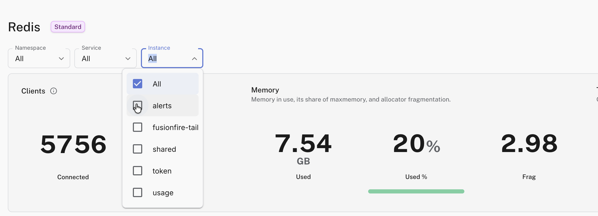

To add variables to a custom dashboard:

1. Open the dashboard and click **Edit** in the top right.
2. Click **Variables** in the edit toolbar to open the variable settings panel.
3. Click **+ Add variable**.
4. Define and configure your variables, then click **Save** on the dashboard.

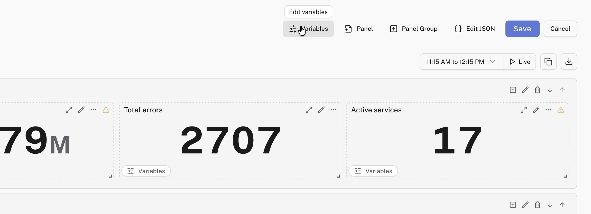

Each variable has a **Name** (how you reference it in queries), plus an optional **Display Label** and **Description** shown on its selector. There are two variable types:

- **Text variable**: viewers type any value into a text field. Check **Constant** to make the field read-only. This is useful for a value you reference in several queries and want to change in one place.
- **List variable**: viewers pick from a dropdown of options.

#### List variables

The **Source** setting controls where a list variable's options come from:

- **Static List Variable**: options you type in by hand. Paste a comma-separated list to add several values at once.
- **Logfire Query List Variable**: options are loaded from a SQL query against your data. The query must return exactly one column, and each distinct non-null value becomes an option.
- **Time Bucket Variable**: time intervals derived from the dashboard's time range, like the built-in [`$resolution`](#resolution-variable) variable. You'll rarely need to create one yourself, and a variable named `resolution` is ignored in favor of the built-in one.

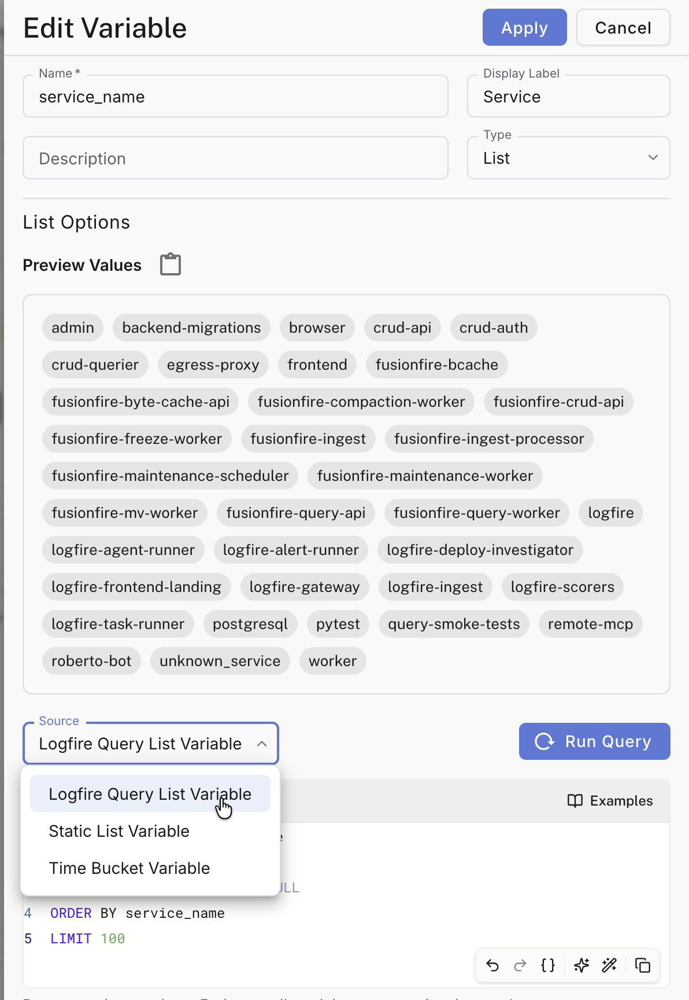

A query source keeps the dropdown in sync with your data automatically. For example, if your metrics record a `tenant_id` attribute, this query fills the dropdown with every tenant ID captured on the `api.requests` metric:

```sql
SELECT DISTINCT attributes->>'tenant_id'
FROM metrics
WHERE metric_name = 'api.requests' AND attributes->>'tenant_id' IS NOT NULL
ORDER BY 1
```

!!! note
    A list variable's selector stays hidden in the dashboard toolbar until it has more than one option, so a query that returns zero or one value won't show a dropdown.

List variables have a few more settings:

- **Allow Multiple Values**: viewers can select several options at once. The variable then resolves to a list of values in SQL, which changes how you compare it: see [using variables in queries](#using-variables-in-queries).
- **Allow All option**: adds an **All** entry to the dropdown. By default, selecting **All** fills the variable with every option in the list. Tick **Use Custom All Value** to send a fixed placeholder string instead: the query pattern for this is also covered in [using variables in queries](#using-variables-in-queries).
- **Capturing Regexp Filter**: a regular expression that transforms the options _after they load._ The expression must contain at least one capturing group (a part of the pattern wrapped in parentheses). An option is kept only if it matches, and its value is replaced by the captured text. For example, with the options `api-prod`, `web-prod`, and `api-staging`, the filter `(.*)-prod` produces the options `api` and `web`.
- **Sort**: order the options alphabetically or numerically, ascending or descending. By default, options keep the order they were loaded in.

#### Variable defaults

Each variable has a default value that viewers see when they first open the dashboard. To change it, enter edit mode, pick the value you want in the toolbar selector, and click **Save**. The save dialog lists what changed and asks whether to keep the new selection as the default.

When a viewer changes a variable away from its default, a small reset button appears on its selector. Clicking it restores the default.

#### Panel variables

Besides dashboard-level variables, an individual panel can declare its own variables. A panel variable renders as a small selector inside the panel (below its title) and re-filters only that panel's queries; the dashboard toolbar and other panels are unaffected. This is useful for dashboards that mix fleet-wide panels with a drill-down panel, where a toolbar variable that re-filters everything would be too broad.

To add a variable to a panel:

1. Open the panel editor (when creating the panel, or via **Edit** on an existing panel).
2. Switch to the **Variables** tab.
3. Click **Add panel variable** and configure it. Panel variables support the same **Text** and **List** types as dashboard variables.
4. Save the variable, then save the panel.

Panel variables are referenced in the panel's SQL with the same `$your_variable_name` syntax. If a panel variable has the same name as a dashboard variable, the panel variable takes precedence for that panel's queries. The variable definition is saved with the panel, so the selector persists across reloads.

#### Using variables in queries

Reference a variable anywhere in a panel's SQL query as `$variable_name`, or `${variable_name}` if the name would otherwise run into the text after it:

```sql
SELECT count() FROM records WHERE service_name = $service_name
```

Write the variable bare, without quotes. Logfire sends the selected value separately from the query and inserts it as a properly quoted SQL value. Writing `'$service_name'` in quotes would search for the literal text `$service_name` instead.

A variable with **Allow Multiple Values** enabled resolves to a list of values rather than a single one. Compare it with `= ANY(...)` instead of `=`:

```sql
SELECT count() FROM records WHERE service_name = ANY($service_name)
```

When a viewer selects **All** on a multiple-value variable, it resolves to the list of every option, so the `ANY` comparison above matches all of them.

For a single-value variable, **All** needs different handling: a list of every option can't be compared with `=`, and the query fails. Instead, tick **Use Custom All Value**, set **Custom All Value** to a placeholder string that will never appear in your data, and write the query to skip the filter when it sees that placeholder:

```sql
SELECT count()
FROM records
WHERE (service_name = $service_name OR $service_name = 'all-values')
```

Variables can only be used in SQL queries. They cannot be used in chart titles or other non-query fields.

Tick **Show rendered query** in the panel editor to see the query with all variable values filled in. This is useful for copying a query somewhere variables don't exist, like the [SQL Workbench](explore.md).

### Built-in variables

Every dashboard provides some variables automatically. You can use them in any dashboard query without defining anything.

#### Resolution variable

All dashboards have access to a special `$resolution` variable that holds a time interval, like `1 minute`, matched to the dashboard's time range. Use it to group timestamps into buckets for time series charts:

```sql
SELECT
  time_bucket($resolution, start_timestamp) AS x,
  count(1) as count
FROM records
GROUP BY x;
```

Logfire picks the resolution automatically to balance detail against query cost, and it adjusts as the time range changes.

#### Time range and context variables

These variables describe the dashboard's current time range and where it lives:

| Variable                                 | Value                                                                                    |
| ---------------------------------------- | ---------------------------------------------------------------------------------------- |
| `$__from`, `$__to`                       | Start and end of the time range, as Unix millisecond timestamps                          |
| `$__from_iso_string`, `$__to_iso_string` | Start and end of the time range, as ISO 8601 timestamps in UTC                           |
| `$__range`                               | Length of the time range as human-readable text, e.g. `1 hour`                           |
| `$__range_s`, `$__range_ms`              | Length of the time range in seconds and in milliseconds                                  |
| `$__organization`, `$__project`          | Names of the current organization and project                                            |
| `$__dashboard_slug`                      | The dashboard's URL slug                                                                 |
| `$__envs`                                | The environments selected in the environment filter, as one comma-separated string       |
| `$resolution`                            | The automatic time bucket interval for the time range, see [above](#resolution-variable) |

---

## Writing Queries

As mentioned in the [Chart Types](#chart-types) section, there are two main types of queries you'll write for dashboards. Here are some useful examples for each type.

### Time Series Queries

These queries visualize data over time and must include a timestamp column.

**Request count over time:**

```sql
SELECT
    time_bucket($resolution, start_timestamp) AS x,
    count() as count
FROM records
GROUP BY x
```

### Non Time Series Queries

These queries focus on aggregating data without the time dimension, perfect for tables, bar charts, and pie charts.

**Most common operations:**

```sql
SELECT
    COUNT() AS count,
    span_name
FROM records
GROUP BY span_name
ORDER BY count DESC
LIMIT 10
```

For comprehensive examples, advanced patterns, and chart-specific configuration tips, see the [Writing SQL Queries for Dashboards](../../how-to-guides/write-dashboard-queries.md) guide.

Please also refer to the [SQL Reference](../../reference/sql.md) and [Metrics Schema](../../guides/web-ui/explore.md#metrics-schema) for more information on the data available to you.

---

## Editing a dashboard

Click **Edit** in the top right of a custom dashboard to enter edit mode. In edit mode:

- The dashboard title becomes an editable text field.
- The toolbar shows the **Variables**, **Panel**, and **Panel Group** buttons, plus **Edit JSON**.
- You can move and resize panels, and reorder panel groups.

Your changes stay in your browser until you click **Save**. **Cancel** discards them and restores the saved dashboard. If you leave the page without saving, Logfire keeps a local draft in your browser and restores it the next time you open the dashboard there.

If you changed a variable selection while editing, the save dialog asks whether to store it as the dashboard's new default. See [Variable defaults](#variable-defaults).

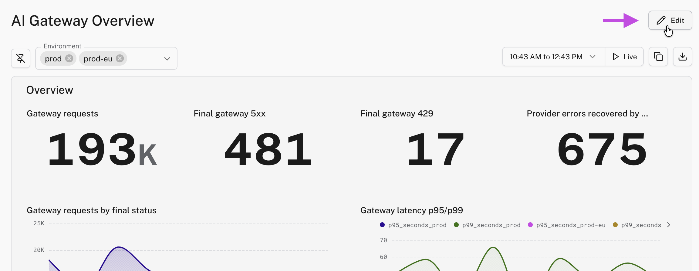

### Move panels

While in edit mode, drag a panel by its title bar to move it.

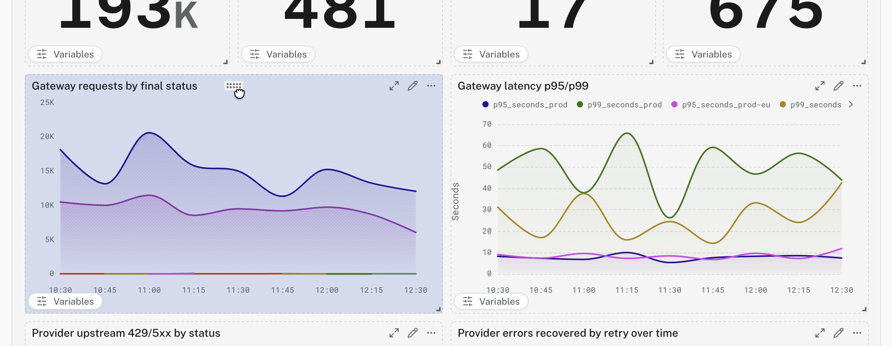

### Resize panels

While in edit mode, drag the bottom right corner of a panel to resize it.

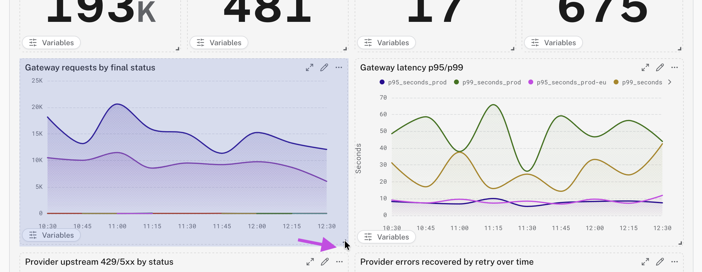

### Reorder panel groups

While in edit mode, click the up and down arrows in the top right corner of a panel group to move it.

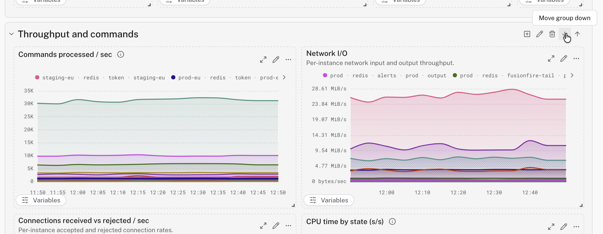

### Exporting and editing the dashboard as JSON

Every dashboard is stored as a JSON document. This is the same format the [Terraform provider](../../how-to-guides/infrastructure-as-code.md) uses, and the format you import when creating a custom dashboard from JSON.

- In view mode, click **Export dashboard** in the toolbar to open a side panel showing the dashboard's JSON. Click **Download** to save it as a file. The dashboard stays interactive while the panel is open.
- In edit mode, click **Edit JSON** to change the JSON directly. Edits apply to the dashboard as you type. Logfire validates the JSON against the dashboard schema and shows the first problem in the editor's status line. A dashboard with invalid JSON can't be saved.

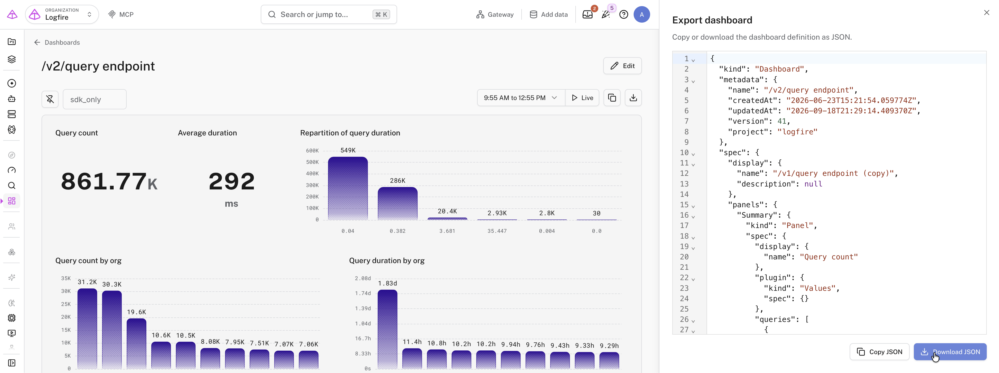

## Time range and live updates

The time range picker in the top right of the dashboard controls the window of data shown. Choose a preset such as `last 5 minutes`, `last 15 minutes`, `last 30 minutes`, `last 6 hours`, up to `last 14 days`, or set a custom range.

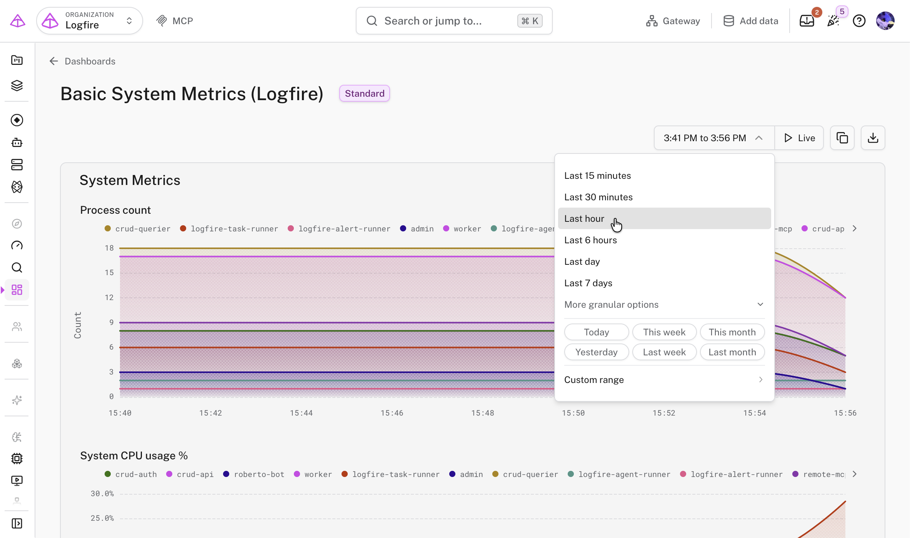

Turn on **Live** next to the picker to keep the dashboard current. Logfire re-runs the panel queries on an interval matched to the time range, between 15 seconds and 1 minute, and the time window keeps moving forward with the clock.

Pausing **Live** freezes the time window where it is, so you can inspect the data without it moving. Resuming follows the clock again.

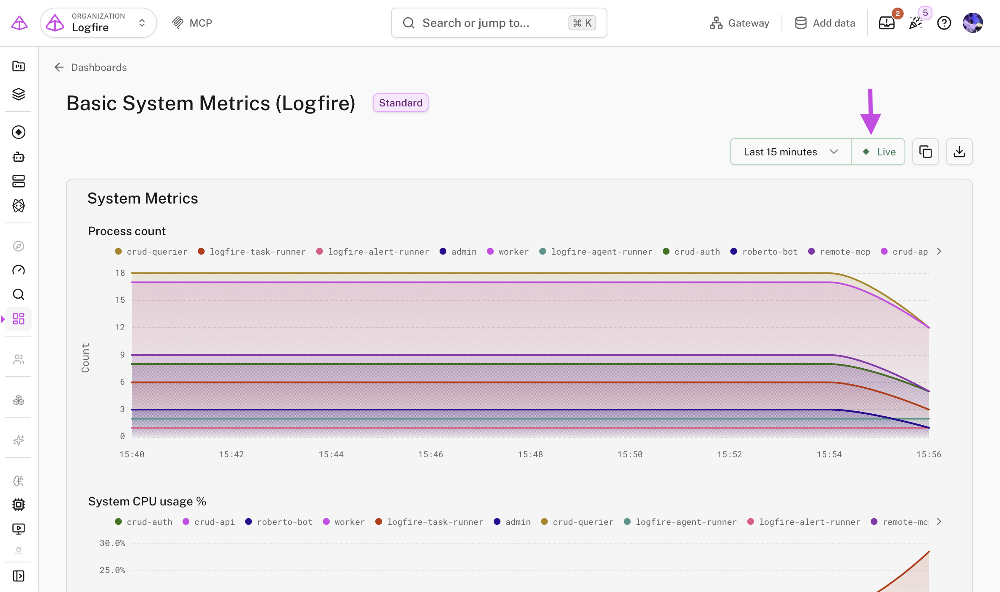

## Next steps

- [Writing SQL Queries for Dashboards](../../how-to-guides/write-dashboard-queries.md) for query recipes and chart configuration tips.
- [SQL Reference](../../reference/sql.md) for the tables and columns available to you.
- [Infrastructure as Code](../../how-to-guides/infrastructure-as-code.md) to manage dashboards with Terraform.
