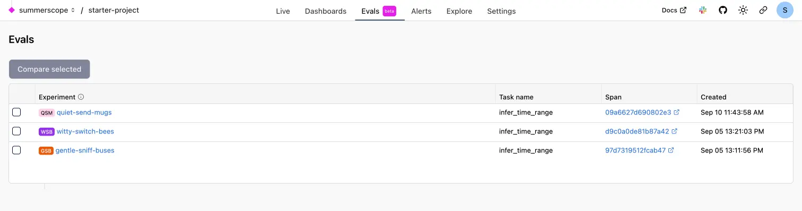
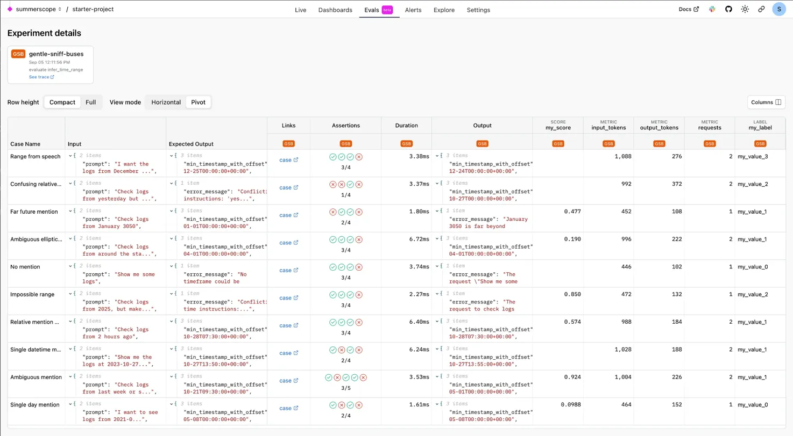
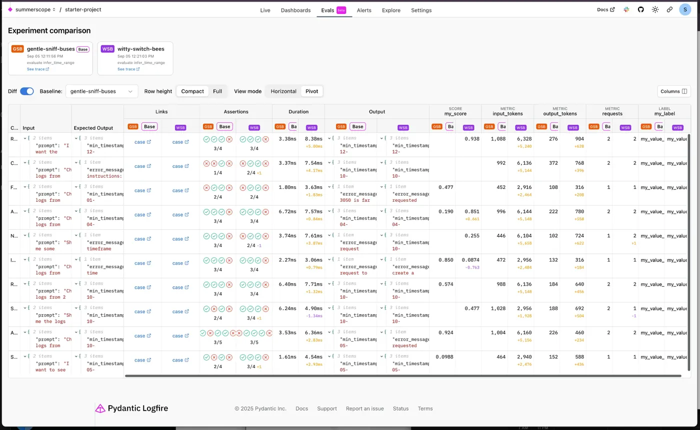

# Evals (beta)

View and analyze your evaluation results in Pydantic Logfire's web interface. Evals provide observability into how your AI systems perform across different test cases and experiments over time.

!!! note "Code-First Evaluation"

    Evals are created and run using the [Pydantic Evals](https://ai.pydantic.dev/evals/) package, which is developed in tandem with Pydantic AI. Logfire serves as an observability layer where you can view and compare results.

To get started, refer to the [Pydantic Evals installation guide](https://ai.pydantic.dev/evals/#installation).

## What are Evals?

Evals help you systematically test and evaluate AI systems by running them against predefined test cases. Each evaluation experiment appears in Logfire automatically when you run the `pydantic_evals.Dataset.evaluate` method with Logfire integration enabled.

For the data model, examples and full documentation on creating and running Evals, read the [Pydantic Evals docs](https://ai.pydantic.dev/evals/)

## Viewing Experiments

The Evals tab shows all experiments for your project available within your data retention period. Each experiment represents a single run of a dataset against a task function.

### Experiment List

Each experiment displays:

- **Experiment name** - Auto-generated by Logfire (e.g., "gentle-sniff-buses")
- **Task name** - The function being evaluated
- **Span link** - Direct link to the detailed trace
- **Created timestamp** - When the experiment was run

Click on any experiment to view detailed results.

### Experiment Details

Individual experiment pages show comprehensive results including:

- **Test cases** with inputs, expected outputs, and actual outputs
- **Assertion results** - Pass/fail status for each evaluator
- **Performance metrics** - Duration, token usage, and custom scores
- **Evaluation scores** - Detailed scoring from all evaluators

## Comparing Experiments

Use the experiment comparison view to analyze performance across different runs:

1. Select multiple experiments from the list
2. Click **Compare selected**
3. View side-by-side results for the same test cases

The comparison view highlights:

- **Differences in outputs** between experiment runs
- **Score variations** across evaluators
- **Performance changes** in metrics like duration and token usage
- **Regression detection** when comparing baseline vs current implementations

## Integration with Traces

Every evaluation experiment generates detailed OpenTelemetry traces that appear in Logfire:

- **Experiment span** - Root span containing all evaluation metadata
- **Case execution spans** - Individual test case runs with full context
- **Task function spans** - Detailed tracing of your AI system under test
- **Evaluator spans** - Scoring and assessment execution details

Navigate from experiment results to full trace details using the span links.
