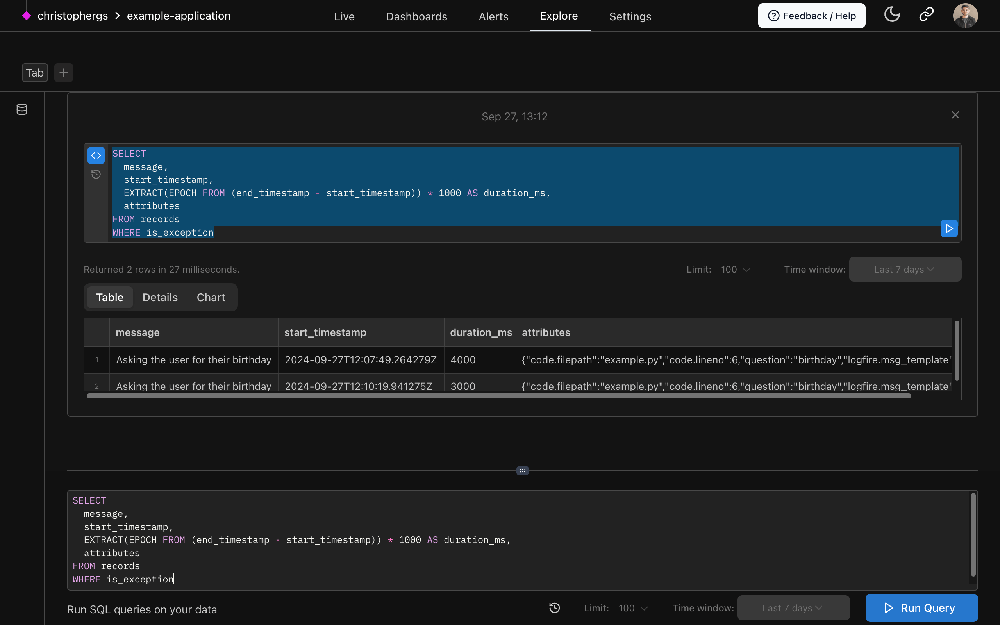

With **Logfire**, you can use the Explore page to run arbitrary SQL queries against your trace and metric data to
analyze and investigate your system.



## Querying Traces

The primary table you will query is the `records` table, which contains all the spans/logs from your traced requests.

To query the records, simply start your query with `SELECT ... FROM records` and add a `WHERE` clause to filter the
spans you want.

For example, here is a query that returns the message, start_timestamp, duration, and attributes for all spans that
have exceptions:

```sql
SELECT
  message,
  start_timestamp,
  EXTRACT(EPOCH FROM (end_timestamp - start_timestamp)) * 1000 AS duration_ms,
  attributes
FROM records
WHERE is_exception
```

You can run more complex queries as well, using subqueries, CTEs, joins, aggregations, custom expressions,
and any other standard SQL.

## Records Schema

The schema of the `records` table is:

```sql
CREATE TABLE records AS (
    start_timestamp timestamp with time zone,
    created_at timestamp with time zone,
    trace_id text,
    span_id text,
    parent_span_id text,
    kind span_kind,
    end_timestamp timestamp with time zone,
    level smallint,
    span_name text,
    message text,
    attributes_json_schema text,
    attributes jsonb,
    tags text[],
    otel_links jsonb,
    otel_events jsonb,
    is_exception boolean,
    otel_status_code status_code,
    otel_status_message text,
    otel_scope_name text,
    otel_scope_version text,
    otel_scope_attributes jsonb,
    service_namespace text,
    service_name text,
    service_version text,
    service_instance_id text,
    process_pid integer
)
```

## Cross-linking with Live View

After running a query, you can take any `trace_id` and/or `span_id` and use it to look up data shown as traces
in the Live View.

Simply go to the Live View and enter a query like:

```
trace_id = '7bda3ddf6e6d4a0c8386093209eb0bfc' -- replace with a real trace_id of your own
```

This will show all the spans with that specific trace ID.

## Metrics Schema

In addition to traces, you can also query your metrics data using the `metrics` table.

The schema of the `metrics` table is:

```sql
CREATE TABLE metrics AS (
    recorded_timestamp timestamp with time zone,
    metric_name text,
    metric_type text,
    unit text,
    start_timestamp timestamp with time zone,
    aggregation_temporality public.aggregation_temporality,
    is_monotonic boolean,
    metric_description text,
    scalar_value double precision,
    histogram_min double precision,
    histogram_max double precision,
    histogram_count integer,
    histogram_sum double precision,
    exp_histogram_scale integer,
    exp_histogram_zero_count integer,
    exp_histogram_zero_threshold double precision,
    exp_histogram_positive_bucket_counts integer[],
    exp_histogram_positive_bucket_counts_offset integer,
    exp_histogram_negative_bucket_counts integer[],
    exp_histogram_negative_bucket_counts_offset integer,
    histogram_bucket_counts integer[],
    histogram_explicit_bounds double precision[],
    attributes jsonb,
    otel_scope_name text,
    otel_scope_version text,
    otel_scope_attributes jsonb,
    service_namespace text,
    service_name text,
    service_version text,
    service_instance_id text,
    process_pid integer
)
```

You can query metrics using standard SQL, just like traces. For example:

```sql
SELECT *
FROM metrics
WHERE metric_name = 'system.cpu.time'
  AND recorded_timestamp > now() - interval '1 hour'
```

## Executing Queries

To execute a query, type or paste it into the query editor and click the "Run Query" button.


You can modify the time range of the query using the dropdown next to the button. There is also a "Limit" dropdown that
controls the maximum number of result rows returned.

The Explore page provides a flexible interface to query your traces and metrics using standard SQL.

Happy querying! :rocket:
