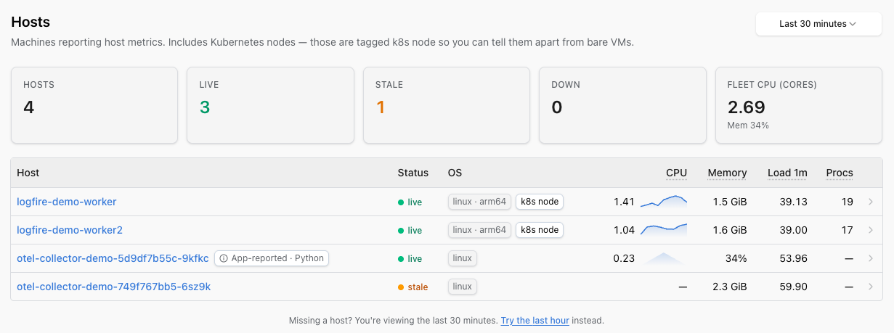

# Hosts

The **Hosts view** shows every host shipping system metrics to your project. It shows CPU, memory, load, disk and network alongside the application traces those hosts produced. Kubernetes nodes show up here too, tagged so you can tell them apart from bare VMs.

You'll find Hosts in the project sidebar, between **Services** and **Kubernetes**.



## The Hosts inventory

Each row is a host, with at-a-glance columns:

- **Status**: `live` if the host emitted a sample in the last minute, `stale` between 1 and 5 minutes, `down` once it's been over 5 minutes since the last sample.
- **OS** and architecture.
- **CPU** with an inline sparkline.
- **Memory** (percent or bytes depending on what the collector reports).
- **1-minute load**.
- **Running process count**.

Summary cards across the top of the page give you the fleet shape: total hosts, live / stale / down counts, and fleet CPU in cores.

Sort by any column to find the box that's hot, the box that went stale, or the host with the most processes.

## Host detail page

Click a row to open the host detail page. You'll see trend charts for:

- **CPU**
- **Memory**
- **1-minute load**
- **Disk**: split by direction (reads vs writes), not collapsed into a total.
- **Network**: split by direction (in vs out), not collapsed into a total.

Disk and network being direction-split is useful when, for example, your nightly backup is saturating writes but reads look fine.

## Setting up

Hosts populate from the standard OpenTelemetry [`hostmetricsreceiver`](https://github.com/open-telemetry/opentelemetry-collector-contrib/tree/main/receiver/hostmetricsreceiver). No proprietary agent, no separate install: the same OpenTelemetry Collector you already use for traces can collect host metrics with a small block in its config. The Hosts page populates within about a minute or two of the next collection cycle.

### Minimal collector config

A working setup for a single host (Linux VM, container host, or laptop), exporting straight to Logfire:

```yaml
receivers:
  hostmetrics:
    collection_interval: 30s
    # Set root_path: /hostfs when running the collector inside a container
    # with the host filesystem bind-mounted at /hostfs (Linux only).
    scrapers:
      cpu: {}
      memory: {}
      load:
        cpu_average: true         # normalise load across CPUs
      disk: {}
      filesystem:
        include_virtual_filesystems: false
      network:
        exclude:
          interfaces: [lo, "veth.*"]
          match_type: regexp
      paging: {}
      processes: {}

processors:
  memory_limiter:
    check_interval: 1s
    limit_percentage: 80
    spike_limit_percentage: 25
  resourcedetection:
    detectors: [env, system, ec2, gcp, azure]    # add `docker` only if you bind-mount /var/run/docker.sock into the collector
    override: false               # SDK-supplied attributes win
  batch: {}

exporters:
  otlphttp/logfire:
    endpoint: https://logfire-us.pydantic.dev   # or https://logfire-eu.pydantic.dev
    headers:
      Authorization: ${env:LOGFIRE_TOKEN}

service:
  pipelines:
    metrics:
      receivers: [hostmetrics]
      processors: [memory_limiter, resourcedetection, batch]
      exporters: [otlphttp/logfire]
```

The pipeline shape (`memory_limiter` first, `batch` last, enrichment in the middle) is the same for any other receivers you add. See [OpenTelemetry Collector Overview](../../how-to-guides/otel-collector/otel-collector-overview.md) for the broader patterns and authentication options. If you haven't set anything up, the empty state on the Hosts page also deep-links to the **Everything else** tab of the add-data wizard.

### Why `resourcedetection` matters

The Hosts inventory keys hosts on `host.id` and `host.name`. Without them, a single host can appear duplicated, or N replicas of a containerised collector can collapse into one fake host. The `resourcedetection` processor's `system` detector fills `host.id` from the machine ID on Linux. Add the `ec2`, `gcp`, or `azure` detectors when running on those clouds (and `eks`, `gke`, or `aks` when running on their managed Kubernetes services) so the right cloud metadata enriches the hosts. Setting `override: false` makes sure an SDK-supplied `host.name` wins when there's one already.

### Hosts that are Kubernetes nodes

Hosts inside a Kubernetes cluster are recognized as nodes and appear on the [Kubernetes view](kubernetes.md) as well as in the Hosts inventory. The dedup hinges on `host.name` matching `k8s.node.name`. If you run a node-scoped DaemonSet collector, set both attributes from the downward API (`spec.nodeName`) so the same string lands in both places. Otherwise the Hosts list will show one row per pod replica instead of one row per node.

### From a Python application

If your workload is a Python app already using Logfire, you can emit system metrics directly from the SDK with [`logfire.instrument_system_metrics()`](../../integrations/system-metrics.md) instead of (or alongside) running a collector. Logfire pre-populates the `host.name` resource attribute (overridable via `resource_attributes`, see the [SQL reference](../../reference/sql.md#resource-attributes)), so the app's host shows up here automatically.

## Run the collector

Save the config above as `collector.yaml`, then:

```bash
docker run --rm \
  -v "$(pwd)/collector.yaml:/etc/otelcol-contrib/config.yaml" \
  -e LOGFIRE_TOKEN=<your write token from project Settings → Write tokens> \
  otel/opentelemetry-collector-contrib:latest
```

The Hosts page populates within about a minute. To collect metrics from the host (not the container), bind-mount the host's filesystem at `/hostfs` and set `root_path: /hostfs` in the receiver block.

## Troubleshooting

| Symptom | Likely cause |
|---------|--------------|
| Host doesn't appear in the inventory | Metrics arrived without a `host.id` (or `host.name`). Add the `system` (and any cloud) detector to your collector's `resourcedetection` processor. |
| Same physical host shows up twice | Two sources are reporting different `host.id` values, for example the SDK reports the container ID while the Collector reports the machine ID. Pick one source per host, or set `host.id` explicitly. |
| Every replica of a containerised collector appears as one fake host | `host.id` is being read from inside the container (so every replica reports the same value). Bind-mount the host's filesystem and set `root_path: /hostfs` so `resourcedetection`'s `system` detector reads the real machine ID. |
| All hosts went `stale` at the same moment | The collector restarted, or a network blip is blocking exports. The page is just a window on what arrived. Confirm with the collector's own logs. |
| Kubernetes node appears as both a host *and* a node, but with different names | `host.name` does not match `k8s.node.name`. Set both from the downward API (`spec.nodeName`) so they dedup correctly. See [Hosts that are Kubernetes nodes](#hosts-that-are-kubernetes-nodes). |
