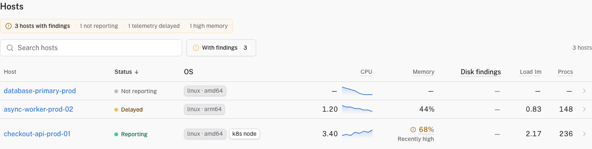

# Hosts

The <OpenInLogfire path="hosts" variant="inline" label="Hosts view" /> shows every host shipping system metrics to your project. It shows CPU, memory, load, disk and network alongside the application traces those hosts produced. Kubernetes nodes show up here too, tagged so you can tell them apart from bare VMs.

You'll find Hosts in the project sidebar, between **Services** and **Kubernetes**.

## The Hosts inventory

Each row is a host, with at-a-glance columns:

- **Status**: **Reporting** if the host emitted a sample in the last 2 minutes, **Delayed** between 2 and 5 minutes, and **Not reporting** once it has been over 5 minutes since the last sample.
- **OS** and architecture.
- **CPU** with an inline sparkline.
- **Memory** (percent or bytes depending on what the collector reports).
- **1-minute load**.
- **Running process count**.

Summary cards across the top of the page give you the fleet shape: total hosts, **Reporting**, **Delayed**, and **Not reporting** counts, and fleet CPU in cores.

Sort by any column to find the box that's hot, the host that stopped reporting, or the host with the most processes.

## Find hosts that need attention

The findings summary calls out conditions you may want to investigate. Select **With findings** to show only affected hosts:

- **Not reporting**: Logfire has not received host metrics for more than 5 minutes.
- **Telemetry delayed**: the latest host metric is between 2 and 5 minutes old.
- **High memory**: at least three readings spanning 2 minutes stayed at or above 90% memory usage.
- **Full filesystem**: the latest reported usage for a filesystem is at least 90% of its capacity.



**High memory** needs `system.memory.utilization`, which the [configuration below](#minimal-collector-config) enables. **Full filesystem** needs the `used` and `free` states from `system.filesystem.usage`, which the `hostmetrics` receiver emits by default.

Memory and filesystem findings inspect the final 15 minutes of the selected range. They cover the hosts loaded into the inventory. A missing metric means Logfire cannot evaluate that condition, not that the host is healthy. Kubernetes lifecycle findings, such as a node that is not ready, appear on the [Kubernetes view](kubernetes.md) instead.

## Host detail page

Click a row to open the host detail page. You'll see trend charts for:

- **CPU**
- **Memory**
- **1-minute load**
- **Disk**: split by direction (reads vs writes), not collapsed into a total.
- **Network**: split by direction (in vs out), not collapsed into a total.

Disk and network being direction-split is useful when, for example, your nightly backup is saturating writes but reads look fine.

## Setting up

Hosts populate from the standard OpenTelemetry [`hostmetricsreceiver`](https://github.com/open-telemetry/opentelemetry-collector-contrib/tree/main/receiver/hostmetricsreceiver). No proprietary agent, no separate install: the same OpenTelemetry Collector you already use for traces can collect host metrics with a small block in its config. The Hosts page populates within about a minute or two of the next collection cycle.

### Minimal collector config

A working setup for a single host (Linux VM, container host, or laptop), exporting straight to Logfire:

<!-- The configuration below is deliberately identical to the one in how-to-guides/otel-collector/host-monitoring.md.
     Each page is meant to work end to end, so a reader never has to jump to the other.
     If you change one, change both: `test_hostmetrics_examples_enable_the_metrics_the_hosts_page_reads`
     in tests/test_docs.py fails the build if a copy stops enabling the metrics the Hosts
     page reads, which is how the two silently drifted apart before. -->

```yaml title="otel-collector-config.yaml"
receivers:
  hostmetrics:
    collection_interval: 60s
    # Set root_path: /hostfs when running the Collector inside a container
    # with the host filesystem bind-mounted at /hostfs (Linux only).
    scrapers:
      cpu:
        metrics:
          system.cpu.utilization:
            enabled: true
      memory:
        metrics:
          system.memory.utilization:
            enabled: true
      load:
        cpu_average: true
      disk:
        exclude:
          devices: ['^(loop|ram)[0-9]+$']
          match_type: regexp
      filesystem:
        include_virtual_filesystems: false
        metrics:
          system.filesystem.utilization:
            enabled: true
      network:
        exclude:
          interfaces: [lo, 'veth.*']
          match_type: regexp
      paging:
      processes:

processors:
  memory_limiter:
    check_interval: 1s
    limit_percentage: 80
    spike_limit_percentage: 25
  resourcedetection:
    detectors: [env, system, ec2, gcp, azure]
    override: false
  batch:

exporters:
  otlphttp:
    endpoint: "https://logfire-us.pydantic.dev"  # or https://logfire-eu.pydantic.dev
    headers:
      Authorization: "Bearer ${env:LOGFIRE_TOKEN}"

service:
  pipelines:
    metrics:
      receivers: [hostmetrics]
      processors: [memory_limiter, resourcedetection, batch]
      exporters: [otlphttp]
```

Keep the collection interval at 60 seconds unless you have a specific need for finer resolution. Some Collector deployment presets use 10 seconds, which sends six times as many datapoints. The `processes` scraper above is inexpensive because it reports aggregate counts. Do not confuse it with the singular `process` scraper, which reports CPU, memory, and disk metrics for every process ID. Leave `process` off, or filter it to a small set of stable process names. See [Cardinality and cost](../../how-to-guides/otel-collector/host-monitoring.md#cardinality-and-cost) for details.

The pipeline shape (`memory_limiter` first, `batch` last, enrichment in the middle) is the same for any other receivers you add. See [OpenTelemetry Collector Overview](../../how-to-guides/otel-collector/otel-collector-overview.md) for the broader patterns and authentication options. If you haven't set anything up, the empty state on the Hosts page also deep-links to the **Everything else** tab of the add-data wizard.

### Why `resourcedetection` matters

The Hosts inventory identifies a host by `host.name`, or by `k8s.node.name` when the metrics come from a Kubernetes node. A host that reports neither does not appear at all. The `resourcedetection` processor's `system` detector fills `host.name`, and `host.id` alongside it, from the machine on Linux. Add the `ec2`, `gcp`, or `azure` detectors when running on those clouds (and `eks`, `gke`, or `aks` when running on their managed Kubernetes services) so the right cloud metadata enriches the hosts. Setting `override: false` makes sure an SDK-supplied `host.name` wins when there's one already.

### Hosts that are Kubernetes nodes

Hosts inside a Kubernetes cluster are recognized as nodes and appear on the [Kubernetes view](kubernetes.md) as well as in the Hosts inventory. The dedup hinges on `host.name` matching `k8s.node.name`. If you run a node-scoped DaemonSet collector, set both attributes from the downward API (`spec.nodeName`) so the same string lands in both places. Otherwise the Hosts list will show one row per pod replica instead of one row per node.

### From a Python application

If your workload is a Python app already using Logfire, you can emit system metrics directly from the SDK with [`logfire.instrument_system_metrics()`](../../integrations/system-metrics.md) instead of (or alongside) running a collector. Logfire pre-populates the `host.name` resource attribute (overridable via `resource_attributes`, see the [SQL reference](../../reference/sql.md#resource-attributes)), so the app's host shows up here automatically.

## Run the collector

Save the config above as `otel-collector-config.yaml`, then:

```bash
docker run --rm \
  -v "$(pwd)/otel-collector-config.yaml:/etc/otelcol-contrib/config.yaml:ro" \
  -e LOGFIRE_TOKEN='<your-write-token>' \
  otel/opentelemetry-collector-contrib:latest
```

The Hosts page populates within about a minute. To collect metrics from the host (not the container), bind-mount the host's filesystem at `/hostfs` and set `root_path: /hostfs` in the receiver block.

## Troubleshooting

| Symptom | Likely cause |
|---------|--------------|
| Host doesn't appear in the inventory | Metrics arrived without a `host.name`, which is what the inventory groups by. Add the `system` (and any cloud) detector to your Collector's `resourcedetection` processor. |
| Same physical host shows up twice | Two sources are reporting different `host.name` values, for example the SDK reports the container's hostname while the Collector reports the machine's. Pick one source per host, or set `host.name` explicitly. |
| One machine appears as several hosts, one per container | Each replica is reporting its own container hostname as `host.name`. Bind-mount the host's filesystem and set `root_path: /hostfs` so `resourcedetection`'s `system` detector reads the real machine instead of the container. |
| All hosts became **Delayed** or **Not reporting** at the same moment | The collector restarted, or a network blip is blocking exports. The page is just a window on what arrived. Confirm with the collector's own logs. |
| Kubernetes node appears as both a host *and* a node, but with different names | `host.name` does not match `k8s.node.name`. Set both from the downward API (`spec.nodeName`) so they dedup correctly. See [Hosts that are Kubernetes nodes](#hosts-that-are-kubernetes-nodes). |
