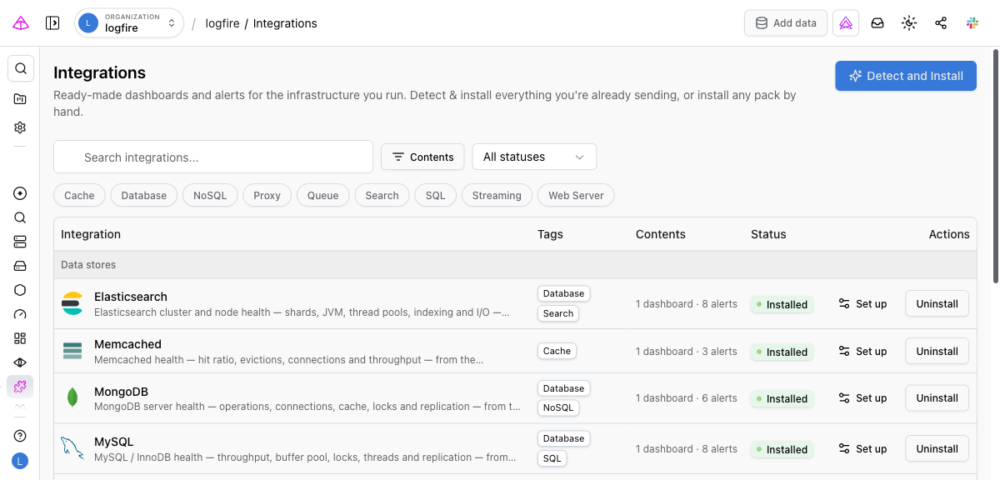

# Integrations

An **integration** is a ready-made observability bundle for a piece of infrastructure you run: a standard dashboard, a set of health alerts, and the configuration needed to collect the data. Logfire ships integrations for Redis, PostgreSQL, MySQL, MongoDB, Elasticsearch, Memcached, RabbitMQ, Kafka, NGINX, and Apache.

They are built on the metrics the [OpenTelemetry Collector](../../how-to-guides/otel-collector/otel-collector-overview.md) already scrapes from those services. The Collector is a separate program that gathers telemetry and forwards it to Logfire. Point it at Redis, open the catalog, and install: you get the dashboard and alerts without working out which attributes the receiver emits, writing the SQL behind each panel, or repeating that work for the next service.

## What an integration installs

- **A standard dashboard.** A curated set of panels for the service. For Redis: memory against `maxmemory`, command throughput, keyspace hit ratio, evictions, connected clients, and replication. Standard dashboards render from one definition Logfire maintains, so installing enables it for your project rather than copying it. There is no per-project copy to drift. Installing the integration is how you enable it: infrastructure dashboards are not listed on the [Dashboards](dashboards.md) page alongside the general-purpose ones.
- **Alerts.** Health alerts grounded in the service's own operational guidance. For Redis: memory near `maxmemory`, high eviction rate, low keyspace hit ratio, rejected connections, and high memory fragmentation. Every integration also includes a *not reporting metrics* alert that fires when the service stops sending telemetry.
- **Setup instructions.** The OpenTelemetry Collector receiver configuration to scrape the service, ready to copy.
- **Detection.** A check that confirms the service's metrics are already arriving in your project, so you only install what is relevant.

!!! note "Which alerts start switched on"

    Alerts come in two tiers. Recommended alerts install **active** and begin evaluating right away. Diagnostic alerts, which are noisier or only meaningful for some workloads, install **inactive** so the default set stays high signal. Switch a diagnostic alert on when you want it.

    Alerts are installed without a notification channel, so nothing pages anyone until you attach one.

## Install an integration

1. **Send telemetry.** Point your OpenTelemetry Collector at the service. Each integration's **Setup** tab has the configuration to copy. On self-hosted Logfire, substitute your own ingest endpoint.
2. **Open the catalog.** In the project sidebar, under **Observe**, select **Integrations**.
3. **Install**, either way round:
    - Select **Detect and Install** at the top of the catalog. Logfire checks every integration against the telemetry in your project and installs the ones it finds.
    - Or find one integration and select **Install** on its row, or open it with **View details** and install from there.
4. **Attach a notification channel.** Open the integration's **Alerts** tab, or your project's [Alerts](alerts.md) page, and give the alerts a channel and schedule so they can reach you.

Integrations keep themselves current. When Logfire revises an integration's content, your installed alerts are brought in line automatically, and its dashboards render from Logfire's definition rather than a per-project copy, so a revised dashboard is already the one you are looking at.

A sync rewrites the alert's own definition: its name, description, query, and evaluation windows. A correction to an alert's query therefore reaches alerts you have already installed. It never touches what you chose: the notification channel you attached, or whether the alert is switched on.

Because the on and off state is yours, it is set only at install. If Logfire later changes whether an alert is recommended or diagnostic, that applies to new installs; an alert you already have stays as you left it, and you can switch it off yourself.

An integration can show **Update available** with an **Update** action in the window between a Logfire release and the sync that follows it. Selecting it is safe but not required: it applies the same content sync, and additionally re-enables any of the integration's dashboards you had turned off.

**Uninstall** deletes the alerts the integration created and disables its bundled dashboards for the project. Alerts and dashboards you made yourself are left alone.

## Read the catalog

The catalog is a table grouped by category: data stores, messaging, web and proxies, infrastructure, AI, and languages. Each row shows the service, its tags, its contents as a count of dashboards and alerts, and its **status** for your project:

- **Available**: no telemetry from this service has been seen.
- **Detected**: the service's metrics are arriving and it is ready to install.
- **Installed**: its dashboards are enabled and its alerts exist.
- **Update available**: installed, but Logfire has since revised the content.

Narrow the list with the search box, the status dropdown (**All statuses**, **Available**, **Installed**), and the tag chips: `Database`, `Cache`, `SQL`, `NoSQL`, `Search`, `Queue`, `Streaming`, `Web Server`, and `Proxy`. Selecting several tags matches any of them.

!!! note "Detection runs on demand"

    Detection happens when you select **Detect and Install**. Nothing scans in the background. An integration counts as detected when its metrics (for example, the `redis.*` metrics) have arrived in your project recently.

## Install from an AI assistant

The catalog is also reachable through the [Logfire MCP server](../../how-to-guides/mcp-server.md), so an AI coding assistant or an on-call agent can put monitoring in place for you. `integration_list` returns the catalog with your project's install and detection state, and `integration_install` installs one. This is what an agent reaches for when it needs dashboards and alerts to exist before it can investigate a problem.

## Available integrations

| Integration | Tags |
|---|---|
| Redis | Database, Cache |
| Memcached | Cache |
| PostgreSQL | Database, SQL |
| MySQL | Database, SQL |
| MongoDB | Database, NoSQL |
| Elasticsearch | Database, Search |
| RabbitMQ | Queue |
| Kafka | Queue, Streaming |
| NGINX | Proxy, Web Server |
| Apache | Web Server |

Integrations are added over time. Each is a data-only definition, so the catalog grows without new per-service code.
