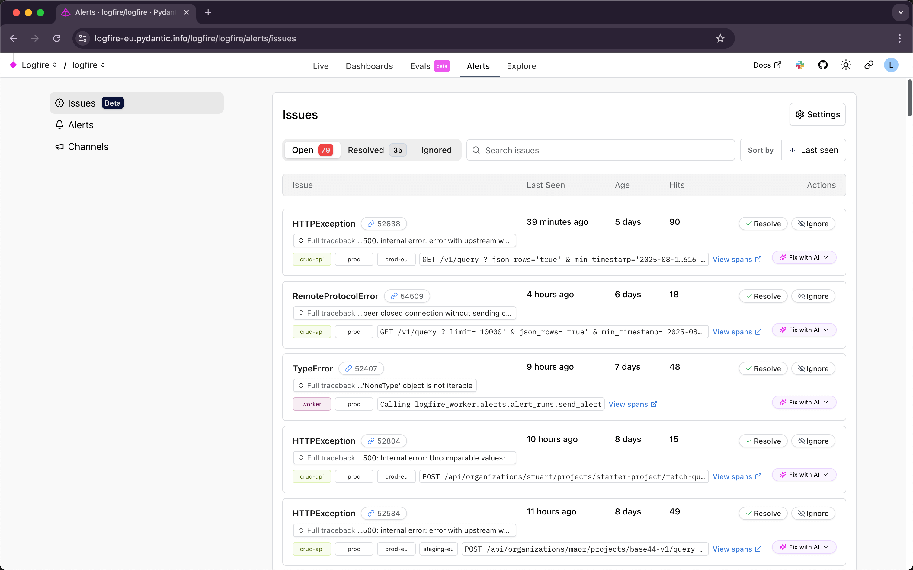

# Issues

!!! warning "Issues in Beta"
    The Issues feature is still under construction, it could break or behave in unexpected ways.

    Please [create an issue](https://github.com/pydantic/logfire/issues/new/choose){:target="\_blank"}
    if you find bugs, get frustrated, or have questions.

Issues provide automatic exception tracking and grouping. Enable issues to identify, prioritize, and resolve problems in your application.

## What are Issues?

Issues are automatically created when Logfire detects exceptions in your application. Instead of manually searching through individual exception logs, Logfire groups similar exceptions together based on their fingerprint, giving you a clear overview of problems affecting your application.

Each issue shows:

- **Exception type and message** - What went wrong
- **Hits** - How many times this exception occurred
- **Last seen and Age** - When the issue was last seen and how long since it first appeared
- **Affected services and environments** - Where the problem is happening
- **Stack trace** - Technical details for debugging

## Issue States

Issues can be in one of three states:

### Open
Active issues that need attention. New exceptions automatically create open issues.

### Resolved
Issues you've marked as fixed. **Resolved issues will automatically reopen** if the same exception occurs again in the future.

### Ignored
Issues you want to permanently ignore. **Ignored issues never reopen** and won't send notifications, even if the same exception continues to occur.

## Managing Issues

### Individual Issue Actions

For each issue, you can:

- **Resolve** - Mark as fixed (will reopen if exception occurs again)
- **Ignore** - Silence permanently (no alerts even if exception recurs)
- **Re-open** - Mark a resolved or ignored issue as active again
- **Delete** - Permanently delete resolved issues

## Turn on Issue Alerts

By default, Issues are only visible in the Logfire web interface. To be notified when Issues occur in your other tools, you can select external channels. 

### Select an Alert Channel

You can:  

1. Create a new channel - Add a webhook URL for services like Slack, Discord, Microsoft Teams, or any service that accepts webhooks  
2. Use an existing channel - Select from previously configured notification channels. 

### Create a new channel:

1. Go to **Settings*** settings on the **Issues** page 
2. Click **Add another channel**
3. Enter a channel name and webhook URL
4. Test the channel before saving

### Managing Notifications

- Select one or many channels where you want to receive issue notifications
- Edit existing channels using the edit icon

Notifications are sent when new issues open and when resolved issues reopen. Ignored issues never send notifications.

### Bulk Actions

To select multiple issues at once, hold down `shift` or `cmd` (macOS) / `cntl` (windows). 

After selecting more than one issue you can:

- Ignore all selected issues  
- Resolve all selected issues 

## Fix with AI

Use this feature to debug your exceptions using your local LLM coding tool plus the Logfire MCP server. 

The Fix with AI button uses Logfire's MCP server to give your AI assistant access to your application data for debugging. You can choose between:

- Claude Code - Debug with Claude Code
- OpenAI Codex - Debug with OpenAI Codex

Run the command provided to retrieve the exception information from the Logfire MCP server so your AI assistant can analyze that specific exception and provide debugging suggestions based on your application context.

Want us to integrate more AI Code assistants? [Let us know](https://logfire.pydantic.dev/docs/help/)

## Sorting and Searching

Search for exception message text using the Search field. 

Use the sort options to find specific issues:
_Click twice on any sort to reverse the order_

- **Sort by Last Seen** - most <> least recent issues
- **Sort by First Seen** - youngest <> oldest issues issues
- **Sort by Message** - sort exception message alphabetically (A-Z) / (Z-A)
- **Sort by Hits** - most <> least hits 
- **Sort by Exception** - sort exception alphabetically (A-Z) / (Z-A)

## Best Practices

### Issue Management Workflow

1. **Monitor open issues regularly** - Check for new exceptions affecting your application
2. **Investigate high-frequency issues first** - Focus on problems impacting the most users
3. **Resolve issues after fixing** - Mark issues as resolved once you've deployed a fix
4. **Ignore noise, not problems** - Only ignore issues that are truly safe to disregard

### When to Resolve vs Ignore

**Resolve** when:
- You've fixed the underlying problem
- You want to be notified if the issue returns
- The exception indicates a real bug or problem

**Ignore** when:
- The exception is expected behavior (e.g., user input validation errors)
- Third-party service errors you can't control
- Legacy code issues you've decided not to fix

### Cleanup

Periodically delete resolved issues that haven't reoccurred to keep your issues list manageable. Remember that deleting an issue is permanent - if the same exception occurs later, it will create a new issue.

## Disabling Issues

If you want to stop tracking issues for a project:

1. Go to **Alerts** menu for the project
2. Click **Settings** on the **Issues** page
3. Click **Disable issues**

!!! warning "Permanent Data Loss"
    Disabling issues will permanently delete all existing issues data, states, and history. You can re-enable issues later, but all previous issue data will be gone and you'll start fresh.
