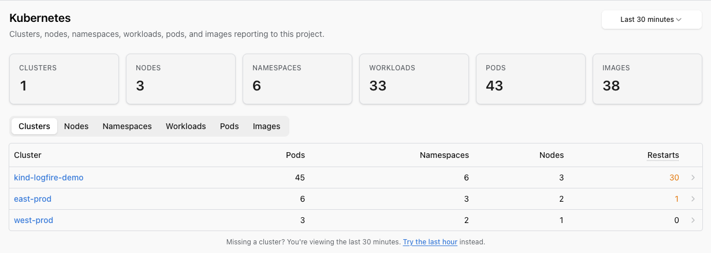
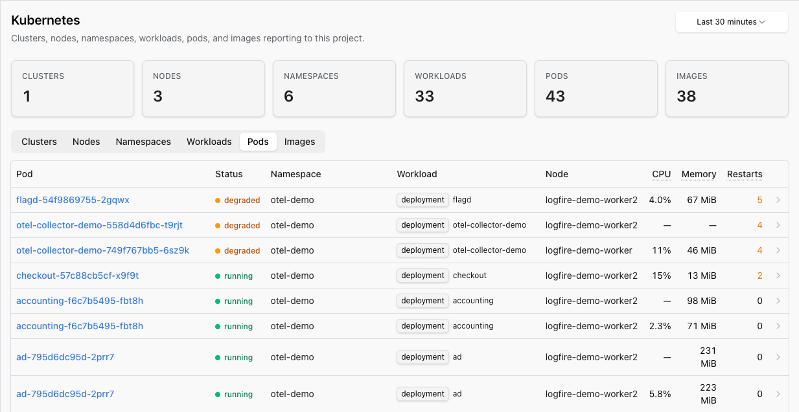

# Kubernetes

The **Kubernetes view** is the cluster-shaped browser for your Kubernetes telemetry. Six lenses on the same data (Clusters, Nodes, Namespaces, Workloads, Pods, and Images) are all sortable, with one-click drill-down to the traces each pod produced in the [Live View](live.md).

You'll find Kubernetes in the project sidebar, between **Hosts** and **Metrics**.



Switch to the **Pods** tab to drop into individual pod state: restart counts, CPU and memory per pod, status pill, and the workload they belong to:



## What's in the view

The top of the page shows summary cards for the whole project: clusters, nodes, namespaces, workloads, pods, and unique container images.

Below the cards, six tabs let you browse by level:

| Tab | Shows |
|-----|-------|
| **Clusters** | One row per cluster, with pod / namespace / node counts and total restarts in the window. |
| **Nodes** | One row per node, with cluster, CPU + sparkline, memory, ready status, and pod count. |
| **Namespaces** | Pod count, CPU and memory usage, restart count. |
| **Workloads** | Workload name and kind, namespace, cluster, pod count, available-vs-desired replicas, restarts. |
| **Pods** | Status pill (Running / Pending / Failed / Succeeded / Unknown), restart count, CPU, memory, ready state. |
| **Images** | Container image digest, the workloads using it, and total deployed size. |

Restart counts roll up at every level. If a single pod is in a crash loop, you can spot it from the Clusters or Workloads tab without drilling all the way down.

## Drill-down

The view follows the Kubernetes hierarchy you already think in:

- From a **cluster** to the namespaces, nodes and workloads inside it.
- From a **namespace** to the workloads and pods inside it.
- From a **workload** (Deployment, StatefulSet, DaemonSet, etc.) to its pods.
- From a **pod** to its workload, its namespace, its node, **and the traces it produced**.

Every detail page links into the [Live View](live.md) for the trace investigation that ends the question.

## Setting up

The recommended path is the upstream [`opentelemetry-kube-stack`](https://github.com/open-telemetry/opentelemetry-helm-charts/tree/main/charts/opentelemetry-kube-stack) Helm chart. By default it deploys the OpenTelemetry Operator, a DaemonSet `OpenTelemetryCollector` running every preset this view reads from: `kubeletMetrics` (with `metric_groups` already set to `[node, pod, container]`), `clusterMetrics` (`k8s_cluster` with leader election so it only emits from one pod), `hostMetrics`, `kubernetesAttributes` (the trace-enrichment processor), and `kubernetesEvents`, plus the ServiceAccount, RBAC and CRDs it all needs. You just point its OTLP exporter at Logfire:

```yaml
# values.yaml: Logfire-shaped overrides for opentelemetry-kube-stack.
# See the chart's own values.yaml for the full schema; this is only the
# overrides on top of the defaults.

clusterName: my-cluster   # shows up as the row label in the Clusters tab

# Inject the write token into every collector pod the chart deploys.
extraEnvs:
  - name: LOGFIRE_TOKEN
    valueFrom:
      secretKeyRef:
        name: logfire-token
        key: LOGFIRE_TOKEN

# Route the daemon collector's three pipelines to Logfire.
# Override must live under `collectors.daemon.config`. The chart's
# collector-specific config wins over `defaultCRConfig.config`.
collectors:
  daemon:
    config:
      exporters:
        otlphttp/logfire:
          endpoint: https://logfire-us.pydantic.dev   # or https://logfire-eu.pydantic.dev
          headers:
            Authorization: ${env:LOGFIRE_TOKEN}
      service:
        pipelines:
          traces:  {exporters: [otlphttp/logfire]}
          metrics: {exporters: [otlphttp/logfire]}
          logs:    {exporters: [otlphttp/logfire]}
```

```bash
helm repo add open-telemetry https://open-telemetry.github.io/opentelemetry-helm-charts
kubectl create namespace observability
kubectl -n observability create secret generic logfire-token \
  --from-literal=LOGFIRE_TOKEN=<your write token from project Settings → Write tokens>
helm upgrade --install otel-stack open-telemetry/opentelemetry-kube-stack \
  -n observability -f values.yaml
```

Data starts flowing within a minute or two of the daemon pods reaching `Ready`. The chart wires the `k8sattributes` processor into the daemon's trace pipeline so the **drill-down from a pod to the spans that pod emitted** in the [Live View](live.md) works out of the box.

For the full per-piece breakdown (RBAC, both collector configs, the `k8sattributes` processor's pod_association chain, and a kind walkthrough), see the [Kubernetes monitoring](../../how-to-guides/otel-collector/kubernetes-monitoring.md) how-to-guide. For an end-to-end article including a real application sending traces and unified dashboards, see [Full-stack Kubernetes observability with Logfire](https://pydantic.dev/articles/kubernetes-cluster-observability-logfire).

If you have not set anything up yet, the empty state on each tab has a **Set up** button that deep-links to the relevant page of the add-data wizard.

## Where Kubernetes events surface today

The chart's `kubernetesEvents` preset turns Kubernetes events (pod scheduling, OOMKills, image pull failures, deployment progress) into log records via the `k8sobjects` receiver and ships them to your project. There is no dedicated **Events** tab in the Kubernetes view yet. To read them, open the [Live View](live.md) and filter on the relevant pod, namespace or `k8s.*` attribute, or query the `records` table directly in the [SQL Explorer](explore.md). Watch this space. An events feed in the Kubernetes view is in our backlog.

## Troubleshooting

| Symptom | Likely cause |
|---------|--------------|
| Clusters tab is empty or shows `pods: 0` | The cluster-scope collector (or the chart's `clusterMetrics` preset) is not running, or `k8s_cluster` is missing from the metrics pipeline. |
| Nodes tab CPU and memory columns are blank | `kubeletstats` is running with the default `metric_groups: [container, pod]`. Add `node` to the list (the chart preset includes it by default). |
| Pod row has no traces to drill into | The `k8sattributes` processor is not on the trace pipeline, so spans never get `k8s.pod.name` etc. attached. The chart wires this in by default; if you assembled the setup by hand, see [Kubernetes monitoring](../../how-to-guides/otel-collector/kubernetes-monitoring.md#what-k8sattributesprocessor-actually-does). |
| Cluster metrics appear duplicated across nodes | `k8s_cluster` is running on every replica without `k8s_leader_elector`. The chart configures the elector; from-scratch setups must add it. |
| Two clusters collide as one row in the **Clusters** tab | Both clusters report the same `k8s.cluster.name`. Set a unique `clusterName` on each via the chart's top-level `clusterName:` value or the `resource/cluster` processor in a hand-rolled setup. |
