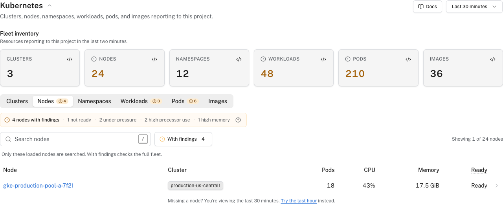

# Kubernetes

The <OpenInLogfire path="kubernetes" variant="inline" label="Kubernetes view" /> is the cluster-shaped browser for your Kubernetes telemetry. Six lenses on the same data (Clusters, Nodes, Namespaces, Workloads, Pods, and Images) are all sortable, with one-click drill-down to the traces each pod produced in the [Live View](live.md).

You'll find Kubernetes in the project sidebar, between **Hosts** and **Metrics**.

Switch to the **Pods** tab to drop into individual pod state: restart counts, CPU and memory per pod, status pill, and the workload they belong to.

## What's in the view

The top of the page shows clusters, nodes, namespaces, workloads, pods, and unique container images observed in the latest 15 minutes of the selected time range. The page also checks the full selected range for Kubernetes data, so an older resource does not make the project look unconfigured when its current snapshot is empty.

Below the cards, six tabs let you browse by level:

| Tab | Shows |
|-----|-------|
| **Clusters** | One row per cluster, with pod / namespace / node counts and total restarts in the window. |
| **Nodes** | One row per node, with cluster, CPU + sparkline, memory, ready status, and pod count. |
| **Namespaces** | Pod count, CPU and memory usage, restart count. |
| **Workloads** | Workload name and kind, namespace, cluster, pod count, available-vs-desired replicas, restarts. |
| **Pods** | Status (Running / Pending / Failed / Succeeded / Unknown), restart count, CPU, memory, workload, and node. |
| **Images** | Container image and tag, with pod, namespace, and cluster counts. |

Restart counts roll up at every level. If a single pod is in a crash loop, you can spot it from the Clusters or Workloads tab without drilling all the way down.

## Find current Kubernetes problems

The **Nodes**, **Workloads**, and **Pods** tabs show current finding counts. Open one of those tabs and select **With findings** to query the full fleet for affected resources, including resources beyond the rows initially loaded on the page.

- **Nodes**: not ready, reporting memory or disk pressure, or using at least 80% of allocatable processor or memory capacity.
- **Workloads**: a deployment has fewer available replicas than desired, or a job reports failed pods.
- **Pods**: pending or failed, or reporting at least three cumulative container restarts.

Kubernetes findings use telemetry received in the latest 15 minutes, rather than every sample in the selected historical range, so they describe the current state. One resource can have more than one condition, which means the condition counts can overlap. A missing metric means Logfire cannot evaluate that condition, not that the resource is healthy.

Kubernetes Events remain separate log records. An image-pull failure, scheduling event, or `OOMKilled` event can explain a finding, but it is not itself counted as one.

## Drill-down

The view follows the Kubernetes hierarchy you already think in:

- From a **cluster** to the namespaces, nodes and workloads inside it.
- From a **namespace** to the workloads and pods inside it.
- From a **workload** (Deployment, StatefulSet, DaemonSet, etc.) to its pods.
- From a **pod** to its workload, its namespace, its node, **and the traces it produced**.

Every detail page links into the [Live View](live.md) for the trace investigation that ends the question.

## Setting up

Follow [Kubernetes monitoring with the OTel Collector](../../how-to-guides/otel-collector/kubernetes-monitoring.md) to install the upstream `opentelemetry-kube-stack` Helm chart and connect it to your Logfire project. The balanced setup collects the full data set this view uses: cluster state, node, pod, and container metrics, pod logs, Kubernetes Events, and Kubernetes identity on telemetry.

Data starts flowing within a minute or two of the daemon pods reaching `Ready`. The chart wires the `k8s_attributes` processor into the daemon's trace pipeline so the **drill-down from a pod to the spans that pod emitted** in the [Live View](live.md) works out of the box.

The setup collects Kubernetes metrics once per minute, omits the kubelet volume group and broad Prometheus scrapes, and keeps the node conditions used by the findings summary. Host metrics are optional because the Kubernetes view gets node CPU and memory from kubelet metrics. After the standard setup works, you can [collect more Kubernetes data](../../how-to-guides/otel-collector/kubernetes-collect-more.md) or [measure and control Kubernetes monitoring volume](../../how-to-guides/otel-collector/kubernetes-reduce-volume.md) without breaking this page.

For the full per-piece breakdown (RBAC, both collector configs, the `k8s_attributes` processor's pod association chain, and a kind walkthrough), see the [custom Collector setup](../../how-to-guides/otel-collector/kubernetes-manual-setup.md). For an end-to-end article including a real application sending traces and unified dashboards, see [Full-stack Kubernetes observability with Logfire](https://pydantic.dev/articles/kubernetes-cluster-observability-logfire).

If you have not set anything up yet, the empty state on each tab has a **Set up** button that deep-links to the relevant page of the add-data wizard.

## Where Kubernetes events surface today

The chart's `kubernetesEvents` preset turns Kubernetes events (pod scheduling, OOMKills, image pull failures, deployment progress) into log records via the `k8s_objects` receiver and ships them to your project. There is no dedicated **Events** tab in the Kubernetes view yet. To read them, open the [Live View](live.md) and filter on the relevant pod, namespace or `k8s.*` attribute, or query the `records` table directly in [SQL Workbench](explore.md). Watch this space. An events feed in the Kubernetes view is in our backlog.

## Troubleshooting

| Symptom | Likely cause |
|---------|--------------|
| Clusters tab is empty or shows `pods: 0` | The cluster-scope collector (or the chart's `clusterMetrics` preset) is not running, or `k8s_cluster` is missing from the metrics pipeline. |
| Nodes tab CPU and memory columns are blank | A custom `kubelet_stats.metric_groups` list omits `node`. Add `node` to the list (the receiver and chart preset include it by default). |
| Pod row has no traces to drill into | The `k8s_attributes` processor is not on the trace pipeline, so spans never get `k8s.pod.name` etc. attached. The chart wires this in by default; if you assembled the setup by hand, see [the custom Collector reference](../../how-to-guides/otel-collector/kubernetes-manual-setup.md#what-k8sattributesprocessor-actually-does). |
| Cluster metrics appear duplicated across nodes | `k8s_cluster` is running on every replica without `k8s_leader_elector`. The chart configures the elector; from-scratch setups must add it. |
| Two clusters collide as one row in the **Clusters** tab | Both clusters report the same `k8s.cluster.name`. Set a unique `clusterName` on each via the chart's top-level `clusterName:` value or the `resource/cluster` processor in a hand-rolled setup. |
