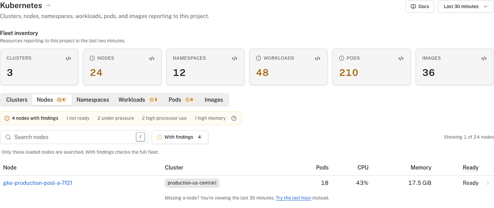

# Kubernetes

Find Kubernetes resources that need attention, then inspect their events, container logs, and application traces in the <OpenInLogfire path="kubernetes" variant="inline" label="Kubernetes view" />. A trace is the full journey of one request, made of nested spans. Each span is one unit of work: a single operation, with a name, a start, and a duration. Open the trace in [Live View](live.md) to investigate what the application did.

You'll find **Kubernetes** in the project sidebar. Resource findings are available in the inventory; the dedicated **Logs** and **Events** tabs are experimental.

Switch to the **Pods** tab to drop into individual pod state: restart counts, CPU and memory per pod, status pill, and the workload they belong to.

## What's in the view

The top of the page shows clusters, nodes, namespaces, workloads, pods, and unique container images observed in the latest 15 minutes of the selected time range. The page also checks the full selected range for Kubernetes data, so an older resource does not make the project look unconfigured when its current snapshot is empty.

Below the cards, six tabs let you browse by level:

| Tab | Shows |
|-----|-------|
| **Clusters** | One row per cluster, with pod, namespace, and node counts and reported cumulative restarts across pods. |
| **Nodes** | One row per node, with cluster, CPU + sparkline, memory, ready status, and pod count. |
| **Namespaces** | Pod count, CPU and memory usage, restart count. |
| **Workloads** | Workload name and kind, namespace, cluster, pod count, available-vs-desired replicas, restarts. |
| **Pods** | Status (Running / Pending / Failed / Succeeded / Unknown), restart count, CPU, memory, workload, and node. |
| **Images** | Container image and tag, with pod, namespace, and cluster counts. |

Pods show their reported cumulative container restart counts. Workload, namespace, and cluster rows roll up those counts across their pods. These totals can help you choose where to investigate; they do not count new restarts during the selected range.

## Find current Kubernetes problems

The **Nodes**, **Workloads**, and **Pods** tabs show finding counts. Open one of those tabs and select **With findings** to query the full fleet for resources with current findings, including resources beyond the rows initially loaded on the page.

- **Nodes**: not ready, reporting memory or disk pressure, or using at least 80% of allocatable processor or memory capacity.
- **Workloads**: a deployment has fewer available replicas than desired, or a job reports failed pods.
- **Pods**: pending or failed, or reporting at least three cumulative container restarts. This is the count reported by Kubernetes, not the number of restarts in the selected range. Kubernetes can reset it after a node restart.

Finding counts use metric samples from the final 15 minutes of the selected range, or the whole range if it is shorter. **With findings** checks the latest 15 minutes at the time of the request, regardless of the selected range. In a historical range, the counts and filtered rows can therefore differ.

One resource can have more than one condition, which means the condition counts can overlap. A missing metric means Logfire cannot evaluate that condition, not that the resource is healthy.

Kubernetes Events remain separate log records. An image-pull failure, scheduling event, or `OOMKilled` event can explain a finding, but it is not itself counted as one.

## Drill-down

The view follows the Kubernetes hierarchy you already think in:

- From a **cluster** to the namespaces, nodes and workloads inside it.
- From a **namespace** to the workloads and pods inside it.
- From a **workload** (Deployment, StatefulSet, DaemonSet, etc.) to its pods.
- From a **pod** to its workload, its namespace, its node, **and the traces it produced**.

Resource detail pages retain your time range and environment when you switch between **Overview**, **Logs**, and **Events**. The Logs and Events tabs keep the selected cluster, namespace, node, workload, or pod scope. Each detail page also links to [Live View](live.md) for application traces.

## Enable experimental Logs and Events

Early access requires access to a Growth or Enterprise organization, or a self-hosted deployment. Findings do not require Early access.

1. Open **Settings → Early access**.
2. Click the flask button labeled **Show experimental features**.
3. Enable **Infrastructure logs**.
4. If prompted, review the terms, check the agreement box, and select **Agree and continue**. If you see a notice instead, select **Enable feature**.
5. Open **Kubernetes** or a resource's detail page. You should see **Overview**, **Logs**, and **Events** tabs.

The switch does not install a Collector or start sending data. An OpenTelemetry Collector is a separate program that sits between your apps and Logfire, gathering telemetry and forwarding it. Use the [Kubernetes monitoring setup](../../how-to-guides/otel-collector/kubernetes-monitoring.md) to collect pod logs and Kubernetes Events. A metrics-only installation does not populate those tabs.

## Read container logs

Open **Logs** for all Kubernetes resources, or select a cluster, namespace, node, workload, or pod first. Search messages, filter by severity, and choose a container on a pod's Logs tab. Open a row to inspect its original body and attributes; a truncated message preview does not replace the stored record.

Live tail follows incoming records. **Pause** freezes the window for inspection. Scrolling away stops automatic scrolling. A new-row indicator appears when new records arrive while you're scrolled away; select **Resume** to return to live output. A fixed historical range stays within its selected bounds.

## Inspect Kubernetes Events

Open **Events** for the fleet or a selected resource. Search by message, reason, or affected object. Each event shows its type, reason, message, affected resource, and reported total occurrence count when available. Open an event to inspect its original structured body.

An Event is a Kubernetes lifecycle record, such as a scheduling failure or a container restart. The chart's `kubernetesEvents` preset sends these records to Logfire through the `k8s_objects` receiver. Repeated updates to the same Event appear together; its occurrence count is reported by Kubernetes, not a count of rows received in your selected range. The list starts with recent records; use **Show more** when available to request older records in the range.

You can also read the records in [Live View](live.md) or query `records` in [SQL Workbench](explore.md), without enabling the experimental tabs.

## Setting up

Follow [Kubernetes monitoring with the OTel Collector](../../how-to-guides/otel-collector/kubernetes-monitoring.md) to install the upstream `opentelemetry-kube-stack` Helm chart and connect it to your Logfire project. The balanced setup collects the full data set this view uses: cluster state, node, pod, and container metrics, pod logs, Kubernetes Events, and Kubernetes identity on telemetry.

Data starts flowing within a minute or two of the daemon pods reaching `Ready`. The chart wires the `k8s_attributes` processor into the daemon's trace pipeline so the **drill-down from a pod to the spans that pod emitted** in the [Live View](live.md) works out of the box.

The setup collects Kubernetes metrics once per minute, omits the kubelet volume group and broad Prometheus scrapes, and keeps the node conditions used by the findings summary. Host metrics are optional because the Kubernetes view gets node CPU and memory from kubelet metrics. After the standard setup works, you can [collect more Kubernetes data](../../how-to-guides/otel-collector/kubernetes-collect-more.md) or [measure and control Kubernetes monitoring volume](../../how-to-guides/otel-collector/kubernetes-reduce-volume.md) without breaking this page.

For the full per-piece breakdown (RBAC, both collector configs, the `k8s_attributes` processor's pod association chain, and a kind walkthrough), see the [custom Collector setup](../../how-to-guides/otel-collector/kubernetes-manual-setup.md). For an end-to-end article including a real application sending traces and unified dashboards, see [Full-stack Kubernetes observability with Logfire](https://pydantic.dev/articles/kubernetes-cluster-observability-logfire).

If you have not set anything up yet, the empty state on each tab has a **Set up** button that deep-links to the relevant page of the add-data wizard.

## Troubleshooting

| Symptom | Likely cause |
|---------|--------------|
| Clusters tab is empty or shows `pods: 0` | The cluster-scope collector (or the chart's `clusterMetrics` preset) is not running, or `k8s_cluster` is missing from the metrics pipeline. |
| Nodes tab CPU and memory columns are blank | A custom `kubelet_stats.metric_groups` list omits `node`. Add `node` to the list (the receiver and chart preset include it by default). |
| Pod row has no traces to drill into | The `k8s_attributes` processor is not on the trace pipeline, so spans never get `k8s.pod.name` etc. attached. The chart wires this in by default; if you assembled the setup by hand, see [the custom Collector reference](../../how-to-guides/otel-collector/kubernetes-manual-setup.md#what-k8sattributesprocessor-actually-does). |
| Cluster metrics appear duplicated across nodes | `k8s_cluster` is running on every replica without `k8s_leader_elector`. The chart configures the elector; from-scratch setups must add it. |
| Two clusters collide as one row in the **Clusters** tab | Check `k8s.cluster.uid`: distinct UIDs keep clusters separate even when names match. Without a UID, Logfire falls back to `k8s.cluster.name`. Set a unique `clusterName` for each name-only cluster via the chart's top-level `clusterName:` value or the `resource/cluster` processor in a custom setup. |
| Logs and Events tabs are missing | Check your Early access eligibility and follow [Enable experimental Logs and Events](#enable-experimental-logs-and-events), including any terms or notice prompt. |
| Logs or Events are empty | Check the time range and environment. Confirm that the Collector sends pod logs and Kubernetes Events, with the cluster and resource identity used by the selected scope. Widen to the fleet view to check whether records arrived under a different identity. |
