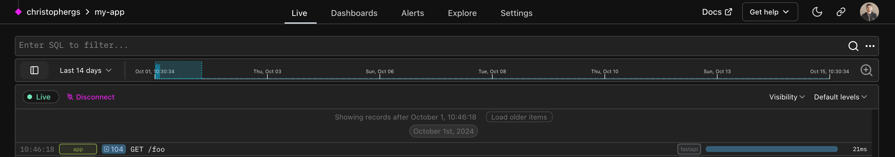
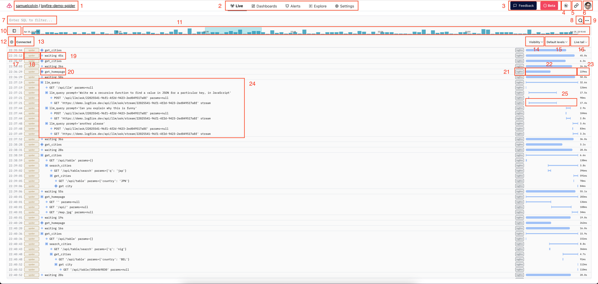
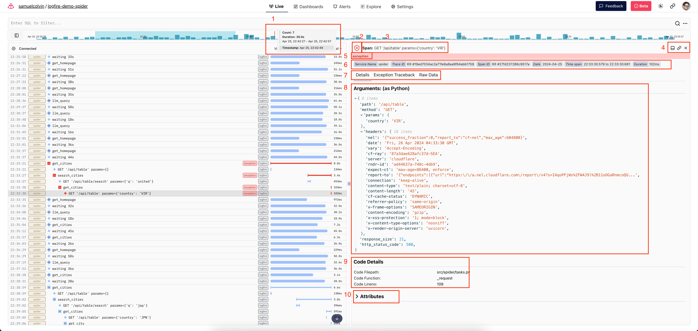
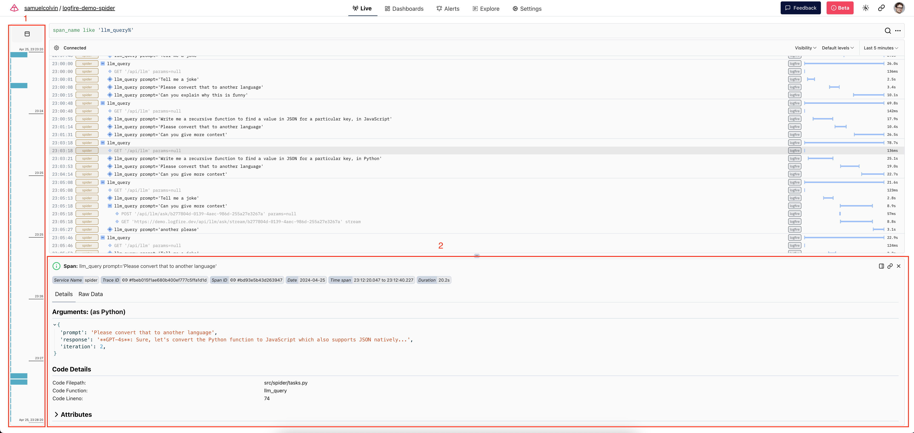

# Live View

The live view is the main view of **Logfire**, where you can see traces in real-time.

The live view is useful (as the name suggests) for watching what's going on within your
application in real-time, but it can also be used to explore historical data.

## The Live View SQL Box

The live view has a query box at the top. Here you can enter the `WHERE` clause of a SQL query.



Note: you can run more complex queries on the [explore screen](explore.md)


The schema for the records table is:

```sql
CREATE TABLE records AS (
    start_timestamp timestamp with time zone,
    created_at timestamp with time zone,
    trace_id text,
    span_id text,
    parent_span_id text,
    kind span_kind,
    end_timestamp timestamp with time zone,
    level smallint,
    span_name text,
    message text,
    attributes_json_schema text,
    attributes jsonb,
    tags text[],
    otel_links jsonb,
    otel_events jsonb,
    is_exception boolean,
    otel_status_code status_code,
    otel_status_message text,
    otel_scope_name text,
    otel_scope_version text,
    otel_scope_attributes jsonb,
    service_namespace text,
    service_name text,
    service_version text,
    service_instance_id text,
    process_pid integer
)
```

Some basic examples to get started:

- To view your warnings and errors type: `level > 'info'`
- To see just exceptions type: `is_exception`
- To filter by service name (which you can find on the detail panel of any given trace): `service_name = 'crud-api'`

## Details panel closed



This is what you'll see when you come to the live view of a project with some data.

1. **Organization and project labels:** In this example, the organization is `samuelcolvin`, and the project is `logfire-demo-spider`. You can click the organization name to go to the organization overview page; the project name is a link to this page.

2. **Project pages:** These are links to the various project-specific pages, including the Live, [Dashboards](./dashboards.md), [Alerts](./alerts.md), [Explore](./explore.md), and Settings pages.

3. **Feedback button:** Click the feedback button to provide us feedback.

4. **Light/Dark mode toggle:** Cycles between light, dark, and system — because everyone seems to have an opinion on this :smile:

5. **Link to the current view:** Clicking this copies a link to the page you are on, with the same query etc.

6. **Organization selection panel:** Opens a drawer with links to the different organizations you are a member of, and also has links to the Terms and Conditions, Support, Documentation, and a Log Out button.

7. **Query text input:** Enter a SQL query here to find spans that match the query. The query should be in the form of a Postgres-compatible `WHERE` clause on the records table (e.g. to find warnings, enter `level >= level_num('error')`). See the [Explore docs](./explore.md) for more detail about the schema here.

8. **Search button:** You can click here to run the query after you've entered it, or just press cmd+enter (or ctrl+enter on windows/linux).

9. **Extra query menu:** Here you can find quick selections for adding filters on various fields to your query. There is also a link to a natural language query entry option, which uses an LLM to generate a query based on a natural language description of what you are looking for.

10. **Toggle timeline position button:** Click here to switch the timeline (see the next item for more info) between vertical and horizontal orientation.

11. **Timeline:** This shows a histogram of the counts of spans matching your query over time. The blue-highlighted section corresponds to the time range currently visible in the scrollable list of traces below. You can click at points on this line to move to viewing logs from that point in time.

12. **Traces scroll settings:** This menu contains some settings related to what is displayed in the traces scroll view.

13. **Status label:** This should show "Connected" if your query is successful and you are receiving live data. If you have a syntax error in your query or run into other issues, you should see details about the problem here.

14. **Service, scope, and tags visibility filters:** Here you can control whether certain spans are displayed based on their service, scope, or tags.

15. **Level visibility filter:** Here you can control which log levels are displayed. By default, 'debug' and 'trace' level spans are hidden from view, but you can change the value here to display them, or you can toggle the visibility of spans of other levels as well.

16. **Time window selection:** Here, you can toggle between "Live tail", which shows live logs as they are received, and a historical time range of varying sizes. When a specific time range is selected, the timeline from item 11 will match that range.

Below item 16, we have the "Traces Scroll View", which shows traces matching your current query and visibility filters.

[//]: # (note we rely on the sane_lists markdown extension to "start" a list from 17!)

17. **Start timestamp label:** This timestamp is the `start_timestamp` of the span. Hover this to see its age in human-readable format.

18. **Service label:** This pill contains the `service_name` of the span. This is the name of the service that produced the span. You can hover to see version info.

19. **Message:** Here you can see the `message` of this span (which is actually the root span of its trace). You can also click here to see more details. Note that the smaller diamond means that this span has no children

20. **A collapsed trace:** The larger diamond to the left of the span message, with a `+` in it, indicates that this span has child spans, and can be expanded to view them by clicking on the `+`-diamond.

21. **Scope label:** This pill contains the `otel_scope_name` of the span. This is the name of the OpenTelemetry scope that produced the span. Generally, OpenTelemetry scopes correspond to instrumentations, so this generally gives you a sense of what library's instrumentation produced the span. This will be logfire when producing spans using the logfire APIs, but will be the name of the OpenTelemetry instrumentation package if the span was produced by another instrumentation. You can hover to see version info.

22. **Trace duration line:** When the root span of a trace is collapsed, the line on the right will be thicker and rounded, and start at the far left. When this is the case, the length of the line represents the log-scale duration of the trace. See item 25 for contrast.

23. **Trace duration label:** Shows the duration of the trace.

24. **An expanded trace:** Here we can see what it looks like if you expand a trace down a couple levels. You can click any row within the trace to see more details about the span.

25. **Span duration line:** When a trace is expanded, the shape of the lines change, representing a transition to a linear scale where you can see each span's start and end timestamp within the overall trace.

## Details panel open



When you click on a span in the Traces Scroll, it will open the details panel, which you can see here.

1. **Timeline tooltip:** Here you can see the tooltip shown when you hover the timeline. It shows the count of records in the hovered histogram bar, the duration of the bar, the time range that the bar represents, and the exact timestamp you are hovering (and at which you'll retrieve records when you click on the timeline)

2. **Level icon:** This icon represents the highest level of this span and any of its descendants.

3. **Span message:** Here you can see whether the item is a Span or Log, and its message.

4. **Details panel orientation toggle, and other buttons:** The second button copies a link to view this specific span. The X closes the details panel for this span.

5. **Exception warning:** This exception indicator is present because an exception bubbled through this span. You can see more details in the Exception Traceback details tab.

6. **Pinned span attributes:** This section contains some details about the span. The link icons on the "Trace ID" and "Span ID" pills can be clicked to take you to a view of the trace or span, respectively.

7. **Details tabs:** These tabs include more detailed information about the span. Some tabs, such as the Exception Details tab, will only be present for spans with data relevant to that tab.

8. **Arguments panel:** If a span was created with one of the logfire span/logging APIs, and some arguments were present, those arguments will be shown here, displayed as a Python dictionary.

9. **Code details panel:** When attributes about the source line are present on a span, this panel will be present, and that information displayed here.

10. **Full span attributes panel:** When any attributes are present, this panel will show the full list of OpenTelemetry attributes on the span. This panel is collapsed by default, but you can click on its name to show it.

## Live view variant



1. This is what the timeline looks like in vertical orientation. You can toggle this orientation at any time.
2. This is what the details panel looks like in horizontal orientation. You can toggle this orientation whenever the details panel is open.
