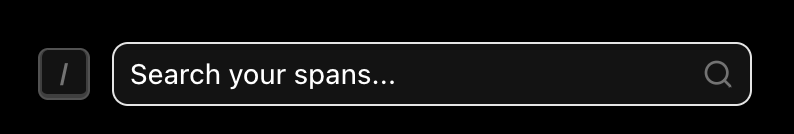
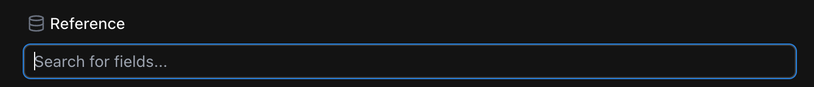
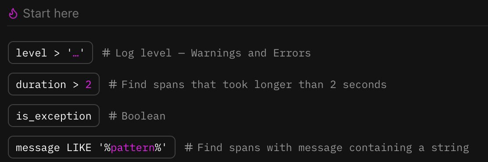
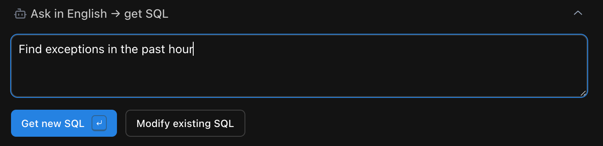
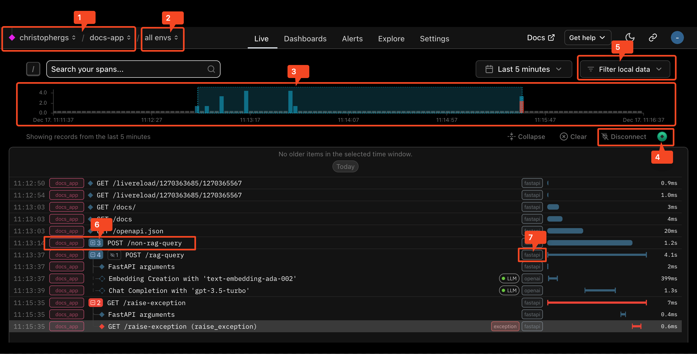
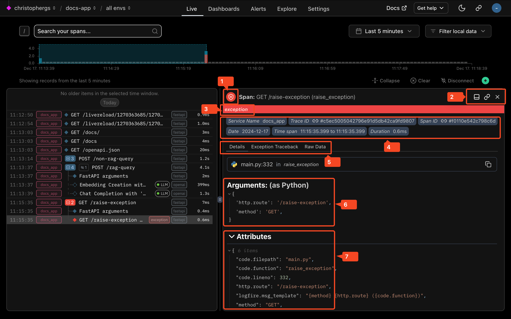

# Live View

The live view is the focal point of **Logfire**, where you can see traces arrive in real-time.

The live view is useful for watching what's going on within your
application in real-time (as the name suggests), but it can also be used to explore historical data via the *live view search*.

## The Live View Search

To search the live view, click `Search your spans` (keyboard shortcut `/`), this
opens the search pane:



### SQL Search
Here you can write raw SQL. A good choice if you know what you want and/or love SQL. As the greyed out
`SELECT * FROM RECORDS WHERE` implies, this is the `WHERE` clause of a SQL query.
It has auto-complete & schema hints, so try typing something to get a reminder. To run your query click `Run` or keyboard
shortcut `cmd+enter` (or `ctrl+enter` on windows/linux).

Note: you can run more complex queries on the [explore screen](explore.md)


The schema for the records table is:

```sql
CREATE TABLE records AS (
    start_timestamp timestamp with time zone,
    created_at timestamp with time zone,
    trace_id text,
    span_id text,
    parent_span_id text,
    kind span_kind,
    end_timestamp timestamp with time zone,
    level smallint,
    span_name text,
    message text,
    attributes_json_schema text,
    attributes jsonb,
    tags text[],
    otel_links jsonb,
    otel_events jsonb,
    is_exception boolean,
    otel_status_code status_code,
    otel_status_message text,
    otel_scope_name text,
    otel_scope_version text,
    otel_scope_attributes jsonb,
    service_namespace text,
    service_name text,
    service_version text,
    service_instance_id text,
    process_pid integer
)
```

You can search for any of these in the `Reference` field of the search box:



If you're not sure where to start, scroll down to the `Start here` section of the search box for some suggestions.



### Ask in English -> Get SQL
Allows you to write your query in English, and will then convert that natural language query to SQL. Great if you're not
confident with SQL and/or can't quite remember a tricky clause. You have the option to either create a completely
new query with `Get new SQL` or (if you have some SQL already) modify a work-in-progress query with `Modify existing SQL`.
You'll note that whenever you click either of these buttons the SQL is updated in the SQL Search box above.



Under the hood this uses
an LLM running with [PydanticAI](https://github.com/pydantic/pydantic-ai).

### Common Clauses
Common clauses: A list of pre-populated useful queries. A powerful way to rapidly generate the query you need, whilst
simultaneously learning more about all the ways you can search your data. Clicking multiple clauses will add them to
your query with a SQL `AND` statement. If you'd like something other than an `AND` statement you can either modify the
SQL populated in the SQL search or use the [explore screen](explore.md) for more complex queries.

## Details panel closed


This is what you'll see when you come to the live view of a project with some data.

1. **Organization and project labels:** In this example, the organization is `christophergs`, and the project is `docs-app`. You can click the organization name to go to the organization overview page; the project name is a link to this page.

2. **Environment:** In the above screenshot, this is set to `all envs`. See the [environments docs](../advanced/environments.md) for details.

3. **Timeline:** This shows a histogram of the counts of spans matching your query over time. The blue-highlighted section corresponds to the time range currently visible in the scrollable list of traces below. You can click at points on this line to move to viewing logs from that point in time.

4. **Status label:** This should show "Connected" if your query is successful and you are receiving live data. If you have a syntax error in your query or run into other issues, you should see details about the problem here.

5. **Level, Service, scope, and tags visibility filters:** Here you can control whether certain spans are displayed based on their level, service, scope, or tags. Important note:
this only filters data **currently on the screen**.

6. **A collapsed trace:** The `+` symbol to the left of the span message indicates that this span has child spans, and can be expanded to view them by clicking on the `+` button.

7. **Scope label:** This pill contains the `otel_scope_name` of the span. This is the name of the OpenTelemetry scope that produced the span. Generally, OpenTelemetry scopes correspond to instrumentations, so this generally gives you a sense of what library's instrumentation produced the span. This will be logfire when producing spans using the logfire APIs, but will be the name of the OpenTelemetry instrumentation package if the span was produced by another instrumentation. You can hover to see version info.

[//]: # (note we rely on the sane_lists markdown extension to "start" a list from 17!)

## Details panel open



When you click on a span in the Traces Scroll, it will open the details panel, which you can see here.

1. **Level icon:** This icon represents the highest level of this span and any of its descendants.

2. **Details panel orientation toggle, and other buttons:** The second button copies a link to view this specific span. The X closes the details panel for this span.

3. **Exception warning:** This exception indicator is present because an exception bubbled through this span. You can see more details in the Exception Traceback details tab.

4. **Pinned span attributes:** This section contains some details about the span. The link icons on the "Trace ID" and "Span ID" pills can be clicked to take you to a view of the trace or span, respectively.

5. **Details tabs:** These tabs include more detailed information about the span. Some tabs, such as the Exception Details tab, will only be present for spans with data relevant to that tab.

6. **Arguments panel:** If a span was created with one of the logfire span/logging APIs, and some arguments were present, those arguments will be shown here, displayed as a Python dictionary.

7. **Attributes:** Full span attributes panel - when any attributes are present, this panel will show the full list of OpenTelemetry attributes on the span.
