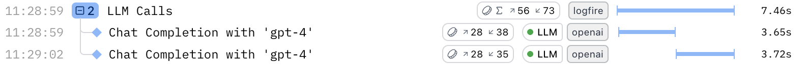
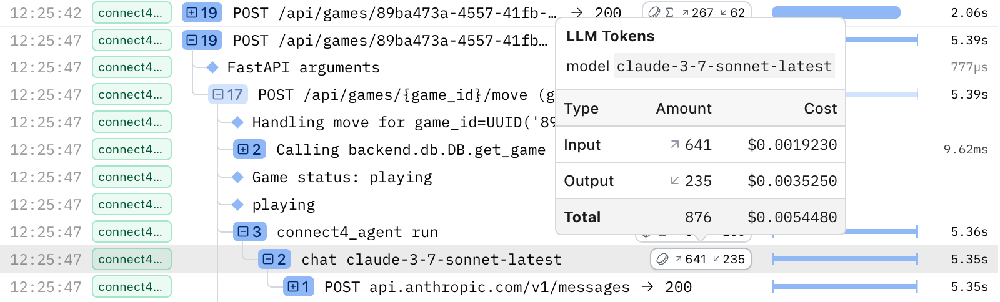
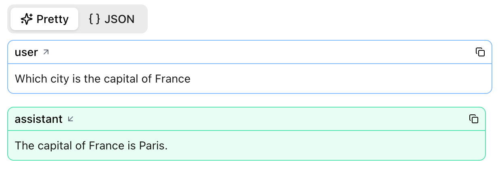
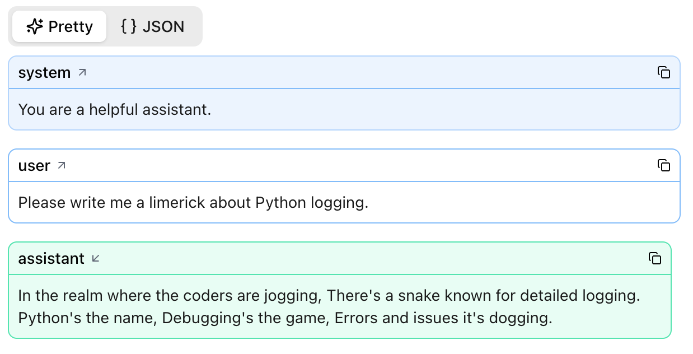
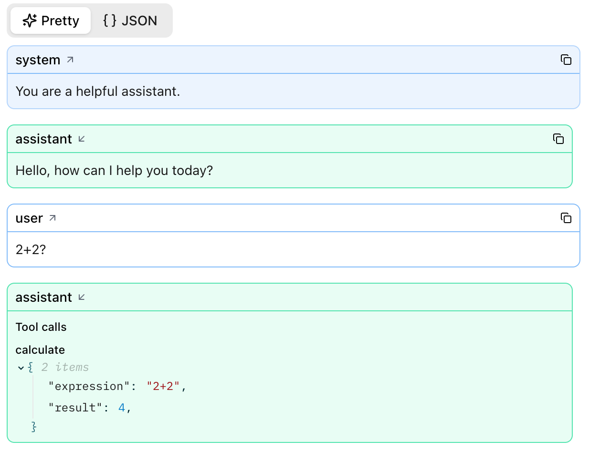
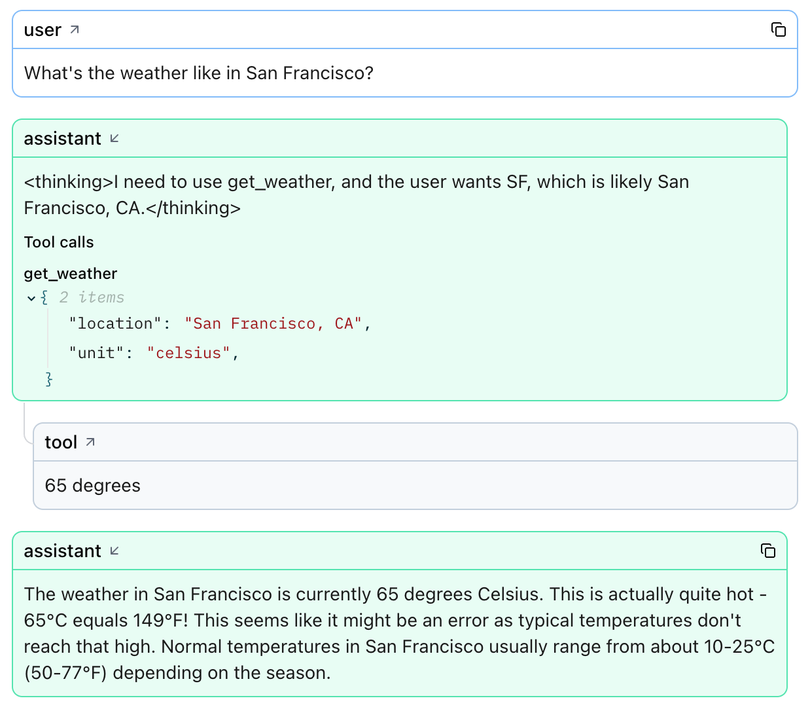
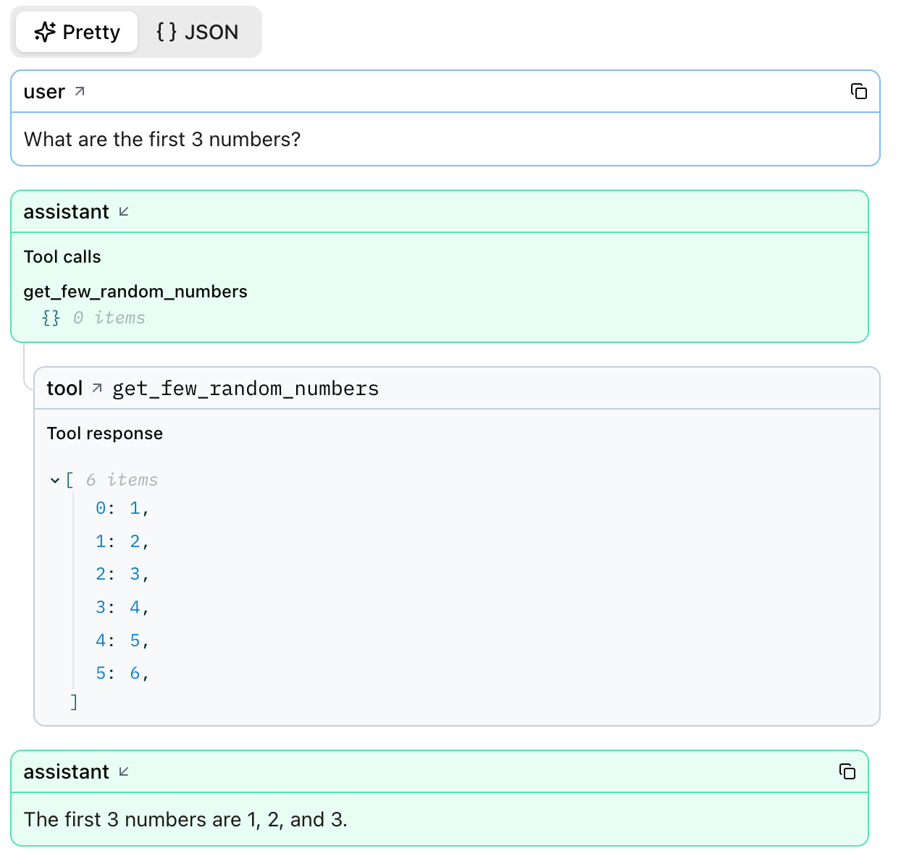
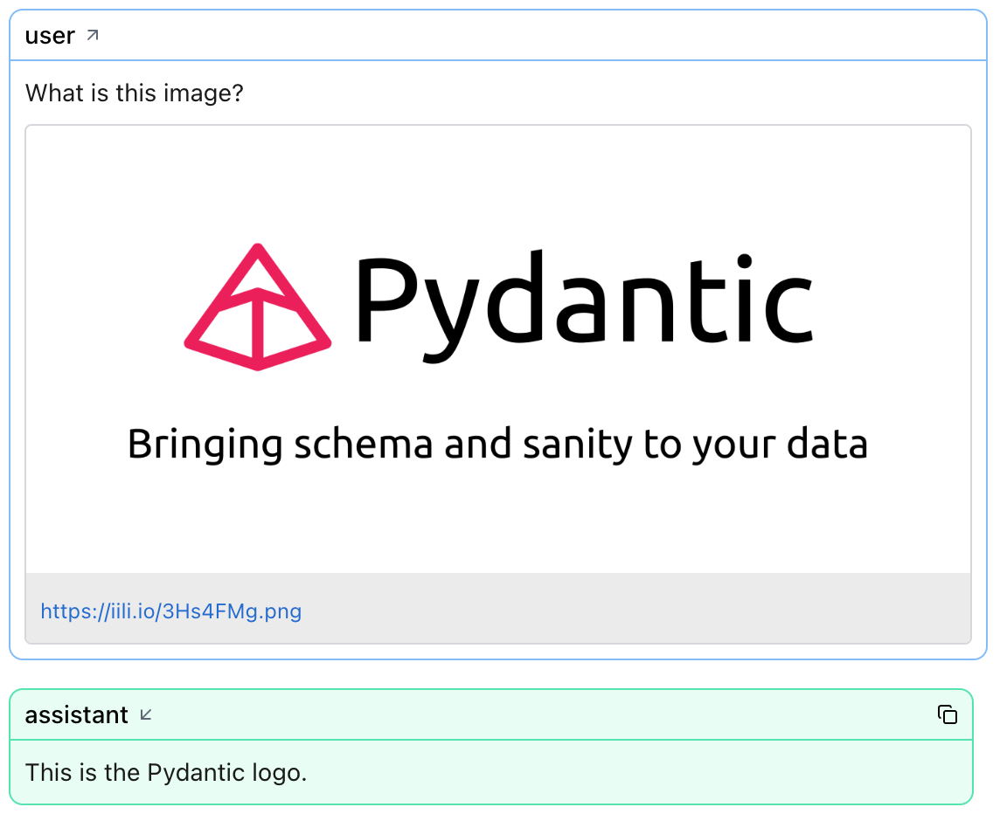
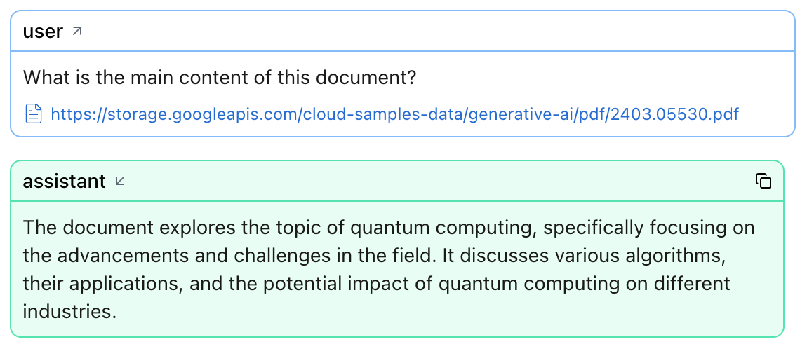

# LLM Panels

Use **Logfire’s LLM panels** to inspect every round‑trip between your application and a large‑language model (LLM) in real time.
For each span Logfire captures:

* The ordered list of **system / user / assistant** messages
* Any **tool calls** (name, arguments, structured return value)
* **Files** referenced in the prompt (previewed inline or via link)
* **Model metadata** – latency, input / output tokens, and total cost

That context makes it easy to debug prompts, shrink token counts, and compare model performance side‑by‑side.

## Understand token & cost badges

Spans in the Live view may have a token usage badge on the right, indicated by a coin icon. If the badge contains a ∑ symbol, that means the badge is showing the sum of token usages across all descendants (children and nested children) of that span. If there's no ∑ symbol, then that specific span represents an LLM request and has recorded token usage on it directly.



Hover over either to see:

- Model name
- Input, Output & Total tokens
- Input, Output & Total cost (USD)



---

## Open the LLM details panel

Click an LLM span to open the details panel.

| Section        | What you’ll see                                             |
|----------------|-------------------------------------------------------------|
| **Messages**   | System, user, assistant, and tool messages in order.        |
| **Tool calls** | Name, arguments, and returned payload (objects or arrays).  |
| **Files**      | Links or inline previews of binary or blob uploads.         |
| **Metadata**   | Model name, token counts, and cost.                |

---

## Supported Instrumentations

| Instrumentation                                                                       | Token badges | Costs | LLM details panel |
|---------------------------------------------------------------------------------------|--------------|-------|-------------------|
| [Pydantic AI](../../integrations/llms/pydanticai.md)                                  | ✅            | ✅     | ✅                 |
| [OpenAI](../../integrations/llms/openai.md)                                           | ✅            | ✅     | ✅                 |
| [Google Gen AI](../../integrations/llms/google-genai.md)                              | ✅            | ✅     | ✅                 |
| [LangChain](../../integrations/llms/langchain.md)                                     | ✅            | ✅     | ✅                 |
| [LiteLLM](../../integrations/llms/litellm.md)                                         | ✅            | ✅     | ✅                 |
| [Anthropic](../../integrations/llms/anthropic.md)                                     | ✅            | ✅     | ✅                 |
| [Claude Agent SDK](../../integrations/llms/claude-agent-sdk.md)                       | ✅            | ✅     | ✅                 |
| [Google ADK](https://github.com/pydantic/logfire/issues/1201#issuecomment-3012423974) | ✅            |       |                   |

Tokens and costs are more generally supported by any instrumentation that follows the standard [OpenTelemetry semantic conventions for GenAI spans](https://opentelemetry.io/docs/specs/semconv/gen-ai/gen-ai-spans/). The following snippet shows the attributes required if you want to log the data manually:

```python
import logfire

logfire.configure()

logfire.info(
    'LLM request',
    **{
        'gen_ai.system': 'google',
        'gen_ai.request.model': 'gemini-2.0-flash',
        'gen_ai.response.model': 'gemini-2.0-flash-001',
        'gen_ai.usage.input_tokens': 20,
        'gen_ai.usage.output_tokens': 40,
    },
)
```

We are actively engaged with the OpenTelemetry community to improve the GenAI specification, so expect more instrumentations to be fully supported in the future.

### How costs are calculated

Costs are calculated from [`genai-prices`](https://github.com/pydantic/genai-prices), an open dataset of provider and model pricing.

For the Pydantic AI, OpenAI, and Anthropic instrumentations, if `genai-prices` is installed locally, it will try to use it to calculate a cost. If it succeeds, it will be attached to the span as the attribute `operation.cost`. This attribute is always used in the Logfire UI when present. This is typically more accurate because it takes into account details like cached tokens. If you're using one of these instrumentations, make sure that `genai-prices` is installed (it's only installed automatically by Pydantic AI) and either update it regularly or use [`UpdatePrices`](https://github.com/pydantic/genai-prices/tree/main/packages/python#updateprices) to ensure you have prices for the latest models.

If `operation.cost` isn't present on the span, then the Logfire UI will use `genai-prices` to calculate a cost based on the other span attributes, particularly the input and output tokens. This may be less accurate because it doesn't have access to details like cached tokens, but it will still give you a rough estimate of the cost. The UI automatically uses the latest data in `genai-prices`, even if it hasn't been released, but there might be some delay due to browser caching. The calculated cost will only be visible in the UI and can't be queried with SQL.

## Example LLM panel views

### Single‑prompt calls

```python skip="true" skip-reason="incomplete"
agent = Agent("google-gla:gemini-1.5-flash")
result = agent.run_sync("Which city is the capital of France?")
print(result.output)
```



Add a system prompt and Logfire captures it too:

```python skip="true" skip-reason="incomplete"
agent = Agent(
    "google-gla:gemini-1.5-flash",
    system_prompt="You are a helpful assistant."
)
result = agent.run_sync("Please write me a limerick about Python logging.")
```



---

### Agents and tool calls

Logfire displays every tool invocation and its structured response.





---

### File uploads

When a prompt includes a file, binary, blob, or URL, Logfire attaches a preview so you can verify exactly what the model received.

#### LLM panel with image url:


#### LLM panel with PDF file:

