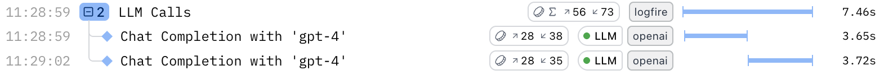

# LLM Panels

Use **Logfire’s LLM panels** to inspect every round‑trip between your application and a large‑language model (LLM) in real time.
For each span Logfire captures:

* The ordered list of **system / user / assistant** messages
* Any **tool calls** (name, arguments, structured return value)
* **Files** referenced in the prompt (previewed inline or via link)
* **Model metadata** – latency, input / output tokens, and total cost

That context makes it easy to debug prompts, shrink token counts, and compare model performance side‑by‑side.

## Understand token & cost badges

Spans in the Live view may have a token usage badge on the right, indicated by a coin icon. If the badge contains a ∑ symbol, that means the badge is showing the sum of token usages across all descendants (children and nested children) of that span. If there's no ∑ symbol, then that specific span represents an LLM request and has recorded token usage on it directly.



Hover over either to see:

- Model name
- Input tokens
- Output tokens
- Total cost (USD)


---

## Open the LLM details panel

Click an LLM span to open the details panel.

| Section        | What you’ll see                                             |
|----------------|-------------------------------------------------------------|
| **Messages**   | System, user, assistant, and tool messages in order.        |
| **Tool calls** | Name, arguments, and returned payload (objects or arrays).  |
| **Files**      | Links or inline previews of binary or blob uploads.         |
| **Metadata**   | Model name, token counts, and cost.                |

Logfire supports all major model hosts and many agent frameworks.

---

## Instrument your code

To get started the integration, please refer to [LLM integration guides](../../integrations/llms/pydanticai.md).

## Example LLM panel views

### Single‑prompt calls

```python
agent = Agent("google-gla:gemini-1.5-flash")
result = agent.run_sync("Which city is the capital of France?")
print(result.output)
```


Add a system prompt and Logfire captures it too:

```python
agent = Agent(
    "google-gla:gemini-1.5-flash",
    system_prompt="You are a helpful assistant."
)
result = agent.run_sync("Please write me a limerick about Python logging.")
```


---

### Agents and tool calls

Logfire displays every tool invocation and its structured response.


---

### File uploads

When a prompt includes a file, binary, blob, or URL, Logfire attaches a preview so you can verify exactly what the model received.

#### LLM panel with image url:


#### LLM panel with PDF file:

