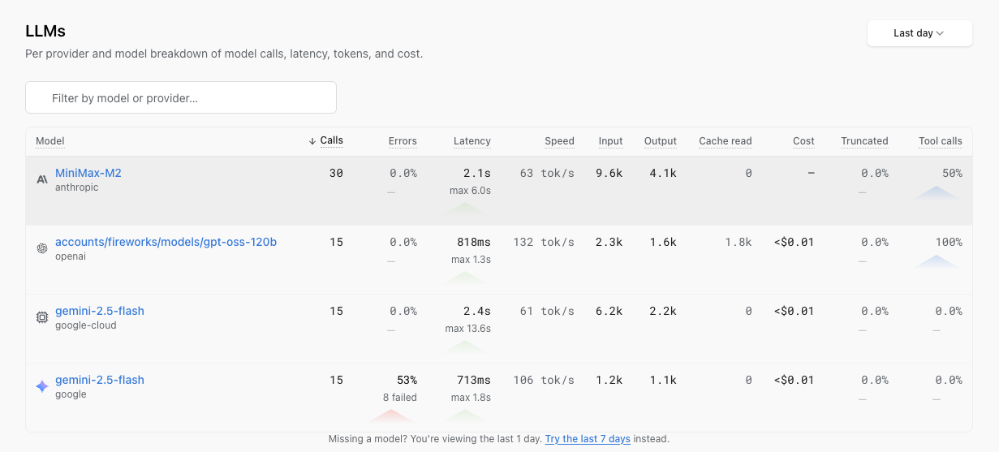
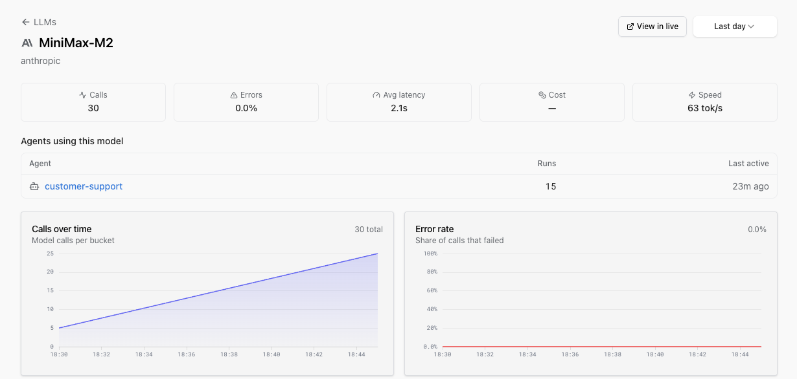

# LLMs

The **LLMs** page is the per-model inventory of every LLM your application is calling. Each row shows calls, latency, tokens and cost for one (provider, model) pair, and the LLM detail page links into the trace for each individual call.

For inspecting an individual LLM call inside a trace, the [LLM Panels](llm-panels.md) guide covers the in-trace view; this page covers the per-model and per-agent analytics surfaces.

You'll find this view in the project sidebar.

## The LLMs page



Each row is a model your application has called in the window. Columns:

- **Calls**: total requests to the model.
- **Errors**: share of failed calls.
- **Latency**: average per call, with the max in the window underneath.
- **Speed**: throughput in tokens per second.
- **Input** and **Output**: token totals.
- **Cache read**: cached input tokens (for providers that bill them separately).
- **Cost**: calculated from [`genai-prices`](https://github.com/pydantic/genai-prices), our open-source pricing dataset.
- **Truncated**: share of responses cut off because they hit the model's max-token cap.
- **Tool calls**: share of calls that returned a tool call.

Sort by cost to see which model is spending the most, by error rate to see which is failing, by truncated rate to see which is hitting limits. The default window is **Last day**; a footer link offers **Last 7 days** if the model you're looking for hasn't reported recently.

## LLM detail page

Click a row to open the LLM detail page.



You'll see five headline metric cards (Calls, Errors, Avg latency, Cost, Speed), a grid of trend charts (Calls over time, Error rate, Latency, Tokens, Cost, Truncated, Tool calls), and two tables:

- **Agents using this model**: which agents (by Pydantic AI agent name or `gen_ai.system` + `gen_ai.request.model` pair) are calling this model and how much. Direct LLM calls with no enclosing agent run don't appear here.
- **Recent calls**: the most recent invocations, each linking straight to the trace in the [Live View](live.md) via a **View in live** button in the header.

## Agent run distributions

On the agent run detail page you'll find two new charts:

- **Tool calls per run**: average and p90, side by side.
- **Turns per run**: average and p90, side by side.

Averages hide the runaway runs: the one that fired 40 tools where the median fired three, the one that ground through 12 turns where the median settled in two. The p90 view makes those visible without writing a dashboard.

## The Tools tab on agent runs

Each agent run has a **Tools tab** that shows what was actually configured for that run: tool definitions, thinking config, max tokens, sampling parameters, and any other model settings, all read from the `gen_ai.*` OpenTelemetry attributes on the agent span. It's the answer to "why did the agent behave like that on this run?" without making you expand spans and read raw JSON.

## How the data flows in

Everything on these pages reads from the OpenTelemetry spans your application is already producing. The columns rely on the `gen_ai.*` [OpenTelemetry semantic conventions for GenAI spans](https://opentelemetry.io/docs/specs/semconv/gen-ai/gen-ai-spans/).

The provider attribute is moving in the spec from `gen_ai.system` to `gen_ai.provider.name`. The older `gen_ai.system` is still the most common form emitted by instrumentations today, so Logfire reads it first and falls back to `gen_ai.provider.name` for SDKs that have already migrated. Truncation is detected from `gen_ai.response.finish_reasons` (a plural array per the current spec).

### What drives each column

| Column on the LLMs page | Attribute(s) | When missing |
|-------------------------|--------------|--------------|
| **Row exists** | `gen_ai.system` (or newer `gen_ai.provider.name`) + `gen_ai.request.model` | Calls land in an `(unknown)` row. |
| **Calls** | count of spans where the provider attribute is set | - |
| **Errors** | spans whose `otel_status_code` column is `ERROR` (derived from the OTel `Status.code`) or whose `is_exception` column is true (set when the span has an `exception` event recorded on it) | All rows show 0%. Verify your SDK is mapping API errors to span errors. |
| **Latency** | span `duration` | - |
| **Speed** | `gen_ai.usage.output_tokens` / latency | 0 tok/s if `output_tokens` is missing. |
| **Input / Output** | `gen_ai.usage.input_tokens`, `gen_ai.usage.output_tokens` | Columns show 0 and **Cost** is forced to 0. |
| **Cache read** | provider-specific cached-token attribute | Empty (only some providers bill cached input separately). |
| **Cost** | `operation.cost` (a Logfire / [`genai-prices`](https://github.com/pydantic/genai-prices) convention, not in the OTel spec) if set, else computed from tokens | Row priced at 0 if tokens are missing. |
| **Truncated** | `'length' in gen_ai.response.finish_reasons` (a plural array per the current spec) | Truncation rate shows 0%. |
| **Tool calls** | presence of tool-call attributes on the span | Tool-call rate shows 0%. |
| **Provider** badge | `gen_ai.system` (or newer `gen_ai.provider.name`) | Row groups under "unknown". |

The **provider label** is whatever the SDK reports. OpenAI-compatible providers (e.g. a Fireworks model accessed via the OpenAI shape) will surface as `openai`; Anthropic-shape providers (e.g. MiniMax) surface as `anthropic`. That's a faithful reflection of the wire shape; it's not a bug.

!!! note "`otel_status_code` and `operation.cost`"
    Both are Logfire columns / conventions, not OTel spec attributes. `otel_status_code` is the `records` table column derived from the OTel `Status.code`; `operation.cost` is a [`genai-prices`](https://github.com/pydantic/genai-prices) convention that some SDK instrumentations emit so the backend doesn't have to do the cost math.

### Streaming gotchas

Token counts often only arrive on the **final** streaming chunk. Instrumentations that close the span on the first chunk lose `gen_ai.usage.input_tokens` / `gen_ai.usage.output_tokens`, and with them, both the tokens columns and the cost. If a model row is appearing on the LLMs page but the token / cost columns are empty, this is the usual cause.

### Collector pipelines

If you route the spans through an OpenTelemetry Collector, keep `gen_ai.*` attributes intact:

- Audit any `attributes` or `transform` processors with a denylist. Adding `gen_ai.*` to one will drop the data the LLMs page needs.
- `batch` and `memory_limiter` are safe.
- Tail sampling that drops non-error spans will drop most of your LLM telemetry and make the per-model averages look wrong.

Costs come from [`genai-prices`](https://github.com/pydantic/genai-prices). See [LLM Panels](llm-panels.md#how-costs-are-calculated) for the full discussion of how costs are computed when `operation.cost` is or isn't already on the span.

## Supported instrumentations

Any instrumentation that emits the OpenTelemetry `gen_ai.*` conventions lands in the LLMs and agent views correctly. That includes:

- [Pydantic AI](../../integrations/llms/pydanticai.md): wired up by default.
- [OpenAI](../../integrations/llms/openai.md)
- [Anthropic](../../integrations/llms/anthropic.md)
- [Google Gen AI](../../integrations/llms/google-genai.md)
- [LangChain](../../integrations/llms/langchain.md)
- [LiteLLM](../../integrations/llms/litellm.md)
- [Claude Agent SDK](../../integrations/llms/claude-agent-sdk.md)
- [Mirascope](../../integrations/llms/mirascope.md), [Magentic](../../integrations/llms/magentic.md), [DSPy](../../integrations/llms/dspy.md), [LlamaIndex](../../integrations/llms/llamaindex.md), [MCP](../../integrations/llms/mcp.md)

If you build with another framework that emits the same conventions (directly or via [OpenLLMetry](https://github.com/traceloop/openllmetry)), the views light up the same way.

## Get your first row to appear

The smallest path from an empty project to a populated LLMs row, using the OpenAI instrumentation:

```bash
pip install 'logfire[openai]'
export LOGFIRE_TOKEN=<your write token from project Settings → Write tokens>
```

```py skip="true" skip-reason="external-connection"
import logfire
import openai

logfire.configure()
logfire.instrument_openai()

openai.OpenAI().chat.completions.create(
    model='gpt-4o-mini',
    messages=[{'role': 'user', 'content': 'hi'}],
)
```

Refresh the LLMs page. A row for `gpt-4o-mini` (provider `openai`) should appear within a minute. For other instrumentations, the [LLM Panels guide](llm-panels.md#supported-instrumentations) has the per-provider list.

## Slicing by environment, agent or user

The inventory groups rows by `(provider, model)`. Beyond the text search at the top, there are no dropdowns for filtering by environment, agent or user *on this page yet*. For per-environment, per-agent, per-user, per-feature or per-tenant breakdowns, query the `records` table directly in [SQL Workbench](explore.md). Every GenAI span carries the `gen_ai.*` attributes alongside `deployment.environment.name` and any custom resource attributes you've set, so you can slice cost, latency or token usage by whatever dimension matters.

## Troubleshooting

| Symptom | Likely cause |
|---------|--------------|
| Model row is missing | The span has no provider attribute (`gen_ai.system` or `gen_ai.provider.name`) and no `gen_ai.request.model`. Use one of the [supported instrumentations](#supported-instrumentations), or set the attributes manually if you're rolling your own. |
| Row shows under `(unknown)` provider | The provider attribute is missing while `gen_ai.request.model` is set. The page falls back to `(unknown)` rather than dropping the call. |
| Tokens or Cost columns are 0 | Streaming is closing the span on the first chunk, so the final `gen_ai.usage.{input,output}_tokens` attributes never land on the span. See [Streaming gotchas](#streaming-gotchas). |
| Truncated rate is 0% even though responses are being cut off | Missing `gen_ai.response.finish_reasons` array on the span (or the legacy singular `gen_ai.response.finish_reason` is being emitted; the LLMs page reads the plural form). |
| Tool-call rate is 0% on a model you know calls tools | Instrumentation isn't recording tool-call attributes on the LLM span. The [supported instrumentations](#supported-instrumentations) all do this; custom ones may not. |
| Average per-model latency dropped after enabling the Collector | The Collector is tail-sampling out non-error spans, so the page is averaging only the errored calls. Either disable tail sampling or sample independently of the `gen_ai.*` pipeline. |
