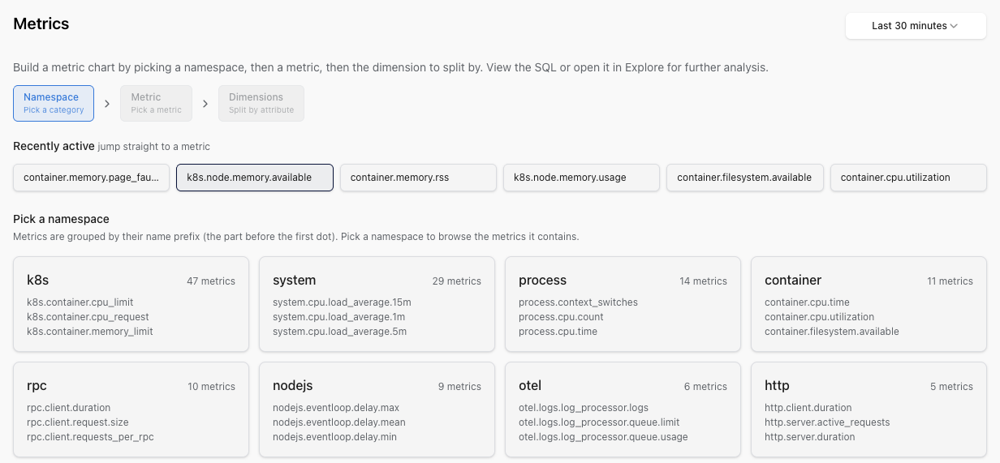

# Metrics explorer

The **Metrics explorer** is built for the moment when you know a metric exists somewhere but you can't remember what it's called, you don't know which labels are useful, and you don't want to write a query yet. Three steps: pick a namespace, pick a metric, see what dimensions you can break it down by. No SQL required. The SQL is on every card when you want it.

You'll find Metrics in the project sidebar, after **Kubernetes**.



## The three steps

### Step 1: Pick a namespace

Metrics are grouped by **namespace**, which is the prefix before the first dot in the metric name. `http.server.duration` lives under `http`, `system.cpu.utilization` lives under `system`, `k8s.pod.cpu.usage` lives under `k8s`. Metrics whose name doesn't follow the `<namespace>.<metric>` convention (usually SDK-instrumented counters from your own code) land in an **Everything else** section at the bottom. The grouping is structural: no metadata file or instrument list to configure.

The top of step 1 has a **Recently active** strip so the metrics you actually look at are one click away.

### Step 2: Pick a metric

Step 2 lists the metrics inside the namespace you picked. Each entry has a sparkline of recent activity, so empty metrics are obvious before you click. Metrics that haven't reported any data in the current window are hidden: the picker shows you what's live now, not what stopped emitting last quarter.

### Step 3: Explore the dimensions

Step 3 shows you a small chart per dimension (label) on the metric, with the cardinality of each dimension shown on the card. You can see what a breakdown would look like before committing to it; you can spot the high-cardinality ones that would explode if grouped on; and you can promote any dimension to the main chart with a click.

Each card has:

- **View SQL**: opens a dialog with the exact SQL that produced the chart. Copy it for a dashboard, or send it to a teammate.
- **Open in Explore**: drops you into the [SQL Explorer](explore.md) with that query already populated, so you can extend it.

Aggregations default sensibly by metric kind, with the rest available from the dropdown:

| Metric kind | Default aggregation | Available in the dropdown |
|-------------|---------------------|---------------------------|
| Gauge | `avg` | `avg`, `sum`, `min`, `max`, `count`, `p50`, `p95`, `p99` |
| Sum (counter) | `sum` | `avg`, `sum`, `min`, `max`, `count`, `p50`, `p95`, `p99` |
| Histogram | `avg` | `avg`, `sum`, `min`, `max`, `count` |
| Exponential histogram | `avg` | `avg`, `sum`, `min`, `max`, `count` |

!!! note "Percentiles on histograms"
    The wizard does not expose `p50`/`p95`/`p99` directly on histogram-typed metrics today: pre-aggregated histograms (e.g. `http.server.request.duration` from OTel SDK instrumentations) report `avg`, `min`, `max`, `count` and `sum` in the wizard. For percentiles over a histogram, switch to the [SQL Explorer](explore.md) and use the histogram bucket columns; the **Open in Explore** button on every card hands you a query you can extend.

## When the wizard isn't enough

The wizard is for discovery. The [SQL Explorer](explore.md) is for the real work. The **View SQL** and **Open in Explore** buttons on every card are the on-ramp between them, so you can do as much as the wizard handles and graduate without retyping anything.

The columns you see in the wizard live on the `metrics` table; the full schema is in the [SQL reference](../../reference/sql.md).

## How the data flows in

The Metrics explorer reads from the OpenTelemetry metrics you're already sending to your Logfire project: there's no separate metric pipeline. If you instrument your application with the [Python SDK](../onboarding-checklist/add-metrics.md), the [TypeScript SDK](https://pydantic.dev/docs/logfire/typescript-sdk/), or via the [OpenTelemetry Collector](../../how-to-guides/otel-collector/otel-collector-overview.md), every metric you emit appears in the catalog within a minute or two of its first sample.

The set of automatically-collected metrics that populate the wizard usefully includes:

| Source | Namespace | Example metric |
|--------|-----------|----------------|
| [System metrics](../../integrations/system-metrics.md) (SDK) or `hostmetricsreceiver` (Collector) | `system` | `system.cpu.utilization`, `system.memory.usage`, `system.network.io` |
| [Cloud metrics](../../how-to-guides/cloud-metrics.md) | varies by provider | AWS `aws.*`, GCP `gcp.*`, Azure `azure.*` |
| [FastAPI](../../integrations/web-frameworks/fastapi.md) / [Django](../../integrations/web-frameworks/django.md) / [Flask](../../integrations/web-frameworks/flask.md) / [Starlette](../../integrations/web-frameworks/starlette.md) | `http` | `http.server.request.duration` (histogram) |
| HTTP clients ([HTTPX](../../integrations/http-clients/httpx.md), [Requests](../../integrations/http-clients/requests.md), [AIOHTTP](../../integrations/http-clients/aiohttp.md)) | `http` | `http.client.request.duration` |
| Kubernetes (`kubeletstatsreceiver`) | `k8s` | `k8s.pod.cpu.usage`, `k8s.node.memory.working_set` |
| GenAI spans / metrics | `gen_ai` | `gen_ai.client.operation.duration`, `gen_ai.client.token.usage` |
| Custom SDK counters (no dot) | *Everything else* (bottom section) | Whatever you emit with `logfire.metric_*` |

The "Everything else" section at the bottom of step 1 catches metrics whose name doesn't follow the `<namespace>.<metric>` convention. Custom counters emitted via `logfire.metric_counter('hello.requests')` land here unless you give them a dotted name.

!!! note "Don't double-count system metrics"
    The SDK's [system-metrics integration](../../integrations/system-metrics.md) and an OpenTelemetry Collector running `hostmetricsreceiver` both write to the `system.*` namespace. Running both on the same host double-counts CPU, memory, and the rest. Pick one source per host.

## Get your first metric to appear

To see a namespace appear in step 1, emit a counter from the Python SDK:

```bash
pip install logfire
export LOGFIRE_TOKEN=<your write token from project Settings → Write tokens>
```

```python
import logfire

logfire.configure()
logfire.metric_counter('hello.requests').add(1)
```

Refresh the Metrics view. `hello` appears in **Recently active** and as its own namespace (the name has a dot). The full Python SDK metric API is in [Add Metrics](../onboarding-checklist/add-metrics.md).

## Troubleshooting

| Symptom | Likely cause |
|---------|--------------|
| Metric appears in the catalog but the chart is empty | The metric stopped reporting within the current window. The wizard hides metrics with no recent data, but the catalog entry remains. Widen the time picker. |
| Custom metric lands in **Everything else** instead of its own namespace | The metric name has no dot (e.g. `requests_total` instead of `app.requests.total`). The grouping is structural: give the name a dotted prefix to create a namespace. |
| Step 1 shows no namespaces at all | The project hasn't received any metric samples yet. The wizard reads from `metrics`-table data; if you're sending only spans, no namespaces will appear here. |
| Two metric sources show up under `system.*` with overlapping series | The SDK's [system-metrics integration](../../integrations/system-metrics.md) and an OpenTelemetry Collector running `hostmetricsreceiver` are both running on the same host. See the [double-counting note](#how-the-data-flows-in). |
| Promoting a dimension shows fewer series than the cardinality card claimed | The chart truncates after a fixed number of series. For full breakdowns of a high-cardinality dimension, jump into the [SQL Explorer](explore.md) via the **Open in Explore** button on the card. |
