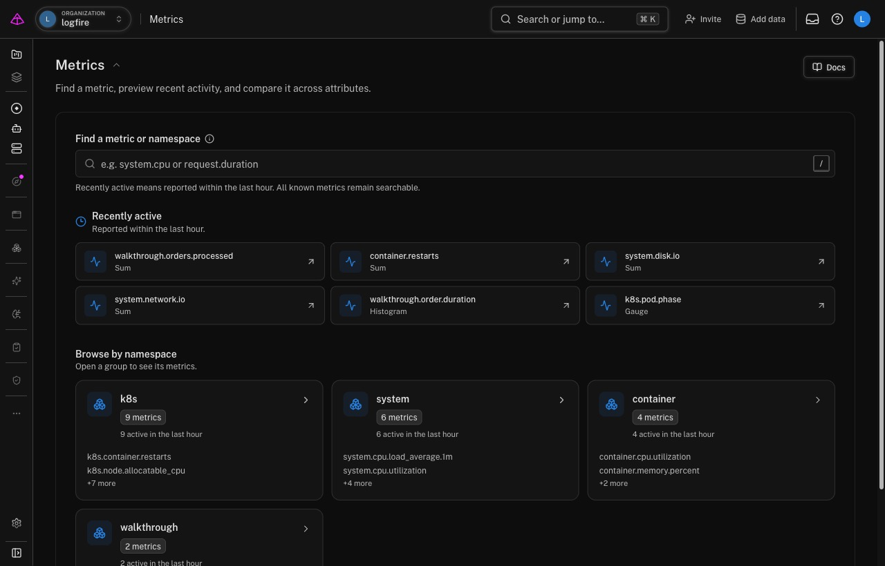
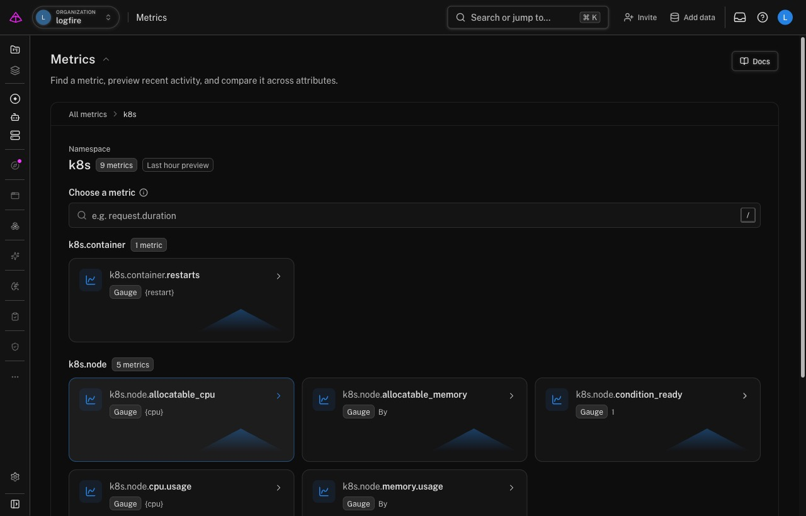
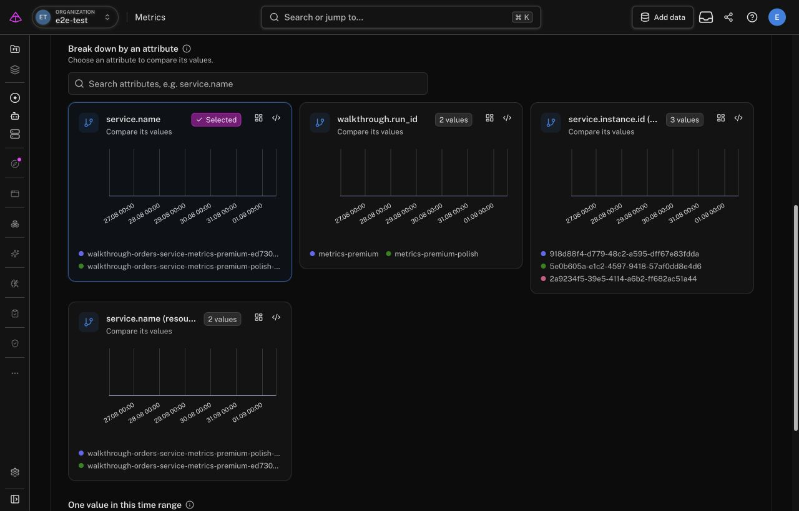

# Metrics Explorer

Find and compare the metrics your project receives without writing SQL. A **metric** is a number tracked over time, like requests per second or CPU load. Use the **Metrics Explorer** to search metric names, preview recent activity, and compare values across attributes such as `service.name` or `k8s.node.name`.

Open the <OpenInLogfire path="metrics" variant="inline" label="Metrics Explorer" /> by clicking **Metrics** in the project sidebar. The selected time range controls the metrics, previews, and attributes the page shows.



## Find a metric

### Search or browse by namespace

The search box matches both metric names and namespaces. Use **Recently active** to open one of the latest metrics directly, or browse the namespace cards below it.

A **namespace** is the prefix before the first dot in a metric name. `http.server.duration` lives under `http`, `system.cpu.utilization` lives under `system`, and `k8s.pod.cpu.usage` lives under `k8s`. A metric without a dot, such as `requests_total`, appears under **Everything else**. This grouping comes from the metric name and requires no separate configuration.

### Choose a metric from a namespace

Opening a namespace shows each metric's type, unit, and a small activity preview. Search within the namespace when the list is long. Large namespaces may be divided by the next part of the metric name, such as `k8s.container` and `k8s.node`, so related metrics stay together.



## Compare a metric across attributes

Opening a metric shows its type, aggregation, chart interval, and overall values. The interval is chosen automatically from the time range. Change the aggregation to switch between calculations such as average, sum, minimum, maximum, or count.

An **attribute** is a piece of context attached to a metric, such as a service, endpoint, or Kubernetes node. The **Break down by an attribute** section previews how the metric differs across each attribute's values. Each card shows a small chart and the number of values found in the selected time range. Attributes that have only one value are listed separately because they do not produce a useful comparison.

Search the attributes when the list is long. Select an attribute card to make that comparison active. The URL updates so you can share the same view. Select **Overall** or **Remove breakdown** to return to the metric without a breakdown.

Each chart provides two actions:

- **Add to dashboard** saves the chart to a dashboard.
- **View SQL** shows the exact query behind the chart. From that dialog, copy the SQL or open it in [SQL Workbench](explore.md) for further editing.



The metric kind determines which calculations are available. The dropdown starts with a suitable default for each kind:

| Metric kind | What it represents | Default | Available calculations |
|-------------|--------------------|---------|------------------------|
| Gauge | A value that can rise or fall | `avg` | `avg`, `sum`, `min`, `max`, `count`, `p50`, `p95`, `p99` |
| Sum | A total that only increases (counter), or a value that can increase and decrease (up-down counter) | `sum` | `avg`, `sum`, `min`, `max`, `count`, `p50`, `p95`, `p99` |
| Histogram | A distribution stored in fixed buckets | `avg` | `avg`, `sum`, `min`, `max`, `count` |
| Exponential histogram | A distribution whose bucket sizes grow exponentially | `avg` | `avg`, `sum`, `min`, `max`, `count` |

`p50`, `p95`, and `p99` are percentiles: for example, `p95` is the value at or below which 95% of measurements fall.

These are the four metric kinds the Metrics Explorer supports. Logfire does not store `Summary` metrics sent over the OpenTelemetry Protocol (OTLP), the standard wire format Logfire uses to receive data. A `Summary` carries pre-computed quantiles instead of buckets. If a request also contains supported metrics, Logfire stores those metrics, drops the summaries, and reports a partial success. If every metric in the request is a `Summary`, the request fails. Logfire records the dropped summaries in your project as a `logfire ingest error`. Summaries most often come from Prometheus scrapes forwarded through the OpenTelemetry Collector's `prometheus` receiver. Send a histogram instead and calculate percentiles at query time. See [Summary metrics are not supported](../../reference/limits.md#summary-metrics-are-not-supported).

!!! note "Percentiles on histograms"
    The Metrics Explorer does not expose `p50`/`p95`/`p99` directly on histogram metrics today. Pre-aggregated histograms, such as `http.server.request.duration`, report `avg`, `min`, `max`, `count`, and `sum`. For percentiles over a histogram, open **View SQL**, continue in [SQL Workbench](explore.md), and use the histogram bucket columns.

## Continue in SQL Workbench

The Metrics Explorer covers discovery and common comparisons. Use [SQL Workbench](explore.md) when you need custom filtering, calculations, joins, or more series than a preview chart shows. Open **View SQL** on a chart, then select **Open in SQL Workbench** to continue without rebuilding the query.

The columns used by the Metrics Explorer live on the `metrics` table. See the full schema in the [SQL reference](../../reference/sql.md).

## Send metrics to the catalog

The Metrics Explorer reads from the supported OpenTelemetry metrics you're already sending to your Logfire project. OpenTelemetry (OTel) is the open industry standard for collecting traces, metrics, and logs. Logfire accepts the metric kinds listed above from OpenTelemetry-compatible SDKs and collectors. There is no separate metric pipeline. If you instrument your application with the [Python SDK](../onboarding-checklist/add-metrics.md), the [TypeScript SDK](https://pydantic.dev/docs/logfire/instrument/typescript/), or the [OpenTelemetry Collector](../../how-to-guides/otel-collector/otel-collector-overview.md), each supported metric appears in the catalog within a minute or two of its first sample.

Common sources include:

| Source | Namespace | Example metric |
|--------|-----------|----------------|
| [System metrics](../../integrations/system-metrics.md) (SDK) or `hostmetricsreceiver` (Collector) | `system` | `system.cpu.utilization`, `system.memory.usage`, `system.network.io` |
| [Cloud metrics](../../how-to-guides/cloud-metrics.md) | varies by provider | AWS `aws.*`, GCP `gcp.*`, Azure `azure.*` |
| [FastAPI](../../integrations/web-frameworks/fastapi.md) / [Django](../../integrations/web-frameworks/django.md) / [Flask](../../integrations/web-frameworks/flask.md) / [Starlette](../../integrations/web-frameworks/starlette.md) | `http` | `http.server.request.duration` (histogram) |
| HTTP clients ([HTTPX](../../integrations/http-clients/httpx.md), [Requests](../../integrations/http-clients/requests.md), [AIOHTTP](../../integrations/http-clients/aiohttp.md)) | `http` | `http.client.request.duration` |
| Kubernetes (`kubeletstatsreceiver`) | `k8s` | `k8s.pod.cpu.usage`, `k8s.node.memory.working_set` |
| GenAI spans / metrics | `gen_ai` | `gen_ai.client.operation.duration`, `gen_ai.client.token.usage` |
| Custom SDK metrics (no dot) | *Everything else* | Whatever you emit with `logfire.metric_*` |

The **Everything else** section catches metrics whose name has no namespace prefix. For example, `logfire.metric_counter('requests_total')` appears there, while `logfire.metric_counter('hello.requests')` creates the `hello` namespace.

!!! note "Don't double-count system metrics"
    The SDK's [system-metrics integration](../../integrations/system-metrics.md) and an OpenTelemetry Collector running `hostmetricsreceiver` both write to the `system.*` namespace. Running both on the same host double-counts CPU, memory, and the rest. Pick one source per host.

## Get your first metric to appear

To add a namespace to the catalog, emit a counter from the Python SDK:

```bash
pip install logfire
export LOGFIRE_TOKEN=<your write token from project Settings → Write tokens>
```

```python
import logfire

logfire.configure()
logfire.metric_counter('hello.requests').add(1)
```

Refresh the Metrics page. `hello.requests` appears in **Recently active**, and `hello` appears as a namespace. The full Python SDK metric API is in [Add Metrics](../onboarding-checklist/add-metrics.md).

## Troubleshooting

| Symptom | Likely cause |
|---------|--------------|
| Metric appears in the catalog but the chart is empty | The metric has no samples in the selected time range. Widen the time picker. |
| Custom metric lands in **Everything else** instead of its own namespace | The metric name has no dot (e.g. `requests_total` instead of `app.requests.total`). The grouping is structural: give the name a dotted prefix to create a namespace. |
| One metric never appears in the catalog while others from the same source do | It is a `Summary` metric, a type the OpenTelemetry spec marks legacy and Logfire does not store. Check for a `logfire ingest error` record naming the metric, and see [Summary metrics are not supported](../../reference/limits.md#summary-metrics-are-not-supported). |
| The page shows no namespaces | The project hasn't received any metric samples yet. If you're sending only spans or logs, no namespaces will appear here. |
| Two metric sources show up under `system.*` with overlapping series | The SDK's [system-metrics integration](../../integrations/system-metrics.md) and an OpenTelemetry Collector running `hostmetricsreceiver` are both running on the same host. See the [double-counting note](#send-metrics-to-the-catalog). |
| An attribute card shows fewer series than its value count | Preview charts limit the number of series. Open **View SQL**, then continue in [SQL Workbench](explore.md) for a complete high-cardinality breakdown. |

## Next steps

- [Add application metrics](../onboarding-checklist/add-metrics.md) when the catalog does not yet contain the signal you need.
- [Build a dashboard](dashboards.md) to keep the charts your team checks regularly in one place.
- [Write a query in SQL Workbench](explore.md) when you need custom filters, joins, or calculations.
