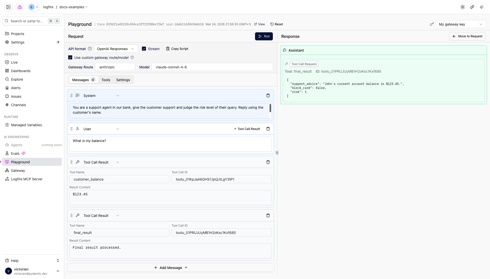

---
title: "Prompt Playground: Experiment with agent prompts"
description: "Prompt Playground: Experiment with agent prompts"
---

# Prompt Playground

The prompt playground gives you the ability to experiment with an agent run and its different parts. It is mostly useful when you want to iterate
on the system prompt, and see if you can get better results by tweaking it. Taking the following agent run as an example:

/// public-trace | https://logfire-eu.pydantic.dev/public-trace/bae009a7-e2cf-4c50-b623-bf255ebabe7c?spanId=26d6114284366b18
    title: 'Logfire instrumentation of an agent run'
///

Clicking **Open in Playground** will redirect you to the Agent Playground, prefilled with the agent run data:

You will then be able to modify parts of the agent run (e.g. the system prompt, but also the user requests and tool calls), and trigger another run
to see the results.

The Prompt Playground can be seen as a UI wrapper over a [Pydantic AI agent](https://ai.pydantic.dev/agent/). As such, you can configure which tools
are available as well as the [model settings](https://ai.pydantic.dev/api/settings/) (e.g. the temperature).
