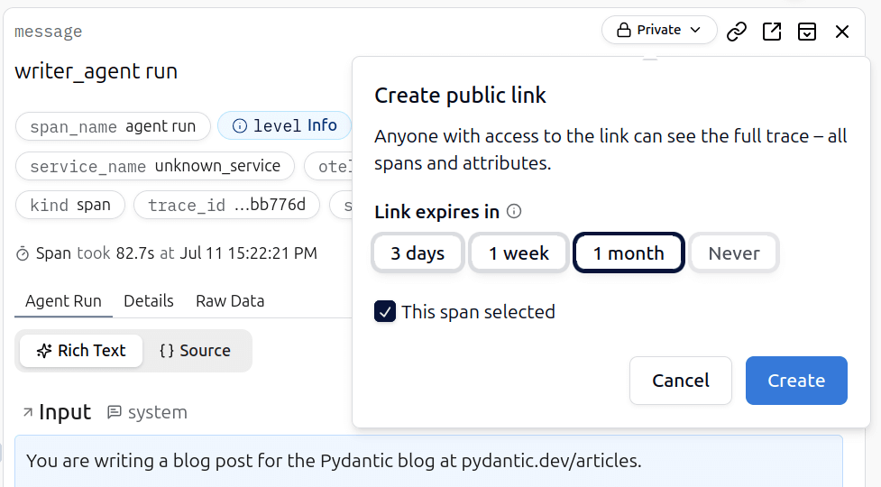

# Public Traces

Public Traces lets you to create shareable links for specific traces. Perfect for collaborating with anyone who doesn't have Logfire access, or sharing debugging information.

## Overview

When you create a public trace link, anyone with access to the link can view the complete trace data, **including all spans and their attributes**. This is particularly useful for:

- Sharing debugging information with external collaborators
- Providing trace examples in support tickets
- Collaborating across teams without granting full project access

## Creating a Public Trace

1. Navigate to any trace in your project
2. Select the inner span you want to highlight (optional)
3. In the details panel, click the **Private** button

4. Configure the link expiration
5. Click **Create** to generate the shareable link

## Managing Public Traces

All public trace links are managed in the **Shared Traces** section under Project Settings. From here you can:

- View all active public links with their trace/span IDs
- See creation dates and expiration times
- Copy existing public links
- Delete public links when no longer needed

## Security Considerations

- Public traces are accessible to anyone with the link
- Consider the sensitivity of the data before creating public links
- Use appropriate expiration times to limit exposure
- Regularly review and clean up unused public links
