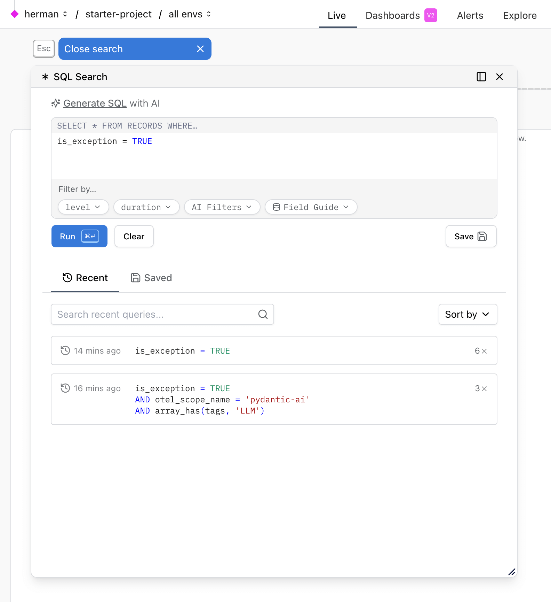

# Saved Searches

Logfire's **Saved Searches** feature allows you to quickly access, organize, and share your most useful queries in the web UI. This feature is available on the Live page, and can be tested on the [public demo](https://logfire-eu.pydantic.dev/demo/logfire-demo).

## 1. Opening the Search Panel

To get started, click the **Search & filter with SQL** button to open the search panel.

You'll see a panel where you can enter a query using either:

- **Direct SQL**: Write your own SQL `WHERE` clause to filter records.
- **Natural Language (AI)**: Describe your query in plain English (or another language), and Logfire will generate the SQL for you using AI.

## 2. Writing and Generating Queries

- **Direct SQL**: Type your SQL directly in the editor. Autocomplete and schema hints are available.
- **Generate SQL with AI**: Click the "Generate SQL with AI" option, then describe what you want (e.g., "all exceptions in the last hour"). The AI will convert your description into a SQL query.
  - You can also enable the **Include existing SQL code** option. This allows the AI to modify or build upon your current SQL query, rather than starting from scratch.

- **Filter by...**: Use the filter chips below the editor to quickly add common filters (e.g., tags, service name, level).

## 3. Running and Reviewing Queries

- Click **Run** to execute your query.
- The results will appear in the main view, and your query will be added to the **Recent** tab for easy access.

## 4. Saving Searches

- To save a query, click the **Save** button next to the editor.
- In the popover, enter a name for your search.
- Choose whether to make it **Public** (visible to all project members) or **Private** (visible only to you) using the toggle.
- Click **Save**. Your search will now appear in the **Saved** tab.

## 5. Managing Recent and Saved Searches

- **Recent**: Shows your most recently run queries. You can search by title or sort them.
- **Saved**: Shows all saved searches. You can search by title. Public searches are visible to all project members; private searches are only visible to you.
- To delete a saved search, click the three-dot menu next to it and select **Delete**.
- **Tip:** Clicking any item in the Recent or Saved list will immediately execute the corresponding query and display the results.

## 6. Sharing and Collaboration

- Public saved searches make it easy to share useful queries with your team.
- Private searches help you keep personal or experimental queries organized.

---

## Visual Workflow

---

## Tips

- You can test this feature on the [public demo page](https://logfire-eu.pydantic.dev/demo/logfire-demo).
- Use the search fields in both **Recent** and **Saved** tabs to quickly find queries by name.
- Use the **Filter by...** pills to build queries faster without writing SQL.

---

**Next Steps:**

- [Explore more about querying with SQL](explore.md)
- [Learn about dashboards and alerts](dashboards.md), (alerts.md)
