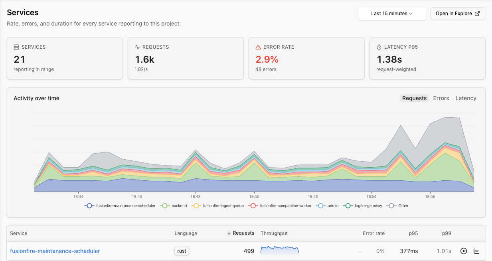
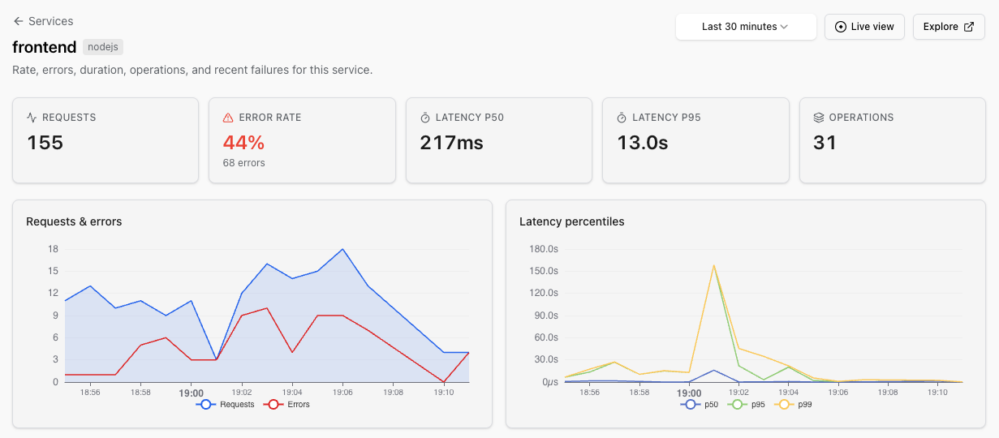
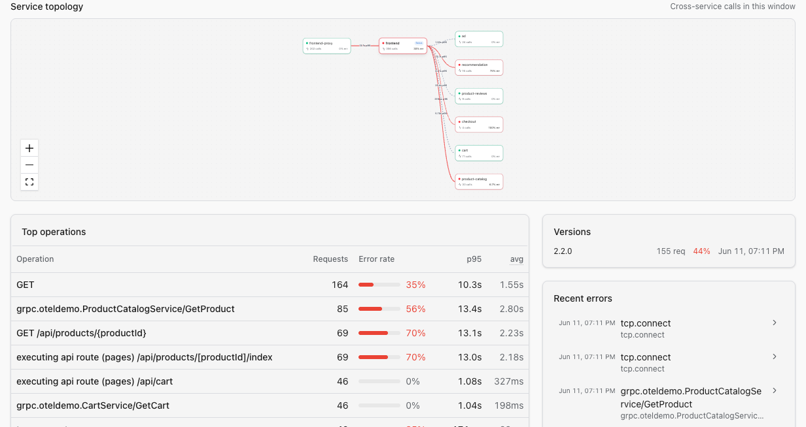

# Services

!!! note "Beta — feedback welcome"
    The Services view is in beta and shipping fixes and improvements quickly. Tell us what's missing or broken in the [Logfire Slack community](https://pydantic.dev/docs/logfire/join-slack/) or email [support@pydantic.dev](mailto:support@pydantic.dev).

The **Services view** is the entry point for finding the service you want to investigate. Each service that ships spans to your project appears as one row, sorted by whatever metric matters right now (requests, error rate, latency). Click a row to drill into its detail page, click a recent failed trace, and you land in the [Live View](live.md) with the failing trace open.

You'll find Services in the project sidebar, between [Explore](explore.md) and [Hosts](hosts.md).



## The Services inventory

The inventory shows summary cards (services in range, total requests, error rate, p95 latency), an **Activity over time** chart with a Requests / Errors / Latency toggle, and one row per service with:

- **Language** (detected from `telemetry.sdk.language`)
- **Requests** in the current window
- **Throughput** sparkline
- **Error rate**
- **p95 / p99 latency**

Sort by any column. The time picker is shared with the rest of the observability surfaces.

## Service detail page

Click a row to open the service detail page.



You'll see:

- **Headline cards** for the service's requests, error rate, latency p50, latency p95, and operation count.
- **Side-by-side trend charts** for requests and errors and for latency percentiles (p50, p95, p99), with **deployment markers** so you can see whether a spike lines up with a release.
- A **Service topology** panel showing cross-service calls in the current window, with the service you opened highlighted.
- **Top operations** — the highest-traffic and slowest spans inside the service.
- **Recent errors** — a short list of failed traces, each linking straight to the [Live View](live.md) so you can investigate.

Two buttons in the header ([Live view](live.md) and [Explore](explore.md)) hand the whole service off to the live view or the SQL editor in one click. The detail page defaults to the last 30 minutes.

The topology graph and the operations / errors tables below the trends:



## Topology graph

The topology graph is drawn from spans that cross service boundaries. Each node is a service; each edge represents real calls between them in the current window. Nodes are colored by error rate so a bleeding dependency is visible at a glance.

Click any node to jump to that service's detail page. Click any recent failed trace from the panel below to land on the trace itself in the [Live View](live.md).

## How services are detected

Logfire identifies a service from the [OpenTelemetry `service.name` resource attribute](https://opentelemetry.io/docs/specs/semconv/resource/#service) on the spans you send. If you instrument your application with the [Python SDK](../onboarding-checklist/integrate.md), the [TypeScript SDK](https://pydantic.dev/docs/logfire/typescript-sdk/), or any OpenTelemetry-compatible instrumentation, `service.name` is set for you. The Services view picks up new services within a minute or two of their first span.

The RED counts are computed from **service entry spans** — the trace roots (`parent_span_id IS NULL`) plus any span whose parent's `service.name` differs from the span's own. ([`service_name`](../../reference/sql.md#service_name) is the column name on Logfire's `records` table; the underlying OTel resource attribute is `service.name`.) That gives downstream services in a call chain real counts even when they're nested inside a longer trace, while still letting the topology graph draw edges between them.

### Resource attributes the inventory uses

| Attribute | What it does |
|-----------|--------------|
| `service.name` | **Required.** The row in the inventory. Use the workload name (e.g. `cart`, `payment-api`), not a hostname or pod name. |
| `service.version` | Drives the version pills on the detail page and the deployment markers on the trend charts. |
| `service.instance.id` | Stable per replica. When the OpenTelemetry Operator's auto-instrumentation is enabled, it defaults this to `<namespace>.<pod>.<container>`. |
| `deployment.environment.name` | Lets you filter the inventory by env (the `all envs` picker in the breadcrumb). The older `deployment.environment` is honoured too. |
| `telemetry.sdk.language` | Drives the **Language** column. Auto-set by every OTel SDK. |

### Topology edges

The graph draws an edge wherever a span's `service.name` differs from its parent's `service.name`. The renderer reads only `service.name` today, so edges to external dependencies (third-party APIs, managed databases) are labelled with the calling service's name rather than the dependency itself — give every span-emitting component a distinct, meaningful `service.name` and the graph will be readable.

## Get your first row to appear

If your project is empty, the fastest path to a Services row is one span from the Python SDK:

```bash
pip install logfire
export LOGFIRE_TOKEN=<your write token from project Settings → Write tokens>
export OTEL_SERVICE_NAME=cart
python -c "import logfire; logfire.configure(); logfire.info('hi')"
```

Refresh the Services page — `cart` should appear within a minute or two. For broader instrumentation paths (FastAPI, Django, gRPC, OTel Collector), see the [Onboarding Checklist](../onboarding-checklist/integrate.md).

## Troubleshooting

| Symptom | Likely cause |
|---------|--------------|
| Service doesn't appear in the inventory | No `service.name` resource attribute on the spans, or the project hasn't received any span yet. Both the Python and TypeScript SDKs set `service.name` for you; if you send raw OTLP, set it explicitly. |
| The row shows under `(unknown)` | Same as above — `service.name` is the row key. |
| One service appears as two rows | `service.name` differs across replicas (e.g. one carries a hostname suffix). Pin it via `OTEL_SERVICE_NAME` or the SDK's `service_name` argument so every replica reports the same string. |
| An edge between two services is missing from the topology | Either no span actually crossed that service boundary in the window, or tail sampling dropped the spans that did. The graph reads from real cross-boundary spans, not from a configured topology. |
| Counts are way lower than expected | Head or tail sampling is dropping spans before they reach Logfire. RED metrics on this page count what arrived, not what was emitted. |
