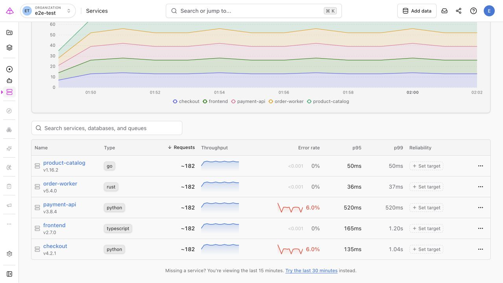
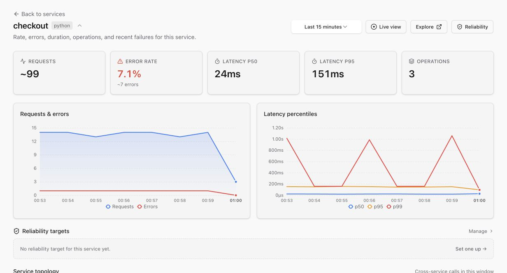
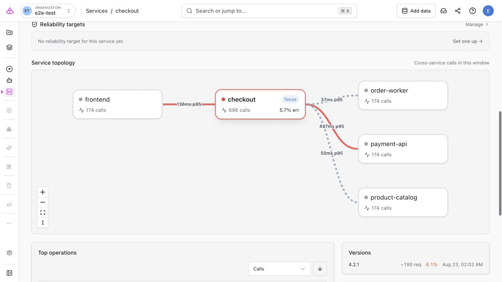

# Services

Use the <OpenInLogfire path="services" variant="inline" label="Services view" /> to find which services are busy, slow, or failing, then follow the signal to the operation or trace responsible.

A span is one unit of work: a single operation, with a name, a start, and a duration. A trace is the full journey of one request, made of nested spans. Logfire builds the Services view from the spans your project receives.

You'll find **Services** near the top of the project sidebar, alongside **Live** and **Agents**.

## Find the service that needs attention

The inventory defaults to the last 15 minutes. Summary cards and the **Activity over time** chart show request volume, errors, and latency across your services. The table adds:

- Search by resource name, type, or badge.
- Sort by name, type, request count, error rate, or p95 latency. **p95** and **p99** mean the 95th- and 99th-percentile latency.
- Quick links to service details, [Live View](live.md), and [Explore](explore.md).
- A **Reliability** column when reliability targets are available.

When the **Databases** or **Queues** toggle is available, you can include resources inferred from database and messaging spans. On narrow screens, rows become cards with the same key signals and separate sort controls.

Each resource type is limited to its 200 busiest entries in the selected range. Logfire displays a warning when results reach that limit.



## Investigate one service

Select a service to open its detail page. It shows:

- Headline request, error-rate, median latency (p50), p95 latency, and operation-count cards.
- Request, error, and latency trends, with deployment markers when version data is available.
- Reliability targets, top operations, database dependencies, versions, and recent errors.
- Links that preserve the service filter in **Live view** and **Explore**.



## Read the topology correctly

The topology is a one-hop view centered on the selected service. Every edge represents spans that crossed a direct service boundary in the current time range.

Traffic on a neighboring node or edge includes only calls exchanged with the selected service, not that neighbor's total traffic. The selected service shows its inbound error rate; neighboring nodes do not claim to summarize the health of the whole service.

Select a neighboring service to open its detail page.



## Send the attributes the page needs

OpenTelemetry (OTel) is the open industry standard for collecting traces, metrics, and logs. Logfire uses these OTel resource and span attributes:

| Attribute | What it does |
|-----------|--------------|
| `service.name` | Groups spans into a named service row. Use a stable workload name such as `cart`, not a hostname or pod name. Without it, telemetry may appear under an unknown-service fallback. |
| `service.version` | Adds versions and deployment markers to service details. |
| `deployment.environment.name` | Lets you filter by environment. The older `deployment.environment` is also honored. |
| `telemetry.sdk.language` | Sets the service's type badge. OTel SDKs normally add it. |
| `db.system.name` | Identifies a database. The older `db.system` is also honored. |
| `messaging.system` | Identifies a queue or messaging system. |

Propagate trace context between workloads so Logfire can reconstruct service boundaries. The topology omits an edge when the relevant spans or parent context do not reach Logfire.

**Requests** is an approximate count of distinct traces that included the service. A trace that re-enters the service counts once. **Errors** estimates how many of those traces contained an error for that service. These probabilistic counts typically have 1 to 2% standard error.

Sampling means keeping a representative subset of telemetry instead of every event. Sampling before export affects inventory counts and can remove topology edges because this page describes the telemetry Logfire received.

## Send a first service span

Copy a write token from **Project settings → Write tokens**, then run:

```bash
pip install logfire
export LOGFIRE_TOKEN="your-write-token"
export OTEL_SERVICE_NAME=cart
python - <<'PY'
import logfire

logfire.configure(inspect_arguments=False)
with logfire.span("first cart request"):
    pass
PY
```

Refresh Services and expand the time range if needed. For FastAPI, Django, gRPC, OpenTelemetry Collector, and other integrations, see [Integrate your application](../onboarding-checklist/integrate.md).

## Fix missing or split services

| Symptom | What to check |
|---------|---------------|
| A service is missing | Confirm a span arrived in the selected time and environment range. If it appears as `unknown_service`, set a stable `service.name`. Also check whether the result reached the 200-service limit. |
| One service appears as two rows | Keep `service.name` identical across replicas with `OTEL_SERVICE_NAME` or the SDK's `service_name` argument. |
| A topology edge is missing | Confirm both workloads use distinct service names, propagate trace context, and export the spans that cross the boundary. |
